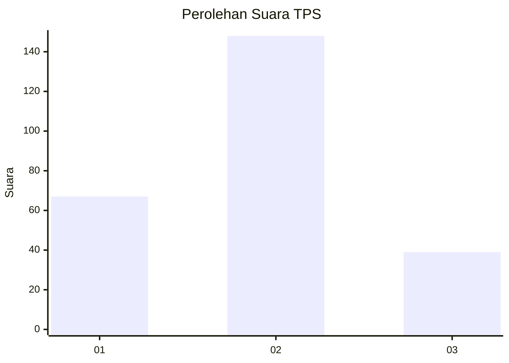
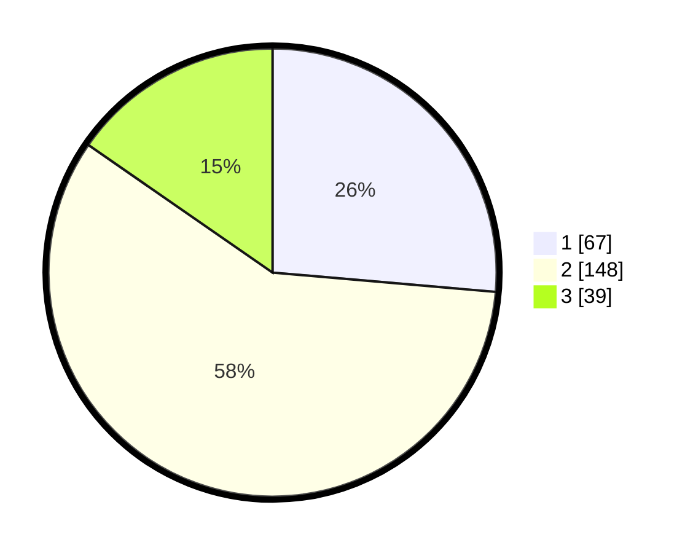

# Hasil

## Grafik

## Tabel

| No. | Nama Paslon    | Suara | Suara (raw) | Persentase |
|:--- |:-------------- | -----:| -----------:| ----------:|
| 1   | ANIES MUHAIMIN | 67    | [67][p-1]   | 26,38      |
| 2   | PRABOWO GIBRAN | 148   | [148][p-2]  | 58,27      |
| 3   | GANJAR MAHFUD  | 39    | [39][p-3]   | 15,35      |

[p-1]: https://github.com/gigit-pemilu/pemilu-2024/blob/main/pilpres/hitung-suara/sub/35-jawa-timur/sub/73-kota-malang/sub/05-lowokwaru/sub/1010-tulusrejo/sub/026-tps/sub/paslon-1.txt
[p-2]: https://github.com/gigit-pemilu/pemilu-2024/blob/main/pilpres/hitung-suara/sub/35-jawa-timur/sub/73-kota-malang/sub/05-lowokwaru/sub/1010-tulusrejo/sub/026-tps/sub/paslon-2.txt
[p-3]: https://github.com/gigit-pemilu/pemilu-2024/blob/main/pilpres/hitung-suara/sub/35-jawa-timur/sub/73-kota-malang/sub/05-lowokwaru/sub/1010-tulusrejo/sub/026-tps/sub/paslon-3.txt

## Foto C Plano

https://sirekap-obj-formc.kpu.go.id/6e11/pemilu/ppwp/35/73/05/10/10/3573051010026-20240214-203725--c747a175-e37d-44a8-af2b-6f8b3f3fa548.jpg

https://sirekap-obj-formc.kpu.go.id/6e11/pemilu/ppwp/35/73/05/10/10/3573051010026-20240214-203932--77d58273-4cfa-46dd-b5c9-b8dc791d9e89.jpg

https://sirekap-obj-formc.kpu.go.id/6e11/pemilu/ppwp/35/73/05/10/10/3573051010026-20240214-204029--0f0f31bf-46fd-4f42-aae4-274fddac2479.jpg

## Metadata

| Key        | Value               |
| ---------- | ------------------- |
| Time Stamp | 2024-02-17 11:30:03 |

