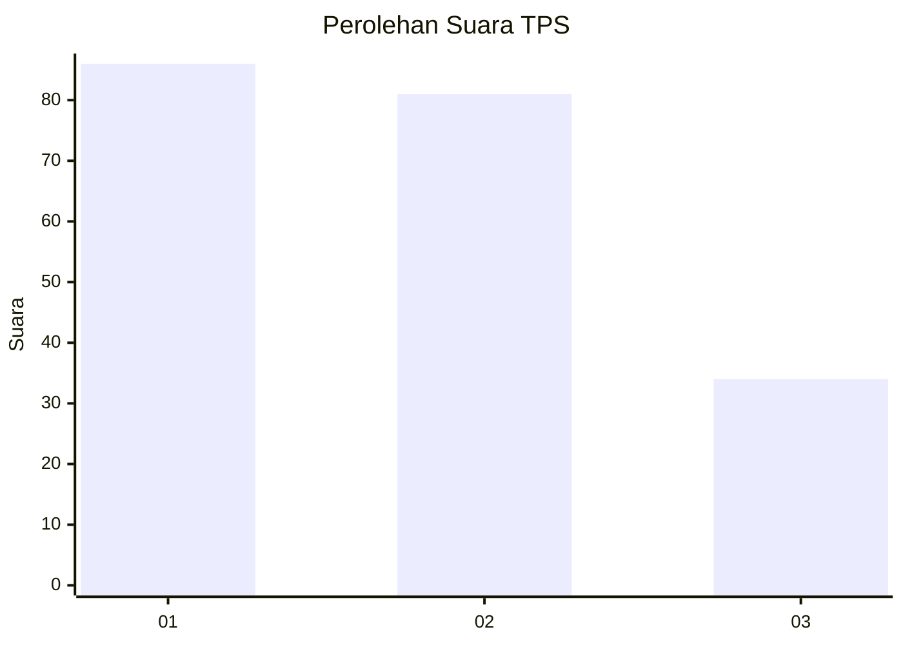
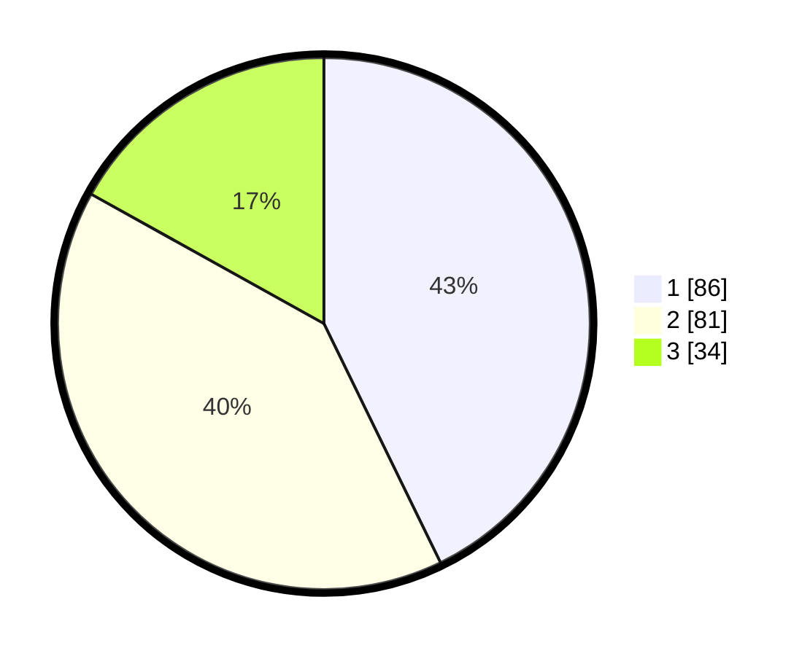

# Hasil

## Grafik

## Tabel

| No. | Nama Paslon    | Suara | Suara (raw) | Persentase |
|:--- |:-------------- | -----:| -----------:| ----------:|
| 1   | ANIES MUHAIMIN | 86    | [86][p-1]   | 42,79      |
| 2   | PRABOWO GIBRAN | 81    | [81][p-2]   | 40,30      |
| 3   | GANJAR MAHFUD  | 34    | [34][p-3]   | 16,92      |

[p-1]: https://github.com/gigit-pemilu/pemilu-2024-35-jawa-timur/blob/main/pilpres/hitung-suara/sub/35-jawa-timur/sub/73-kota-malang/sub/05-lowokwaru/sub/1010-tulusrejo/sub/045-tps/sub/paslon-1.txt
[p-2]: https://github.com/gigit-pemilu/pemilu-2024-35-jawa-timur/blob/main/pilpres/hitung-suara/sub/35-jawa-timur/sub/73-kota-malang/sub/05-lowokwaru/sub/1010-tulusrejo/sub/045-tps/sub/paslon-2.txt
[p-3]: https://github.com/gigit-pemilu/pemilu-2024-35-jawa-timur/blob/main/pilpres/hitung-suara/sub/35-jawa-timur/sub/73-kota-malang/sub/05-lowokwaru/sub/1010-tulusrejo/sub/045-tps/sub/paslon-3.txt

## Foto C Plano

https://sirekap-obj-formc.kpu.go.id/1952/pemilu/ppwp/35/73/05/10/10/3573051010045-20240214-213038--db49058e-80e0-4bfe-b1ce-43f440d92c42.jpg

https://sirekap-obj-formc.kpu.go.id/1952/pemilu/ppwp/35/73/05/10/10/3573051010045-20240214-220404--ebcff005-aec4-4f44-8d1d-46964db3e6e6.jpg

https://sirekap-obj-formc.kpu.go.id/1952/pemilu/ppwp/35/73/05/10/10/3573051010045-20240214-220436--38f6e18e-cd86-4fd9-94ba-9a3fc061f6a8.jpg

## Metadata

| Key        | Value               |
| ---------- | ------------------- |
| Time Stamp | 2024-02-24 22:31:28 |

