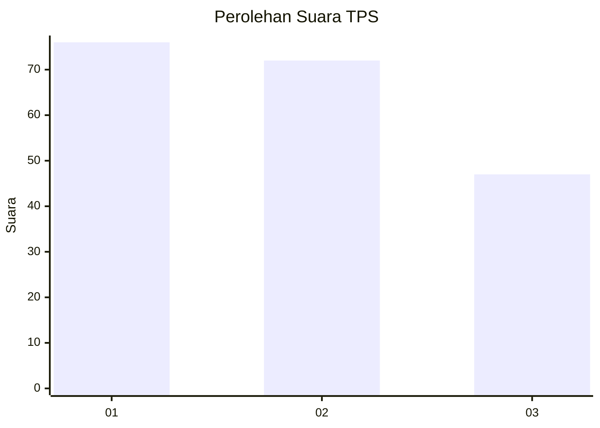
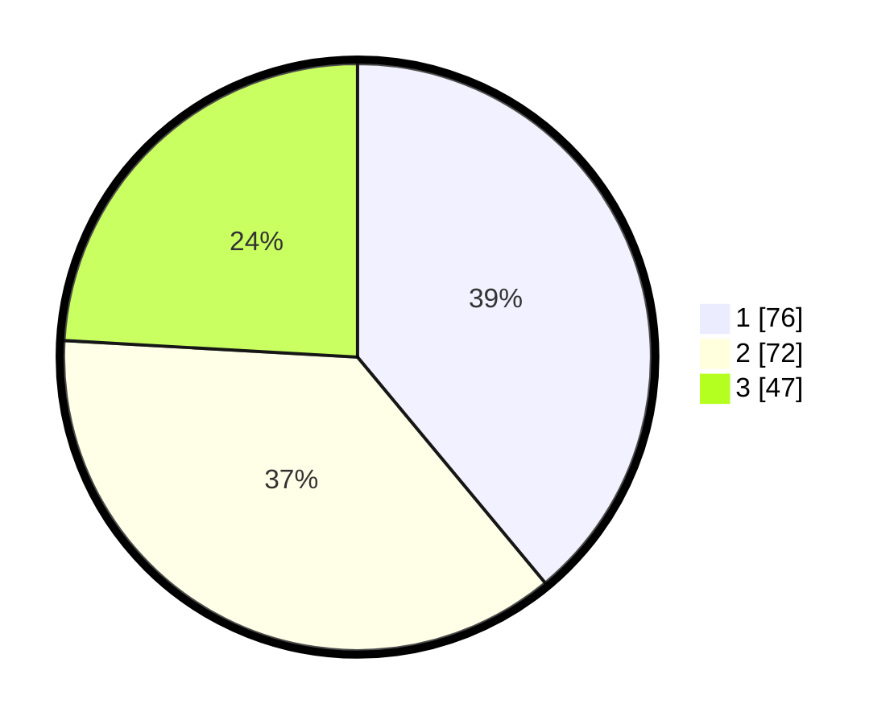

# Hasil

## Grafik

## Tabel

| No. | Nama Paslon    | Suara | Suara (raw) | Persentase |
|:--- |:-------------- | -----:| -----------:| ----------:|
| 1   | ANIES MUHAIMIN | 76    | [76][p-1]   | 38,97      |
| 2   | PRABOWO GIBRAN | 72    | [72][p-2]   | 36,92      |
| 3   | GANJAR MAHFUD  | 47    | [47][p-3]   | 24,10      |

[p-1]: https://github.com/gigit-pemilu/pemilu-2024/blob/main/pilpres/hitung-suara/sub/35-jawa-timur/sub/73-kota-malang/sub/05-lowokwaru/sub/1010-tulusrejo/sub/047-tps/sub/paslon-1.txt
[p-2]: https://github.com/gigit-pemilu/pemilu-2024/blob/main/pilpres/hitung-suara/sub/35-jawa-timur/sub/73-kota-malang/sub/05-lowokwaru/sub/1010-tulusrejo/sub/047-tps/sub/paslon-2.txt
[p-3]: https://github.com/gigit-pemilu/pemilu-2024/blob/main/pilpres/hitung-suara/sub/35-jawa-timur/sub/73-kota-malang/sub/05-lowokwaru/sub/1010-tulusrejo/sub/047-tps/sub/paslon-3.txt

## Foto C Plano

https://sirekap-obj-formc.kpu.go.id/bbe8/pemilu/ppwp/35/73/05/10/10/3573051010047-20240214-215706--0d2521ae-8c45-4ad3-8ec8-49dffc494317.jpg

https://sirekap-obj-formc.kpu.go.id/bbe8/pemilu/ppwp/35/73/05/10/10/3573051010047-20240214-220003--d8a07300-2cc3-4da1-acc8-697b2ff1c3bd.jpg

https://sirekap-obj-formc.kpu.go.id/bbe8/pemilu/ppwp/35/73/05/10/10/3573051010047-20240214-220105--876f0e22-e003-48e7-8b75-ff2ef7310338.jpg

## Metadata

| Key        | Value               |
| ---------- | ------------------- |
| Time Stamp | 2024-02-25 13:00:00 |

