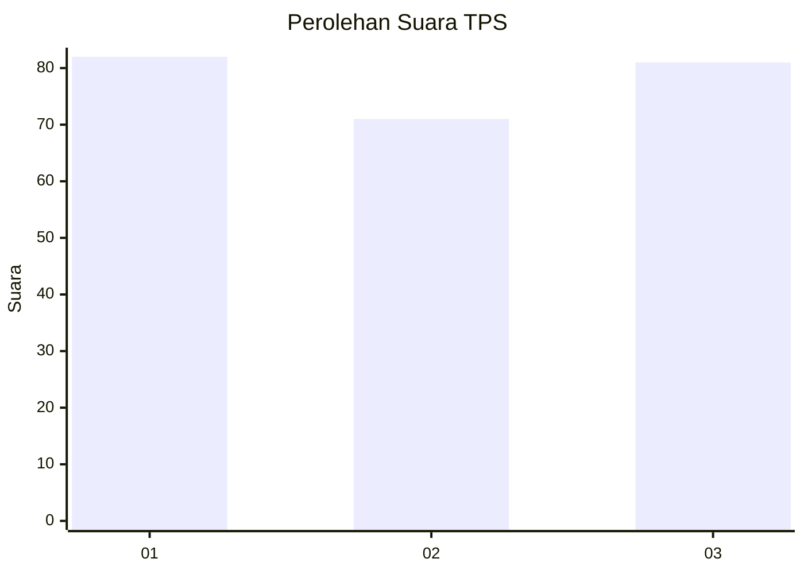
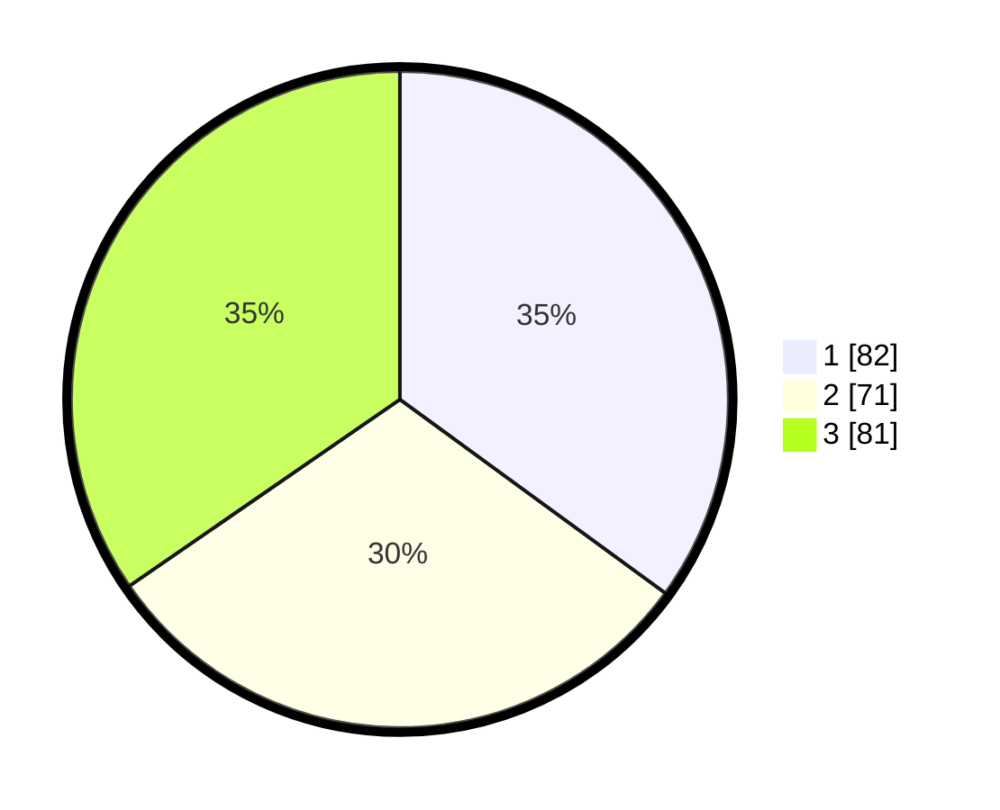

# Hasil

## Grafik

## Tabel

| No. | Nama Paslon    | Suara | Suara (raw) | Persentase |
|:--- |:-------------- | -----:| -----------:| ----------:|
| 1   | ANIES MUHAIMIN | 82    | [82][p-1]   | 35,04      |
| 2   | PRABOWO GIBRAN | 71    | [71][p-2]   | 30,34      |
| 3   | GANJAR MAHFUD  | 81    | [81][p-3]   | 34,62      |

[p-1]: https://github.com/gigit-pemilu/pemilu-2024-35-jawa-timur/blob/main/pilpres/hitung-suara/sub/35-jawa-timur/sub/73-kota-malang/sub/05-lowokwaru/sub/1011-lowokwaru/sub/030-tps/sub/paslon-1.txt
[p-2]: https://github.com/gigit-pemilu/pemilu-2024-35-jawa-timur/blob/main/pilpres/hitung-suara/sub/35-jawa-timur/sub/73-kota-malang/sub/05-lowokwaru/sub/1011-lowokwaru/sub/030-tps/sub/paslon-2.txt
[p-3]: https://github.com/gigit-pemilu/pemilu-2024-35-jawa-timur/blob/main/pilpres/hitung-suara/sub/35-jawa-timur/sub/73-kota-malang/sub/05-lowokwaru/sub/1011-lowokwaru/sub/030-tps/sub/paslon-3.txt

## Foto C Plano

https://sirekap-obj-formc.kpu.go.id/8646/pemilu/ppwp/35/73/05/10/11/3573051011030-20240214-155802--436ce825-a904-4e87-a748-e61b45a917b5.jpg

https://sirekap-obj-formc.kpu.go.id/8646/pemilu/ppwp/35/73/05/10/11/3573051011030-20240215-022023--d0c61ec7-11c5-4bb6-a544-eb0a2e223578.jpg

https://sirekap-obj-formc.kpu.go.id/8646/pemilu/ppwp/35/73/05/10/11/3573051011030-20240214-160122--46100c15-a431-470e-9625-52de3b55681f.jpg

## Metadata

| Key        | Value               |
| ---------- | ------------------- |
| Time Stamp | 2024-02-25 11:00:00 |

