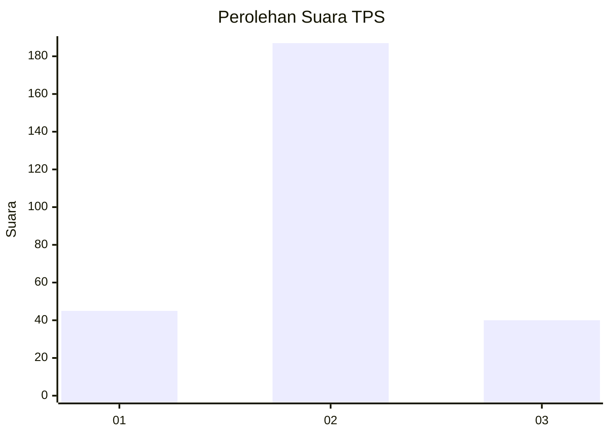

# Hasil

## Grafik

## Tabel

| No. | Nama Paslon    | Suara | Suara (raw) | Persentase |
|:--- |:-------------- | -----:| -----------:| ----------:|
| 1   | ANIES MUHAIMIN | 45    | [45][p-1]   | 16,54      |
| 2   | PRABOWO GIBRAN | 187   | [187][p-2]  | 68,75      |
| 3   | GANJAR MAHFUD  | 40    | [40][p-3]   | 14,71      |

[p-1]: https://github.com/gigit-pemilu/pemilu-2024/blob/main/pilpres/hitung-suara/sub/35-jawa-timur/sub/73-kota-malang/sub/05-lowokwaru/sub/1012-tasik-madu/sub/010-tps/sub/paslon-1.txt
[p-2]: https://github.com/gigit-pemilu/pemilu-2024/blob/main/pilpres/hitung-suara/sub/35-jawa-timur/sub/73-kota-malang/sub/05-lowokwaru/sub/1012-tasik-madu/sub/010-tps/sub/paslon-2.txt
[p-3]: https://github.com/gigit-pemilu/pemilu-2024/blob/main/pilpres/hitung-suara/sub/35-jawa-timur/sub/73-kota-malang/sub/05-lowokwaru/sub/1012-tasik-madu/sub/010-tps/sub/paslon-3.txt

## Foto C Plano

https://sirekap-obj-formc.kpu.go.id/a322/pemilu/ppwp/35/73/05/10/12/3573051012010-20240214-192049--beab458a-8986-4fb2-b1c8-175714941378.jpg

https://sirekap-obj-formc.kpu.go.id/a322/pemilu/ppwp/35/73/05/10/12/3573051012010-20240214-192113--2ef157fb-7efb-42cf-8c9e-20f6a8876c10.jpg

https://sirekap-obj-formc.kpu.go.id/a322/pemilu/ppwp/35/73/05/10/12/3573051012010-20240214-192118--7994994f-27fa-4a0c-924d-1a2ebca1a026.jpg

## Metadata

| Key        | Value               |
| ---------- | ------------------- |
| Time Stamp | 2024-02-25 16:00:00 |

