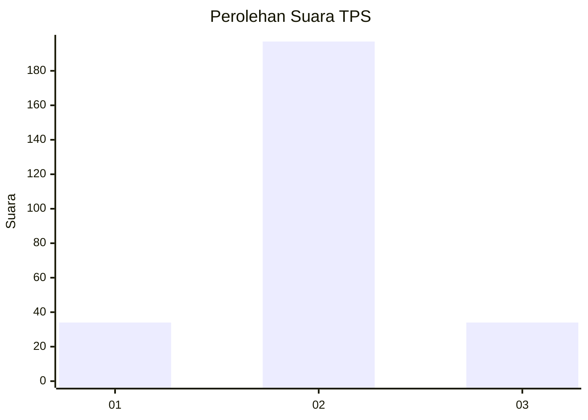
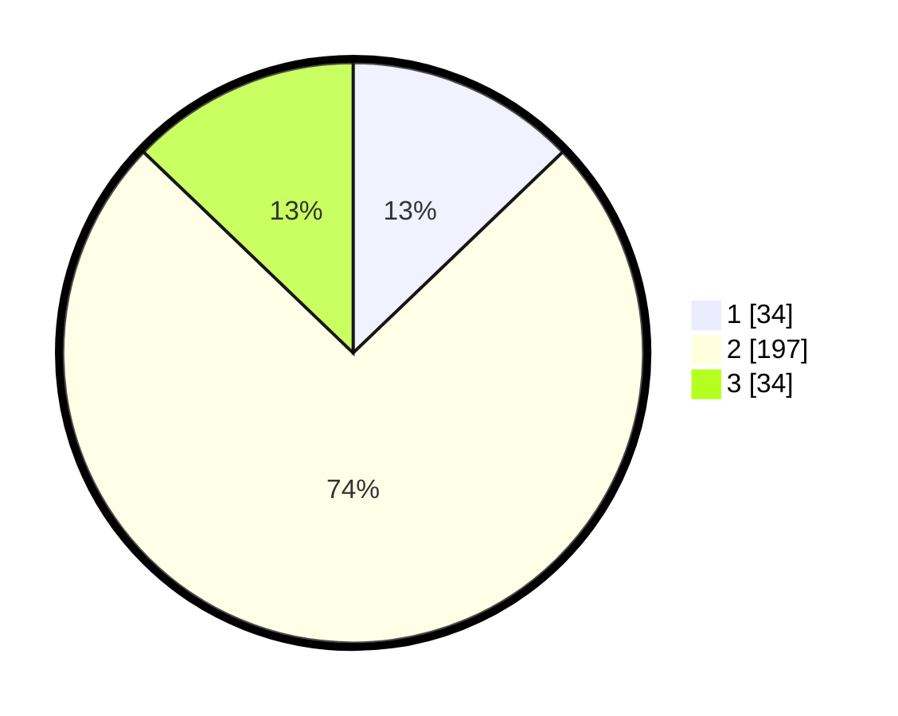

# Hasil

## Grafik

## Tabel

| No. | Nama Paslon    | Suara | Suara (raw) | Persentase |
|:--- |:-------------- | -----:| -----------:| ----------:|
| 1   | ANIES MUHAIMIN | 34    | [34][p-1]   | 12,83      |
| 2   | PRABOWO GIBRAN | 197   | [197][p-2]  | 74,34      |
| 3   | GANJAR MAHFUD  | 34    | [34][p-3]   | 12,83      |

[p-1]: https://github.com/gigit-pemilu/pemilu-2024-35-jawa-timur/blob/main/pilpres/hitung-suara/sub/35-jawa-timur/sub/73-kota-malang/sub/05-lowokwaru/sub/1012-tasik-madu/sub/013-tps/sub/paslon-1.txt
[p-2]: https://github.com/gigit-pemilu/pemilu-2024-35-jawa-timur/blob/main/pilpres/hitung-suara/sub/35-jawa-timur/sub/73-kota-malang/sub/05-lowokwaru/sub/1012-tasik-madu/sub/013-tps/sub/paslon-2.txt
[p-3]: https://github.com/gigit-pemilu/pemilu-2024-35-jawa-timur/blob/main/pilpres/hitung-suara/sub/35-jawa-timur/sub/73-kota-malang/sub/05-lowokwaru/sub/1012-tasik-madu/sub/013-tps/sub/paslon-3.txt

## Foto C Plano

https://sirekap-obj-formc.kpu.go.id/8b07/pemilu/ppwp/35/73/05/10/12/3573051012013-20240215-063136--c2d3c0aa-bfac-4551-aee9-f20181e5c05c.jpg

https://sirekap-obj-formc.kpu.go.id/8b07/pemilu/ppwp/35/73/05/10/12/3573051012013-20240215-063152--8dc98b9d-6096-4d70-ac8a-acd3a470387d.jpg

https://sirekap-obj-formc.kpu.go.id/8b07/pemilu/ppwp/35/73/05/10/12/3573051012013-20240215-063158--abcb8b37-82f3-4847-afcf-9e81f9ac3efb.jpg

## Metadata

| Key        | Value               |
| ---------- | ------------------- |
| Time Stamp | 2024-02-25 17:00:00 |

