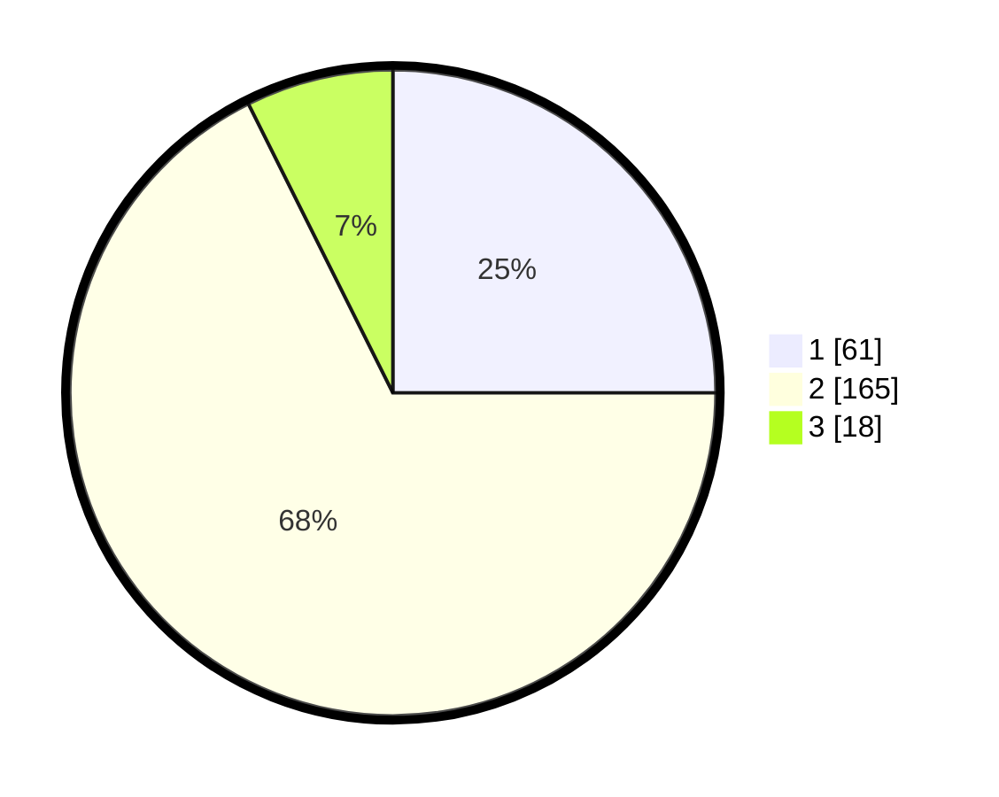

# Hasil

## Grafik

## Tabel

| No. | Nama Paslon    | Suara | Suara (raw) | Persentase |
|:--- |:-------------- | -----:| -----------:| ----------:|
| 1   | ANIES MUHAIMIN | 61    | [61][p-1]   | 25,00      |
| 2   | PRABOWO GIBRAN | 165   | [165][p-2]  | 67,62      |
| 3   | GANJAR MAHFUD  | 18    | [18][p-3]   | 7,38       |

[p-1]: https://github.com/gigit-pemilu/pemilu-2024-35-jawa-timur/blob/main/pilpres/hitung-suara/sub/35-jawa-timur/sub/74-kota-probolinggo/sub/01-kademangan/sub/1001-ketapang/sub/005-tps/sub/paslon-1.txt
[p-2]: https://github.com/gigit-pemilu/pemilu-2024-35-jawa-timur/blob/main/pilpres/hitung-suara/sub/35-jawa-timur/sub/74-kota-probolinggo/sub/01-kademangan/sub/1001-ketapang/sub/005-tps/sub/paslon-2.txt
[p-3]: https://github.com/gigit-pemilu/pemilu-2024-35-jawa-timur/blob/main/pilpres/hitung-suara/sub/35-jawa-timur/sub/74-kota-probolinggo/sub/01-kademangan/sub/1001-ketapang/sub/005-tps/sub/paslon-3.txt

## Foto C Plano

https://sirekap-obj-formc.kpu.go.id/2c0b/pemilu/ppwp/35/74/01/10/01/3574011001005-20240214-185736--96f2dc26-a559-490a-b02b-5fcbd943e5cc.jpg

https://sirekap-obj-formc.kpu.go.id/2c0b/pemilu/ppwp/35/74/01/10/01/3574011001005-20240214-185752--8119d45e-5517-4652-99d9-9616bf5e9031.jpg

https://sirekap-obj-formc.kpu.go.id/2c0b/pemilu/ppwp/35/74/01/10/01/3574011001005-20240214-185808--68a11093-8ed8-40fe-b78f-0480513eb3fa.jpg

## Metadata

| Key        | Value               |
| ---------- | ------------------- |
| Time Stamp | 2024-02-15 18:00:26 |

## DATA PEMILIH TETAP

Jumlah pemilih dalam DPT: **285**.
 * L: **155**.
 * P: **630**.

## DATA PENGGUNA HAK PILIH

Jumlah pengguna hak pilih dalam DPT: **754**.
 * L: **130**.
 * P: **724**.

Jumlah pengguna hak pilih dalam DPTb: **0**.
 * L: **0**.
 * P: **0**.

Jumlah pengguna hak pilih dalam DPK: **3**.
 * L: **2**.
 * P: **1**.

Jumlah pengguna hak pilih: **257**.
 * L: **152**.
 * P: **122**.

## JUMLAH SUARA SAH DAN TIDAK SAH

JUMLAH SELURUH SUARA SAH: **244**.

JUMLAH SUARA TIDAK SAH: **13**.

JUMLAH SELURUH SUARA SAH DAN SUARA TIDAK SAH: **257**.

