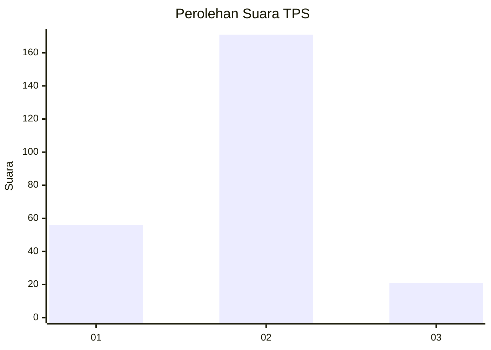
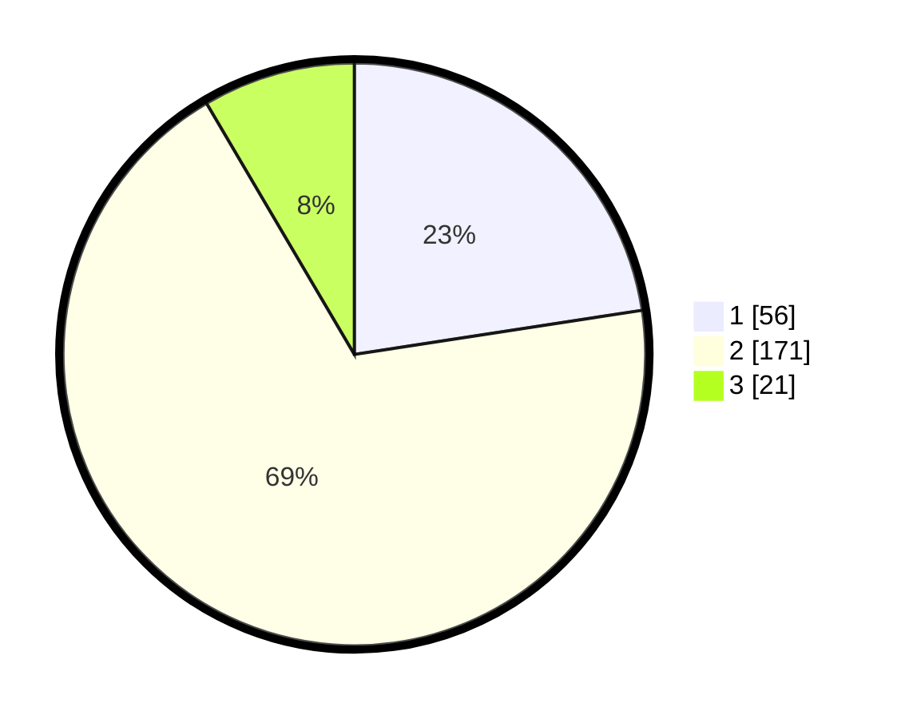

# Hasil

## Grafik

## Tabel

| No. | Nama Paslon    | Suara | Suara (raw) | Persentase |
|:--- |:-------------- | -----:| -----------:| ----------:|
| 1   | ANIES MUHAIMIN | 56    | [56][p-1]   | 22,58      |
| 2   | PRABOWO GIBRAN | 171   | [171][p-2]  | 68,95      |
| 3   | GANJAR MAHFUD  | 21    | [21][p-3]   | 8,47       |

[p-1]: https://github.com/gigit-pemilu/pemilu-2024-35-jawa-timur/blob/main/pilpres/hitung-suara/sub/35-jawa-timur/sub/74-kota-probolinggo/sub/01-kademangan/sub/1001-ketapang/sub/008-tps/sub/paslon-1.txt
[p-2]: https://github.com/gigit-pemilu/pemilu-2024-35-jawa-timur/blob/main/pilpres/hitung-suara/sub/35-jawa-timur/sub/74-kota-probolinggo/sub/01-kademangan/sub/1001-ketapang/sub/008-tps/sub/paslon-2.txt
[p-3]: https://github.com/gigit-pemilu/pemilu-2024-35-jawa-timur/blob/main/pilpres/hitung-suara/sub/35-jawa-timur/sub/74-kota-probolinggo/sub/01-kademangan/sub/1001-ketapang/sub/008-tps/sub/paslon-3.txt

## Foto C Plano

https://sirekap-obj-formc.kpu.go.id/6ccb/pemilu/ppwp/35/74/01/10/01/3574011001008-20240215-175650--30942f75-d386-4138-a579-12e12f6b06fe.jpg

https://sirekap-obj-formc.kpu.go.id/6ccb/pemilu/ppwp/35/74/01/10/01/3574011001008-20240215-175722--2d27429e-d0bb-40c4-b97b-0af4862277a3.jpg

https://sirekap-obj-formc.kpu.go.id/6ccb/pemilu/ppwp/35/74/01/10/01/3574011001008-20240215-175806--3a0405c3-d03b-4ce5-bd54-75583132e23e.jpg

## Metadata

| Key        | Value               |
| ---------- | ------------------- |
| Time Stamp | 2024-02-16 21:01:00 |

