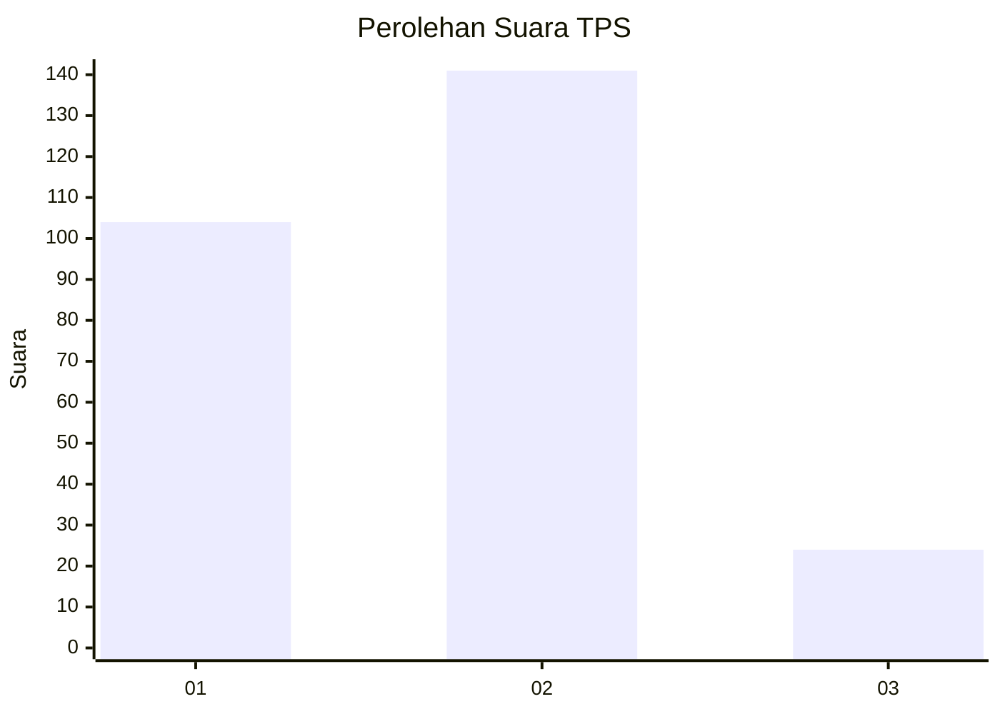
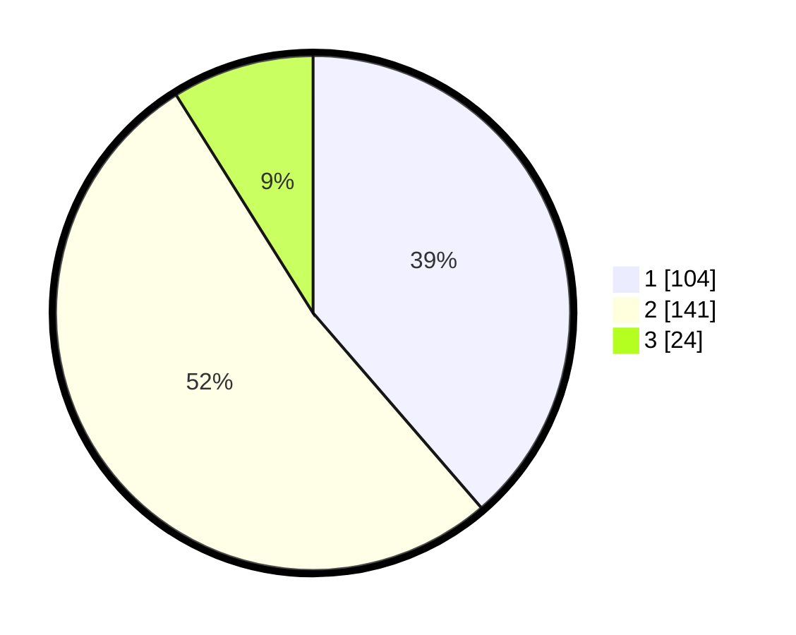

# Hasil

## Grafik

## Tabel

| No. | Nama Paslon    | Suara | Suara (raw) | Persentase |
|:--- |:-------------- | -----:| -----------:| ----------:|
| 1   | ANIES MUHAIMIN | 104   | [104][p-1]  | 38,66      |
| 2   | PRABOWO GIBRAN | 141   | [141][p-2]  | 52,42      |
| 3   | GANJAR MAHFUD  | 24    | [24][p-3]   | 8,92       |

[p-1]: https://github.com/gigit-pemilu/pemilu-2024-35-jawa-timur/blob/main/pilpres/hitung-suara/sub/35-jawa-timur/sub/74-kota-probolinggo/sub/01-kademangan/sub/1001-ketapang/sub/015-tps/sub/paslon-1.txt
[p-2]: https://github.com/gigit-pemilu/pemilu-2024-35-jawa-timur/blob/main/pilpres/hitung-suara/sub/35-jawa-timur/sub/74-kota-probolinggo/sub/01-kademangan/sub/1001-ketapang/sub/015-tps/sub/paslon-2.txt
[p-3]: https://github.com/gigit-pemilu/pemilu-2024-35-jawa-timur/blob/main/pilpres/hitung-suara/sub/35-jawa-timur/sub/74-kota-probolinggo/sub/01-kademangan/sub/1001-ketapang/sub/015-tps/sub/paslon-3.txt

## Foto C Plano

https://sirekap-obj-formc.kpu.go.id/0791/pemilu/ppwp/35/74/01/10/01/3574011001015-20240214-184745--aaeaf905-5fc5-4272-95db-e6f436a87170.jpg

https://sirekap-obj-formc.kpu.go.id/0791/pemilu/ppwp/35/74/01/10/01/3574011001015-20240214-185012--740e4cc6-9c2b-4090-b904-5d7b61ad07d8.jpg

https://sirekap-obj-formc.kpu.go.id/0791/pemilu/ppwp/35/74/01/10/01/3574011001015-20240214-185018--570412e2-5bc8-434e-8a7a-73ef65c3e5a6.jpg

## Metadata

| Key        | Value               |
| ---------- | ------------------- |
| Time Stamp | 2024-02-15 15:00:29 |

## DATA PEMILIH TETAP

Jumlah pemilih dalam DPT: **447**.
 * L: **135**.
 * P: **156**.

## DATA PENGGUNA HAK PILIH

Jumlah pengguna hak pilih dalam DPT: **644**.
 * L: **105**.
 * P: **134**.

Jumlah pengguna hak pilih dalam DPTb: **71**.
 * L: **6**.
 * P: **1**.

Jumlah pengguna hak pilih dalam DPK: **26**.
 * L: **10**.
 * P: **10**.

Jumlah pengguna hak pilih: **271**.
 * L: **121**.
 * P: **150**.

## JUMLAH SUARA SAH DAN TIDAK SAH

JUMLAH SELURUH SUARA SAH: **269**.

JUMLAH SUARA TIDAK SAH: **2**.

JUMLAH SELURUH SUARA SAH DAN SUARA TIDAK SAH: **271**.

