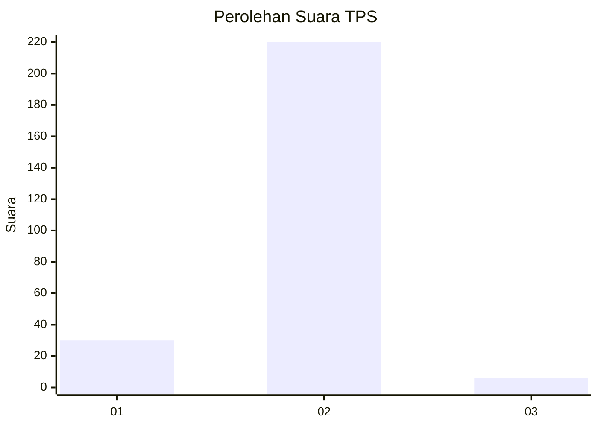
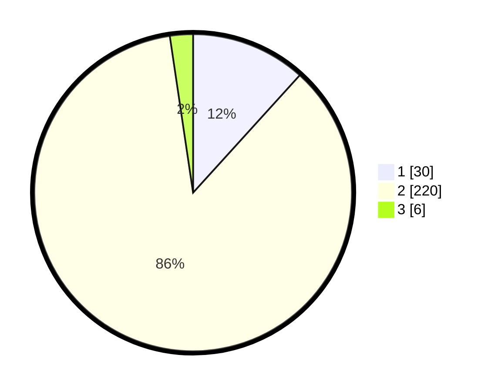

# Hasil

## Grafik

## Tabel

| No. | Nama Paslon    | Suara | Suara (raw) | Persentase |
|:--- |:-------------- | -----:| -----------:| ----------:|
| 1   | ANIES MUHAIMIN | 30    | [30][p-1]   | 11,72      |
| 2   | PRABOWO GIBRAN | 220   | [220][p-2]  | 85,94      |
| 3   | GANJAR MAHFUD  | 6     | [6][p-3]    | 2,34       |

[p-1]: https://github.com/gigit-pemilu/pemilu-2024/blob/main/pilpres/hitung-suara/sub/35-jawa-timur/sub/74-kota-probolinggo/sub/02-wonoasih/sub/1002-pakistaji/sub/011-tps/sub/paslon-1.txt
[p-2]: https://github.com/gigit-pemilu/pemilu-2024/blob/main/pilpres/hitung-suara/sub/35-jawa-timur/sub/74-kota-probolinggo/sub/02-wonoasih/sub/1002-pakistaji/sub/011-tps/sub/paslon-2.txt
[p-3]: https://github.com/gigit-pemilu/pemilu-2024/blob/main/pilpres/hitung-suara/sub/35-jawa-timur/sub/74-kota-probolinggo/sub/02-wonoasih/sub/1002-pakistaji/sub/011-tps/sub/paslon-3.txt

## Foto C Plano

https://sirekap-obj-formc.kpu.go.id/084b/pemilu/ppwp/35/74/02/10/02/3574021002011-20240214-160139--4df1c11e-c011-43ef-a15e-fe3bc3697dfe.jpg

https://sirekap-obj-formc.kpu.go.id/084b/pemilu/ppwp/35/74/02/10/02/3574021002011-20240214-204206--fc93a1f9-ec89-44db-b747-e29c1d491149.jpg

https://sirekap-obj-formc.kpu.go.id/084b/pemilu/ppwp/35/74/02/10/02/3574021002011-20240301-110333--0f760f53-b1d3-4aee-8660-dbc06bf740d2.jpg

## Metadata

| Key        | Value               |
| ---------- | ------------------- |
| Time Stamp | 2024-03-01 12:00:00 |

