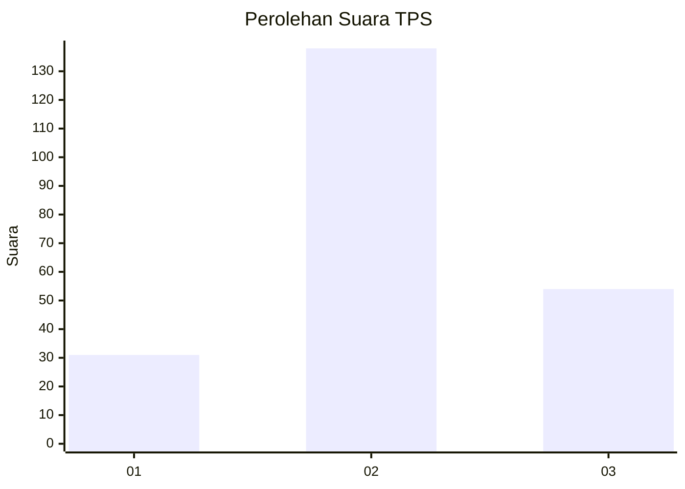
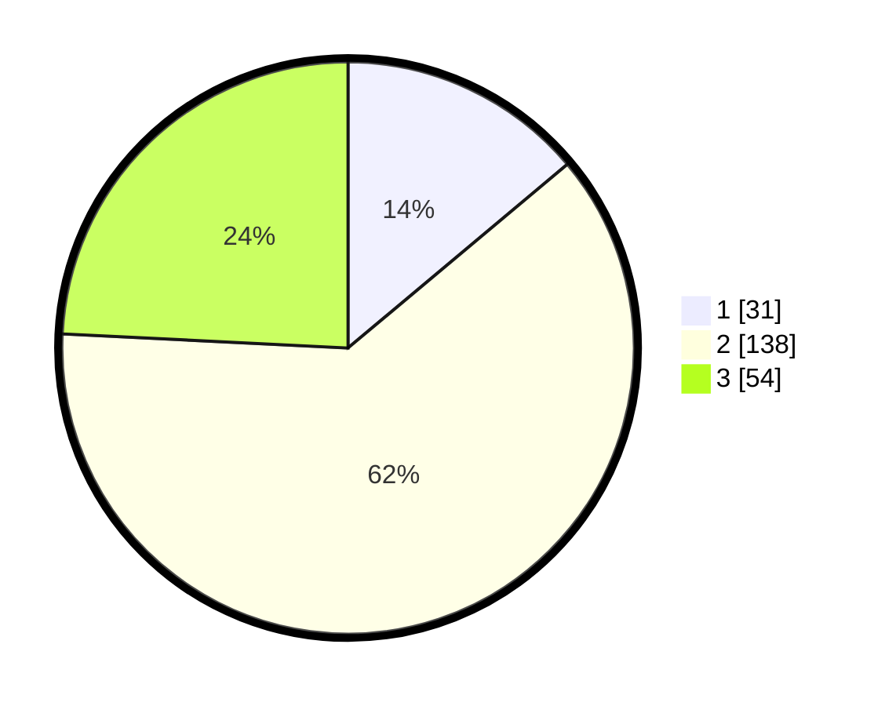

# Hasil

## Grafik

## Tabel

| No. | Nama Paslon    | Suara | Suara (raw) | Persentase |
|:--- |:-------------- | -----:| -----------:| ----------:|
| 1   | ANIES MUHAIMIN | 31    | [31][p-1]   | 13,90      |
| 2   | PRABOWO GIBRAN | 138   | [138][p-2]  | 61,88      |
| 3   | GANJAR MAHFUD  | 54    | [54][p-3]   | 24,22      |

[p-1]: https://github.com/gigit-pemilu/pemilu-2024-35-jawa-timur/blob/main/pilpres/hitung-suara/sub/35-jawa-timur/sub/74-kota-probolinggo/sub/03-mayangan/sub/1001-mayangan/sub/002-tps/sub/paslon-1.txt
[p-2]: https://github.com/gigit-pemilu/pemilu-2024-35-jawa-timur/blob/main/pilpres/hitung-suara/sub/35-jawa-timur/sub/74-kota-probolinggo/sub/03-mayangan/sub/1001-mayangan/sub/002-tps/sub/paslon-2.txt
[p-3]: https://github.com/gigit-pemilu/pemilu-2024-35-jawa-timur/blob/main/pilpres/hitung-suara/sub/35-jawa-timur/sub/74-kota-probolinggo/sub/03-mayangan/sub/1001-mayangan/sub/002-tps/sub/paslon-3.txt

## Foto C Plano

https://sirekap-obj-formc.kpu.go.id/f36a/pemilu/ppwp/35/74/03/10/01/3574031001002-20240301-114745--81486b5a-13aa-467f-a199-3f0758f6a48a.jpg

https://sirekap-obj-formc.kpu.go.id/f36a/pemilu/ppwp/35/74/03/10/01/3574031001002-20240215-084026--ed64c3ea-36e9-4184-b43b-fd9a9fa8c6a0.jpg

https://sirekap-obj-formc.kpu.go.id/f36a/pemilu/ppwp/35/74/03/10/01/3574031001002-20240215-084240--93a95360-734e-45a3-b849-7ca3f9a8c2ea.jpg

## Metadata

| Key        | Value               |
| ---------- | ------------------- |
| Time Stamp | 2024-03-01 12:00:00 |

