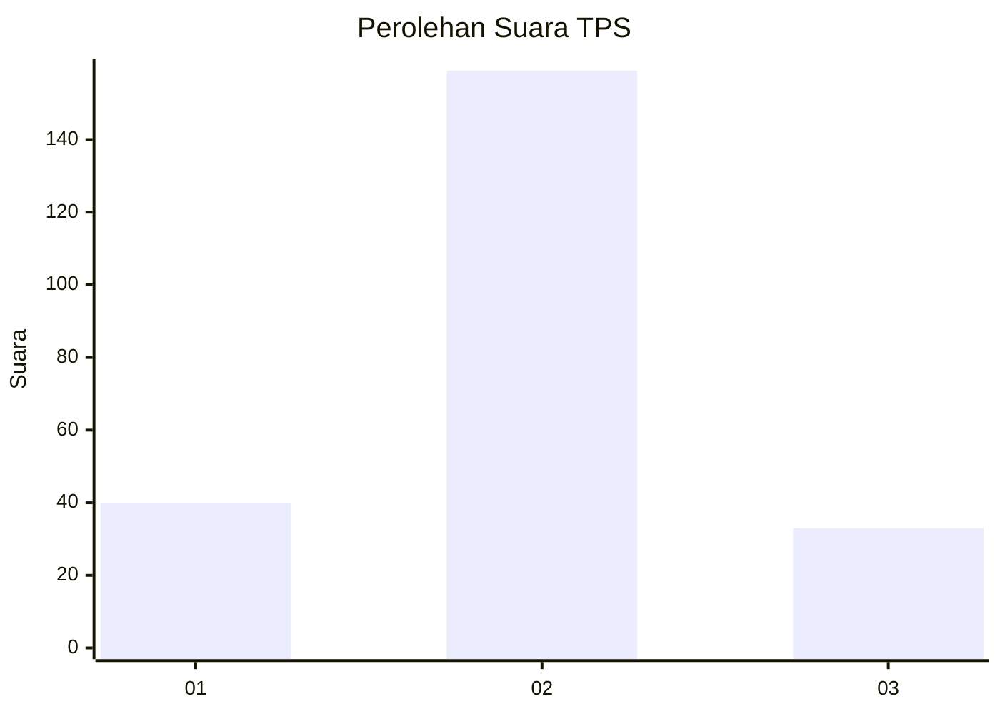
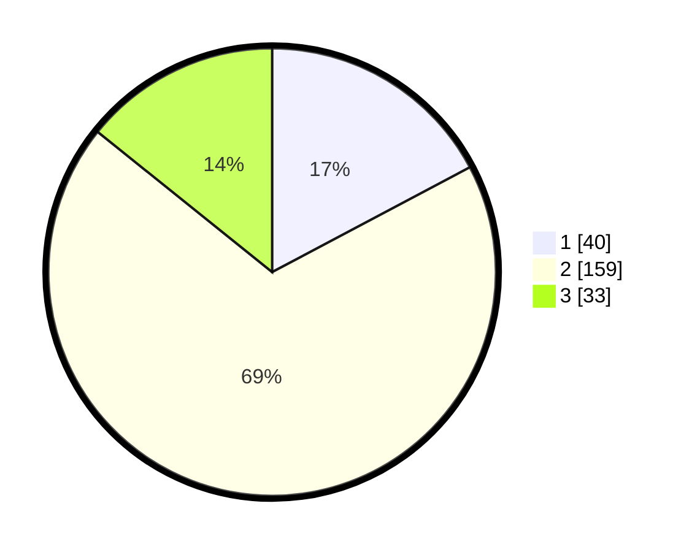

# Hasil

## Grafik

## Tabel

| No. | Nama Paslon    | Suara | Suara (raw) | Persentase |
|:--- |:-------------- | -----:| -----------:| ----------:|
| 1   | ANIES MUHAIMIN | 40    | [40][p-1]   | 17,24      |
| 2   | PRABOWO GIBRAN | 159   | [159][p-2]  | 68,53      |
| 3   | GANJAR MAHFUD  | 33    | [33][p-3]   | 14,22      |

[p-1]: https://github.com/gigit-pemilu/pemilu-2024/blob/main/pilpres/hitung-suara/sub/35-jawa-timur/sub/74-kota-probolinggo/sub/03-mayangan/sub/1010-wiroborang/sub/017-tps/sub/paslon-1.txt
[p-2]: https://github.com/gigit-pemilu/pemilu-2024/blob/main/pilpres/hitung-suara/sub/35-jawa-timur/sub/74-kota-probolinggo/sub/03-mayangan/sub/1010-wiroborang/sub/017-tps/sub/paslon-2.txt
[p-3]: https://github.com/gigit-pemilu/pemilu-2024/blob/main/pilpres/hitung-suara/sub/35-jawa-timur/sub/74-kota-probolinggo/sub/03-mayangan/sub/1010-wiroborang/sub/017-tps/sub/paslon-3.txt

## Foto C Plano

https://sirekap-obj-formc.kpu.go.id/8cf7/pemilu/ppwp/35/74/03/10/10/3574031010017-20240216-192650--853c924d-6813-4d0b-bdfb-1aedacf4129c.jpg

https://sirekap-obj-formc.kpu.go.id/8cf7/pemilu/ppwp/35/74/03/10/10/3574031010017-20240216-191456--0d817092-07f2-4515-94df-eb4e8cbb398a.jpg

https://sirekap-obj-formc.kpu.go.id/8cf7/pemilu/ppwp/35/74/03/10/10/3574031010017-20240216-192102--84c3c058-ef5f-4996-9a8a-4392dbe20ddc.jpg

## Metadata

| Key        | Value               |
| ---------- | ------------------- |
| Time Stamp | 2024-02-16 21:01:00 |

## DATA PEMILIH TETAP

Jumlah pemilih dalam DPT: **226**.
 * L: **800**.
 * P: **824**.

## DATA PENGGUNA HAK PILIH

Jumlah pengguna hak pilih dalam DPT: **226**.
 * L: **600**.
 * P: **824**.

Jumlah pengguna hak pilih dalam DPTb: **9**.
 * L: **804**.
 * P: **685**.

Jumlah pengguna hak pilih dalam DPK: **802**.
 * L: **0**.
 * P: **2**.

Jumlah pengguna hak pilih: **800**.
 * L: **0**.
 * P: **80**.

## JUMLAH SUARA SAH DAN TIDAK SAH

JUMLAH SELURUH SUARA SAH: **232**.

JUMLAH SUARA TIDAK SAH: **3**.

JUMLAH SELURUH SUARA SAH DAN SUARA TIDAK SAH: **235**.

