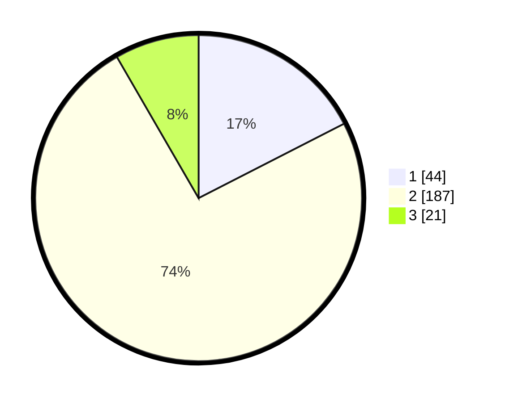

# Hasil

## Grafik

## Tabel

| No. | Nama Paslon    | Suara | Suara (raw) | Persentase |
|:--- |:-------------- | -----:| -----------:| ----------:|
| 1   | ANIES MUHAIMIN | 44    | [44][p-1]   | 17,46      |
| 2   | PRABOWO GIBRAN | 187   | [187][p-2]  | 74,21      |
| 3   | GANJAR MAHFUD  | 21    | [21][p-3]   | 8,33       |

[p-1]: https://github.com/gigit-pemilu/pemilu-2024-35-jawa-timur/blob/main/pilpres/hitung-suara/sub/35-jawa-timur/sub/74-kota-probolinggo/sub/04-kanigaran/sub/1003-kanigaran/sub/023-tps/sub/paslon-1.txt
[p-2]: https://github.com/gigit-pemilu/pemilu-2024-35-jawa-timur/blob/main/pilpres/hitung-suara/sub/35-jawa-timur/sub/74-kota-probolinggo/sub/04-kanigaran/sub/1003-kanigaran/sub/023-tps/sub/paslon-2.txt
[p-3]: https://github.com/gigit-pemilu/pemilu-2024-35-jawa-timur/blob/main/pilpres/hitung-suara/sub/35-jawa-timur/sub/74-kota-probolinggo/sub/04-kanigaran/sub/1003-kanigaran/sub/023-tps/sub/paslon-3.txt

## Foto C Plano

https://sirekap-obj-formc.kpu.go.id/799e/pemilu/ppwp/35/74/04/10/03/3574041003023-20240301-124925--bdaacf31-17b4-45d3-a1e5-b079784a4a82.jpg

https://sirekap-obj-formc.kpu.go.id/799e/pemilu/ppwp/35/74/04/10/03/3574041003023-20240214-213820--ab12b4e0-00c6-45fb-8cef-ac9efa1faa0b.jpg

https://sirekap-obj-formc.kpu.go.id/799e/pemilu/ppwp/35/74/04/10/03/3574041003023-20240214-213945--c6f3888e-ff86-4422-adc1-ab443a5d607e.jpg

## Metadata

| Key        | Value               |
| ---------- | ------------------- |
| Time Stamp | 2024-03-01 13:00:00 |

