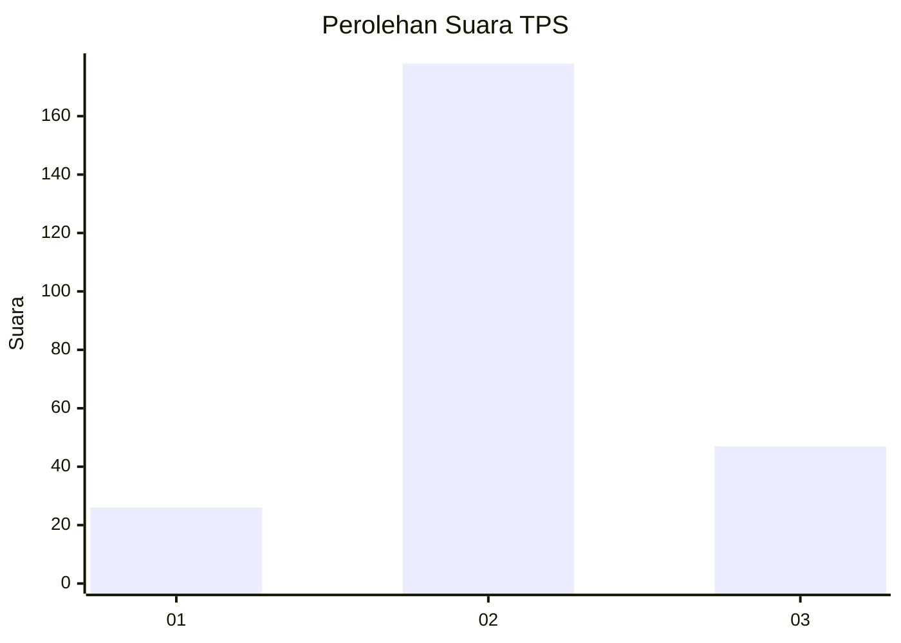
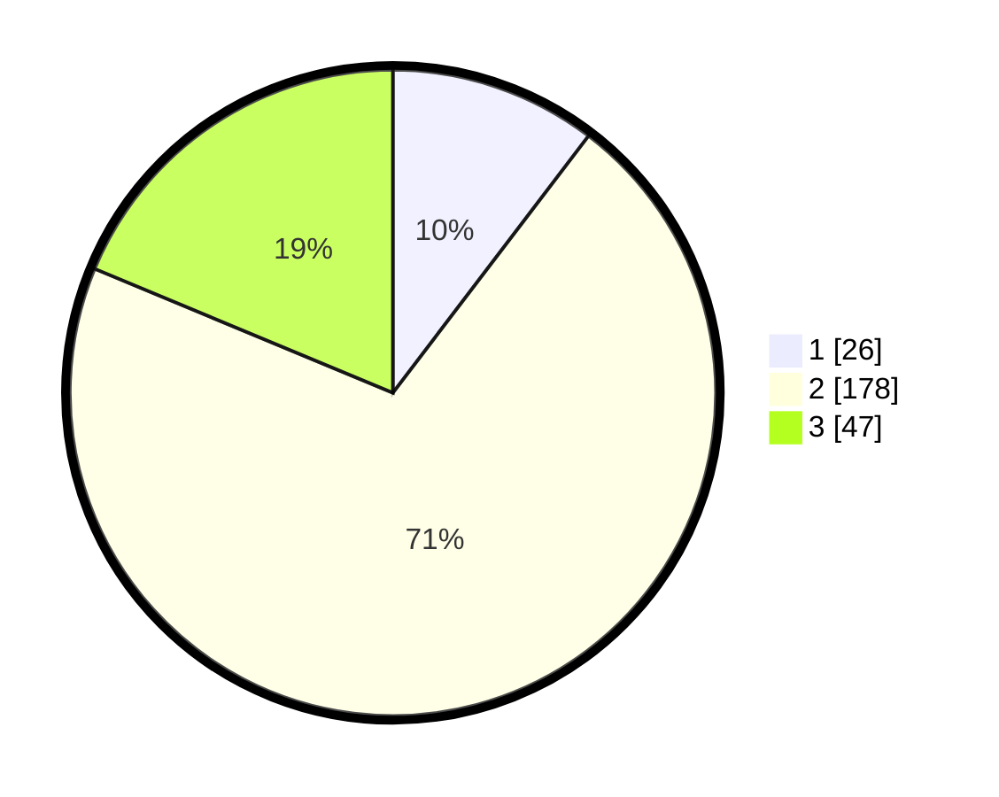

# Hasil

## Grafik

## Tabel

| No. | Nama Paslon    | Suara | Suara (raw) | Persentase |
|:--- |:-------------- | -----:| -----------:| ----------:|
| 1   | ANIES MUHAIMIN | 26    | [26][p-1]   | 10,36      |
| 2   | PRABOWO GIBRAN | 178   | [178][p-2]  | 70,92      |
| 3   | GANJAR MAHFUD  | 47    | [47][p-3]   | 18,73      |

[p-1]: https://github.com/gigit-pemilu/pemilu-2024-35-jawa-timur/blob/main/pilpres/hitung-suara/sub/35-jawa-timur/sub/74-kota-probolinggo/sub/05-kedopok/sub/1004-jrebeng-lor/sub/001-tps/sub/paslon-1.txt
[p-2]: https://github.com/gigit-pemilu/pemilu-2024-35-jawa-timur/blob/main/pilpres/hitung-suara/sub/35-jawa-timur/sub/74-kota-probolinggo/sub/05-kedopok/sub/1004-jrebeng-lor/sub/001-tps/sub/paslon-2.txt
[p-3]: https://github.com/gigit-pemilu/pemilu-2024-35-jawa-timur/blob/main/pilpres/hitung-suara/sub/35-jawa-timur/sub/74-kota-probolinggo/sub/05-kedopok/sub/1004-jrebeng-lor/sub/001-tps/sub/paslon-3.txt

## Foto C Plano

https://sirekap-obj-formc.kpu.go.id/f13f/pemilu/ppwp/35/74/05/10/04/3574051004001-20240217-140808--94563b0a-21b7-49c8-8683-5fd50bd5e59f.jpg

https://sirekap-obj-formc.kpu.go.id/f13f/pemilu/ppwp/35/74/05/10/04/3574051004001-20240217-140912--eac11cf6-aa46-4ada-967c-dbf9c49c4b7f.jpg

https://sirekap-obj-formc.kpu.go.id/f13f/pemilu/ppwp/35/74/05/10/04/3574051004001-20240217-141014--d5fa0054-b1ca-47b3-ba21-6448acaa2566.jpg

## Metadata

| Key        | Value               |
| ---------- | ------------------- |
| Time Stamp | 2024-02-25 14:00:00 |

