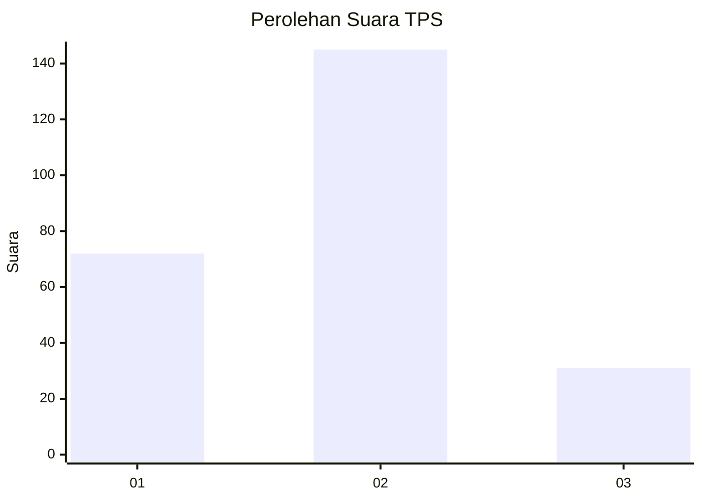
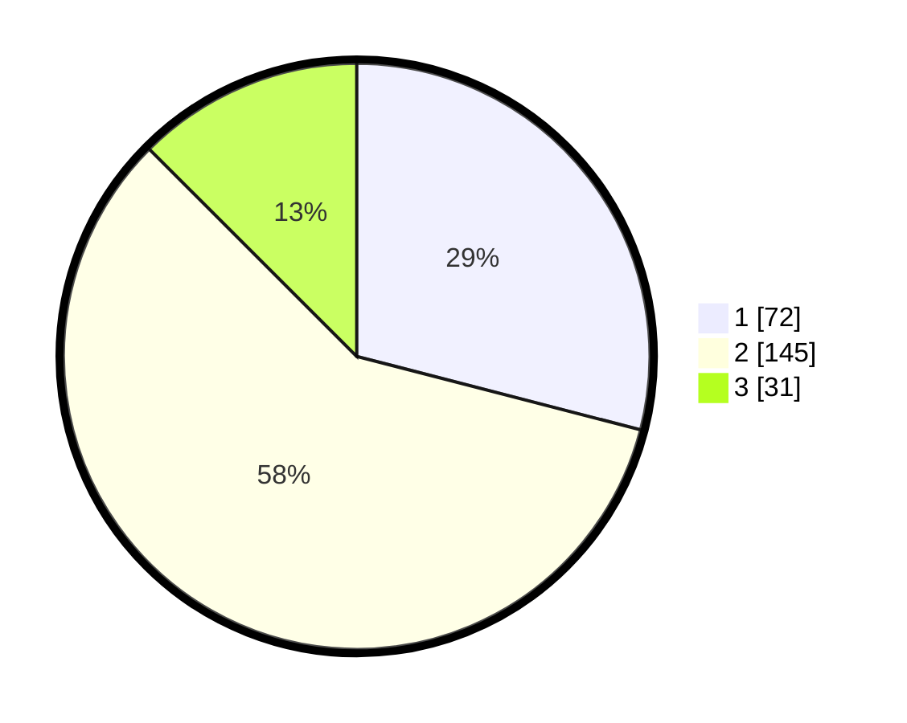

# Hasil

## Grafik

## Tabel

| No. | Nama Paslon    | Suara | Suara (raw) | Persentase |
|:--- |:-------------- | -----:| -----------:| ----------:|
| 1   | ANIES MUHAIMIN | 72    | [72][p-1]   | 29,03      |
| 2   | PRABOWO GIBRAN | 145   | [145][p-2]  | 58,47      |
| 3   | GANJAR MAHFUD  | 31    | [31][p-3]   | 12,50      |

[p-1]: https://github.com/gigit-pemilu/pemilu-2024-35-jawa-timur/blob/main/pilpres/hitung-suara/sub/35-jawa-timur/sub/75-kota-pasuruan/sub/02-purworejo/sub/1004-purutrejo/sub/011-tps/sub/paslon-1.txt
[p-2]: https://github.com/gigit-pemilu/pemilu-2024-35-jawa-timur/blob/main/pilpres/hitung-suara/sub/35-jawa-timur/sub/75-kota-pasuruan/sub/02-purworejo/sub/1004-purutrejo/sub/011-tps/sub/paslon-2.txt
[p-3]: https://github.com/gigit-pemilu/pemilu-2024-35-jawa-timur/blob/main/pilpres/hitung-suara/sub/35-jawa-timur/sub/75-kota-pasuruan/sub/02-purworejo/sub/1004-purutrejo/sub/011-tps/sub/paslon-3.txt

## Foto C Plano

https://sirekap-obj-formc.kpu.go.id/0484/pemilu/ppwp/35/75/02/10/04/3575021004011-20240214-205430--70929cbe-96d4-44e7-967b-4dfecee8977e.jpg

https://sirekap-obj-formc.kpu.go.id/0484/pemilu/ppwp/35/75/02/10/04/3575021004011-20240214-205013--2af57029-2936-434f-868d-8f3c2fe1b7ac.jpg

https://sirekap-obj-formc.kpu.go.id/0484/pemilu/ppwp/35/75/02/10/04/3575021004011-20240214-205543--2b7b0087-050a-4e7e-895e-5e7d5c0baadf.jpg

## Metadata

| Key        | Value               |
| ---------- | ------------------- |
| Time Stamp | 2024-02-16 01:00:27 |

