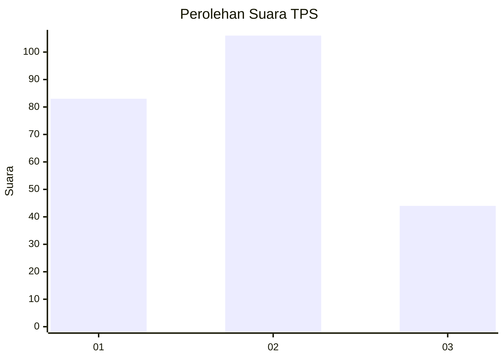
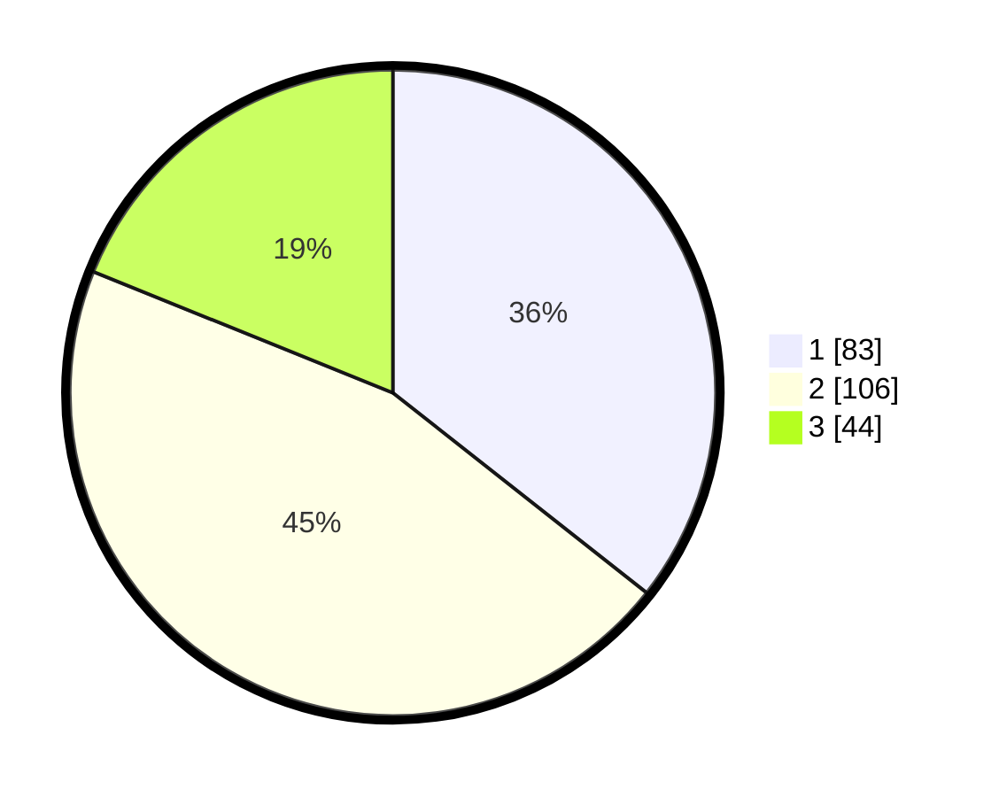

# Hasil

## Grafik

## Tabel

| No. | Nama Paslon    | Suara | Suara (raw) | Persentase |
|:--- |:-------------- | -----:| -----------:| ----------:|
| 1   | ANIES MUHAIMIN | 83    | [83][p-1]   | 35,62      |
| 2   | PRABOWO GIBRAN | 106   | [106][p-2]  | 45,49      |
| 3   | GANJAR MAHFUD  | 44    | [44][p-3]   | 18,88      |

[p-1]: https://github.com/gigit-pemilu/pemilu-2024/blob/main/pilpres/hitung-suara/sub/35-jawa-timur/sub/75-kota-pasuruan/sub/02-purworejo/sub/1004-purutrejo/sub/014-tps/sub/paslon-1.txt
[p-2]: https://github.com/gigit-pemilu/pemilu-2024/blob/main/pilpres/hitung-suara/sub/35-jawa-timur/sub/75-kota-pasuruan/sub/02-purworejo/sub/1004-purutrejo/sub/014-tps/sub/paslon-2.txt
[p-3]: https://github.com/gigit-pemilu/pemilu-2024/blob/main/pilpres/hitung-suara/sub/35-jawa-timur/sub/75-kota-pasuruan/sub/02-purworejo/sub/1004-purutrejo/sub/014-tps/sub/paslon-3.txt

## Foto C Plano

https://sirekap-obj-formc.kpu.go.id/187d/pemilu/ppwp/35/75/02/10/04/3575021004014-20240217-215559--77cc5d78-1aa7-46a1-b244-40bad5b709e7.jpg

https://sirekap-obj-formc.kpu.go.id/187d/pemilu/ppwp/35/75/02/10/04/3575021004014-20240217-002940--9cb518f5-a3cd-4eaa-945b-9aec147d1355.jpg

https://sirekap-obj-formc.kpu.go.id/187d/pemilu/ppwp/35/75/02/10/04/3575021004014-20240217-003117--ca5486e2-842d-480c-a8c2-154c506e397b.jpg

## Metadata

| Key        | Value               |
| ---------- | ------------------- |
| Time Stamp | 2024-02-19 06:16:00 |

