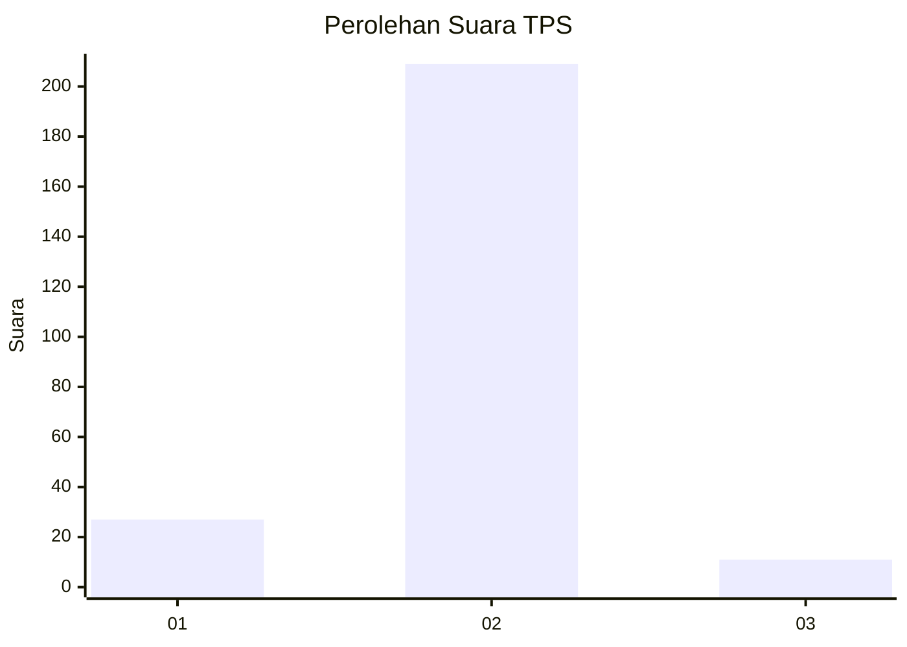
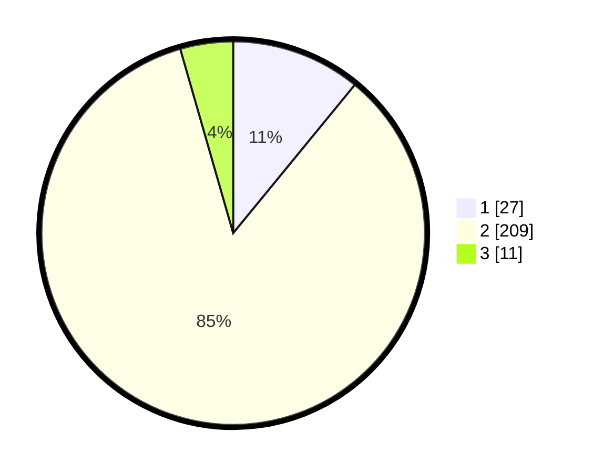

# Hasil

## Grafik

## Tabel

| No. | Nama Paslon    | Suara | Suara (raw) | Persentase |
|:--- |:-------------- | -----:| -----------:| ----------:|
| 1   | ANIES MUHAIMIN | 27    | [27][p-1]   | 10,93      |
| 2   | PRABOWO GIBRAN | 209   | [209][p-2]  | 84,62      |
| 3   | GANJAR MAHFUD  | 11    | [11][p-3]   | 4,45       |

[p-1]: https://github.com/gigit-pemilu/pemilu-2024-35-jawa-timur/blob/main/pilpres/hitung-suara/sub/35-jawa-timur/sub/76-kota-mojokerto/sub/02-magersari/sub/1003-magersari/sub/006-tps/sub/paslon-1.txt
[p-2]: https://github.com/gigit-pemilu/pemilu-2024-35-jawa-timur/blob/main/pilpres/hitung-suara/sub/35-jawa-timur/sub/76-kota-mojokerto/sub/02-magersari/sub/1003-magersari/sub/006-tps/sub/paslon-2.txt
[p-3]: https://github.com/gigit-pemilu/pemilu-2024-35-jawa-timur/blob/main/pilpres/hitung-suara/sub/35-jawa-timur/sub/76-kota-mojokerto/sub/02-magersari/sub/1003-magersari/sub/006-tps/sub/paslon-3.txt

## Foto C Plano

https://sirekap-obj-formc.kpu.go.id/a70b/pemilu/ppwp/35/76/02/10/03/3576021003006-20240229-113209--386b247d-865f-4d63-af7f-da3740ec7c7f.jpg

https://sirekap-obj-formc.kpu.go.id/a70b/pemilu/ppwp/35/76/02/10/03/3576021003006-20240214-204639--b21d17d4-8fdc-428d-a0f3-eb41b7bb44ff.jpg

https://sirekap-obj-formc.kpu.go.id/a70b/pemilu/ppwp/35/76/02/10/03/3576021003006-20240214-204642--d740064c-15ae-4588-936c-750598f53662.jpg

## Metadata

| Key        | Value               |
| ---------- | ------------------- |
| Time Stamp | 2024-02-29 12:00:00 |

