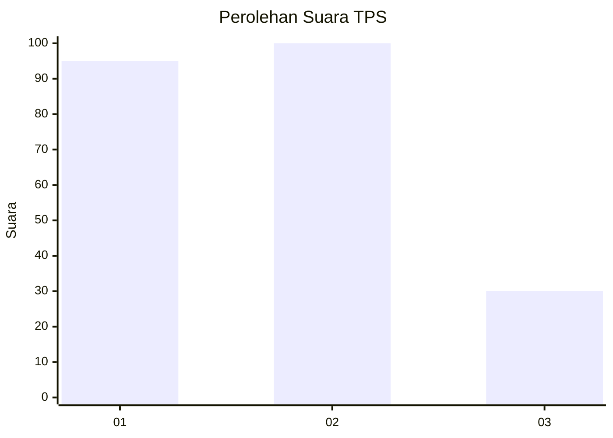
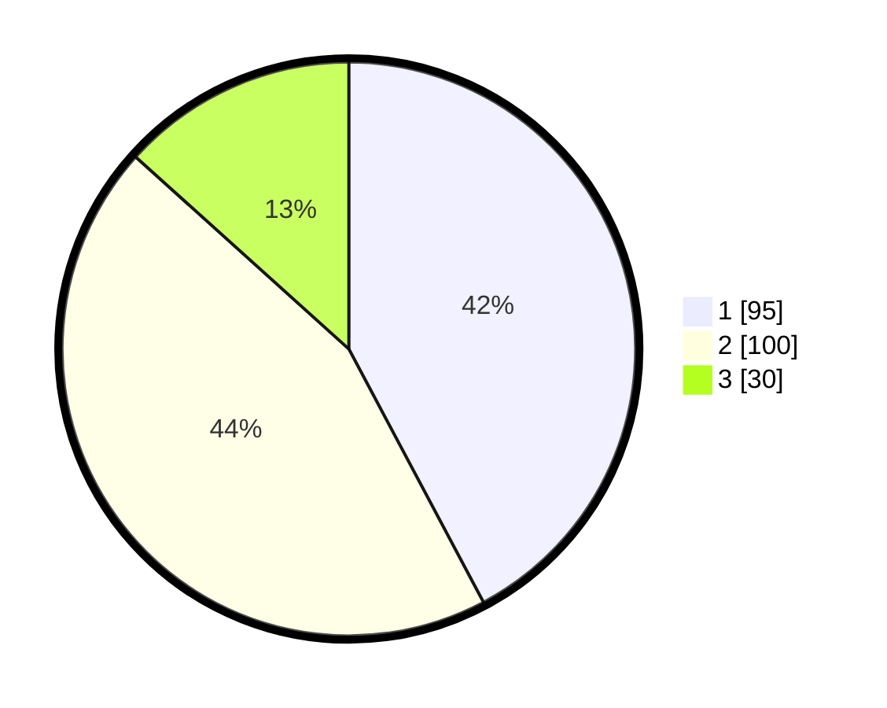

# Hasil

## Grafik

## Tabel

| No. | Nama Paslon    | Suara | Suara (raw) | Persentase |
|:--- |:-------------- | -----:| -----------:| ----------:|
| 1   | ANIES MUHAIMIN | 95    | [95][p-1]   | 42,22      |
| 2   | PRABOWO GIBRAN | 100   | [100][p-2]  | 44,44      |
| 3   | GANJAR MAHFUD  | 30    | [30][p-3]   | 13,33      |

[p-1]: https://github.com/gigit-pemilu/pemilu-2024-35-jawa-timur/blob/main/pilpres/hitung-suara/sub/35-jawa-timur/sub/76-kota-mojokerto/sub/03-kranggan/sub/1001-kranggan/sub/002-tps/sub/paslon-1.txt
[p-2]: https://github.com/gigit-pemilu/pemilu-2024-35-jawa-timur/blob/main/pilpres/hitung-suara/sub/35-jawa-timur/sub/76-kota-mojokerto/sub/03-kranggan/sub/1001-kranggan/sub/002-tps/sub/paslon-2.txt
[p-3]: https://github.com/gigit-pemilu/pemilu-2024-35-jawa-timur/blob/main/pilpres/hitung-suara/sub/35-jawa-timur/sub/76-kota-mojokerto/sub/03-kranggan/sub/1001-kranggan/sub/002-tps/sub/paslon-3.txt

## Foto C Plano

https://sirekap-obj-formc.kpu.go.id/4a3c/pemilu/ppwp/35/76/03/10/01/3576031001002-20240214-192226--010b2127-183c-4ab5-a54c-1c60809b6dc2.jpg

https://sirekap-obj-formc.kpu.go.id/4a3c/pemilu/ppwp/35/76/03/10/01/3576031001002-20240214-162212--66e5fa2f-b455-48f5-b9fa-c80c203464d9.jpg

https://sirekap-obj-formc.kpu.go.id/4a3c/pemilu/ppwp/35/76/03/10/01/3576031001002-20240214-192246--0fdfb80e-749f-4e73-aaf7-86bd8975591d.jpg

## Metadata

| Key        | Value               |
| ---------- | ------------------- |
| Time Stamp | 2024-02-15 15:00:29 |

