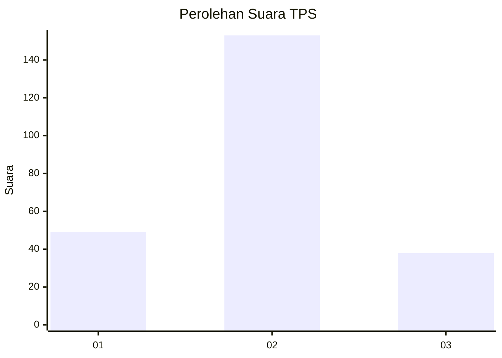

# Hasil

## Grafik

## Tabel

| No. | Nama Paslon    | Suara | Suara (raw) | Persentase |
|:--- |:-------------- | -----:| -----------:| ----------:|
| 1   | ANIES MUHAIMIN | 49    | [49][p-1]   | 20,42      |
| 2   | PRABOWO GIBRAN | 153   | [153][p-2]  | 63,75      |
| 3   | GANJAR MAHFUD  | 38    | [38][p-3]   | 15,83      |

[p-1]: https://github.com/gigit-pemilu/pemilu-2024-35-jawa-timur/blob/main/pilpres/hitung-suara/sub/35-jawa-timur/sub/76-kota-mojokerto/sub/03-kranggan/sub/1001-kranggan/sub/006-tps/sub/paslon-1.txt
[p-2]: https://github.com/gigit-pemilu/pemilu-2024-35-jawa-timur/blob/main/pilpres/hitung-suara/sub/35-jawa-timur/sub/76-kota-mojokerto/sub/03-kranggan/sub/1001-kranggan/sub/006-tps/sub/paslon-2.txt
[p-3]: https://github.com/gigit-pemilu/pemilu-2024-35-jawa-timur/blob/main/pilpres/hitung-suara/sub/35-jawa-timur/sub/76-kota-mojokerto/sub/03-kranggan/sub/1001-kranggan/sub/006-tps/sub/paslon-3.txt

## Foto C Plano

https://sirekap-obj-formc.kpu.go.id/b496/pemilu/ppwp/35/76/03/10/01/3576031001006-20240215-044841--f41ff6a9-239e-4e9c-96f1-434e325337d1.jpg

https://sirekap-obj-formc.kpu.go.id/b496/pemilu/ppwp/35/76/03/10/01/3576031001006-20240215-044919--b96bddfa-f989-4415-87e7-808869475f2a.jpg

https://sirekap-obj-formc.kpu.go.id/b496/pemilu/ppwp/35/76/03/10/01/3576031001006-20240215-044936--fa61ada3-bab5-459a-8ad4-6018dc332578.jpg

## Metadata

| Key        | Value               |
| ---------- | ------------------- |
| Time Stamp | 2024-02-15 15:00:29 |

