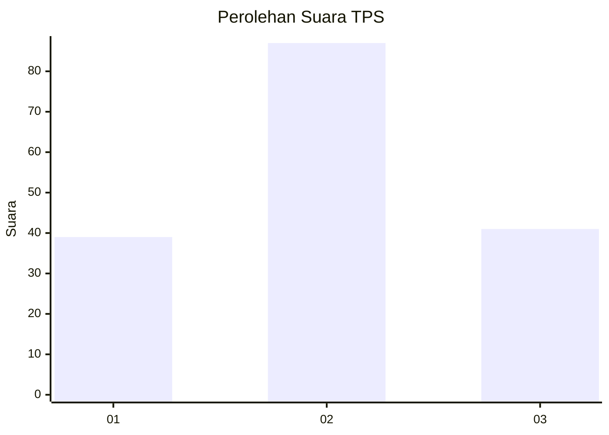
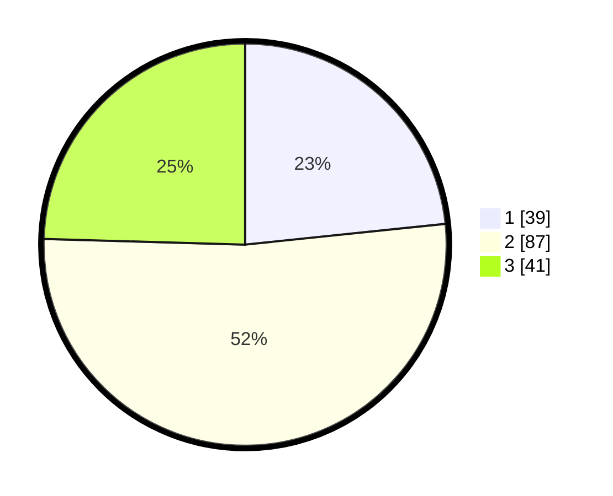

# Hasil

## Grafik

## Tabel

| No. | Nama Paslon    | Suara | Suara (raw) | Persentase |
|:--- |:-------------- | -----:| -----------:| ----------:|
| 1   | ANIES MUHAIMIN | 39    | [39][p-1]   | 23,35      |
| 2   | PRABOWO GIBRAN | 87    | [87][p-2]   | 52,10      |
| 3   | GANJAR MAHFUD  | 41    | [41][p-3]   | 24,55      |

[p-1]: https://github.com/gigit-pemilu/pemilu-2024-35-jawa-timur/blob/main/pilpres/hitung-suara/sub/35-jawa-timur/sub/76-kota-mojokerto/sub/03-kranggan/sub/1002-miji/sub/022-tps/sub/paslon-1.txt
[p-2]: https://github.com/gigit-pemilu/pemilu-2024-35-jawa-timur/blob/main/pilpres/hitung-suara/sub/35-jawa-timur/sub/76-kota-mojokerto/sub/03-kranggan/sub/1002-miji/sub/022-tps/sub/paslon-2.txt
[p-3]: https://github.com/gigit-pemilu/pemilu-2024-35-jawa-timur/blob/main/pilpres/hitung-suara/sub/35-jawa-timur/sub/76-kota-mojokerto/sub/03-kranggan/sub/1002-miji/sub/022-tps/sub/paslon-3.txt

## Foto C Plano

https://sirekap-obj-formc.kpu.go.id/1626/pemilu/ppwp/35/76/03/10/02/3576031002022-20240214-220032--d9cd4c36-cba1-4ed4-b1fc-86ac95ddf171.jpg

https://sirekap-obj-formc.kpu.go.id/1626/pemilu/ppwp/35/76/03/10/02/3576031002022-20240214-195259--58bb8d12-4ff3-4031-9192-2225b606de06.jpg

https://sirekap-obj-formc.kpu.go.id/1626/pemilu/ppwp/35/76/03/10/02/3576031002022-20240214-195334--a44d4a1e-9f33-414c-81fb-73020dfcee56.jpg

## Metadata

| Key        | Value               |
| ---------- | ------------------- |
| Time Stamp | 2024-02-15 22:00:27 |

