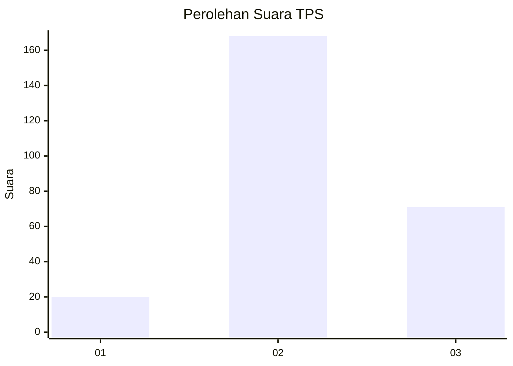

# Hasil

## Grafik

## Tabel

| No. | Nama Paslon    | Suara | Suara (raw) | Persentase |
|:--- |:-------------- | -----:| -----------:| ----------:|
| 1   | ANIES MUHAIMIN | 20    | [20][p-1]   | 7,72       |
| 2   | PRABOWO GIBRAN | 168   | [168][p-2]  | 64,86      |
| 3   | GANJAR MAHFUD  | 71    | [71][p-3]   | 27,41      |

[p-1]: https://github.com/gigit-pemilu/pemilu-2024-35-jawa-timur/blob/main/pilpres/hitung-suara/sub/35-jawa-timur/sub/76-kota-mojokerto/sub/03-kranggan/sub/1003-meri/sub/013-tps/sub/paslon-1.txt
[p-2]: https://github.com/gigit-pemilu/pemilu-2024-35-jawa-timur/blob/main/pilpres/hitung-suara/sub/35-jawa-timur/sub/76-kota-mojokerto/sub/03-kranggan/sub/1003-meri/sub/013-tps/sub/paslon-2.txt
[p-3]: https://github.com/gigit-pemilu/pemilu-2024-35-jawa-timur/blob/main/pilpres/hitung-suara/sub/35-jawa-timur/sub/76-kota-mojokerto/sub/03-kranggan/sub/1003-meri/sub/013-tps/sub/paslon-3.txt

## Foto C Plano

https://sirekap-obj-formc.kpu.go.id/1f69/pemilu/ppwp/35/76/03/10/03/3576031003013-20240214-204324--b4f7b804-c3d4-48da-9c98-d9aae5d90f97.jpg

https://sirekap-obj-formc.kpu.go.id/1f69/pemilu/ppwp/35/76/03/10/03/3576031003013-20240214-204502--6c4f7dee-2d47-4434-a62b-45723b0ad156.jpg

https://sirekap-obj-formc.kpu.go.id/1f69/pemilu/ppwp/35/76/03/10/03/3576031003013-20240214-223510--79b9e2b3-5470-4c7b-9b56-b60d47cd2331.jpg

## Metadata

| Key        | Value               |
| ---------- | ------------------- |
| Time Stamp | 2024-02-25 18:00:00 |

