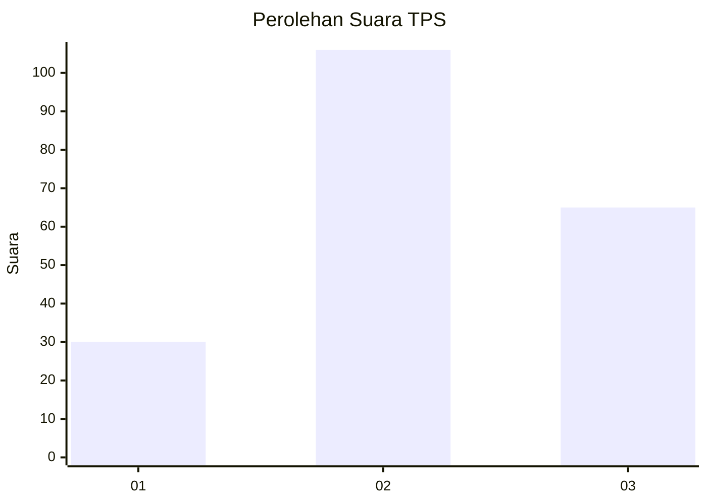
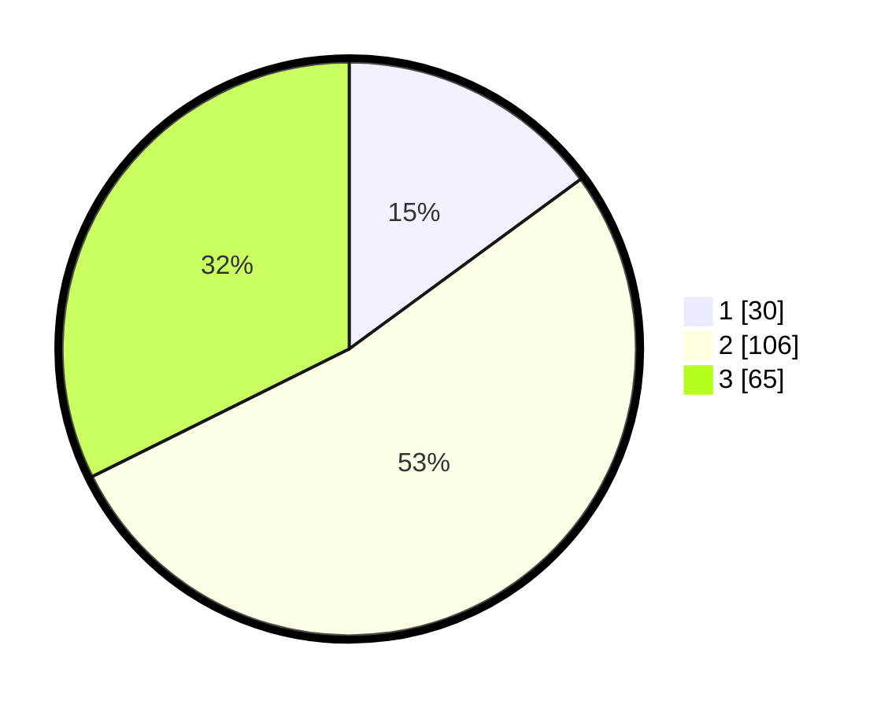

# Hasil

## Grafik

## Tabel

| No. | Nama Paslon    | Suara | Suara (raw) | Persentase |
|:--- |:-------------- | -----:| -----------:| ----------:|
| 1   | ANIES MUHAIMIN | 30    | [30][p-1]   | 14,93      |
| 2   | PRABOWO GIBRAN | 106   | [106][p-2]  | 52,74      |
| 3   | GANJAR MAHFUD  | 65    | [65][p-3]   | 32,34      |

[p-1]: https://github.com/gigit-pemilu/pemilu-2024-35-jawa-timur/blob/main/pilpres/hitung-suara/sub/35-jawa-timur/sub/77-kota-madiun/sub/01-kartoharjo/sub/1001-oro-oro-ombo/sub/005-tps/sub/paslon-1.txt
[p-2]: https://github.com/gigit-pemilu/pemilu-2024-35-jawa-timur/blob/main/pilpres/hitung-suara/sub/35-jawa-timur/sub/77-kota-madiun/sub/01-kartoharjo/sub/1001-oro-oro-ombo/sub/005-tps/sub/paslon-2.txt
[p-3]: https://github.com/gigit-pemilu/pemilu-2024-35-jawa-timur/blob/main/pilpres/hitung-suara/sub/35-jawa-timur/sub/77-kota-madiun/sub/01-kartoharjo/sub/1001-oro-oro-ombo/sub/005-tps/sub/paslon-3.txt

## Foto C Plano

https://sirekap-obj-formc.kpu.go.id/2856/pemilu/ppwp/35/77/01/10/01/3577011001005-20240214-184500--c5b1da4e-4f65-440a-907c-85768e94b2aa.jpg

https://sirekap-obj-formc.kpu.go.id/2856/pemilu/ppwp/35/77/01/10/01/3577011001005-20240214-191226--61525d6e-76b9-4fc8-b647-00d6ba68a02f.jpg

https://sirekap-obj-formc.kpu.go.id/2856/pemilu/ppwp/35/77/01/10/01/3577011001005-20240214-192505--31e417bb-19e0-4508-9691-b2b0b4504216.jpg

## Metadata

| Key        | Value               |
| ---------- | ------------------- |
| Time Stamp | 2024-02-14 21:46:01 |

