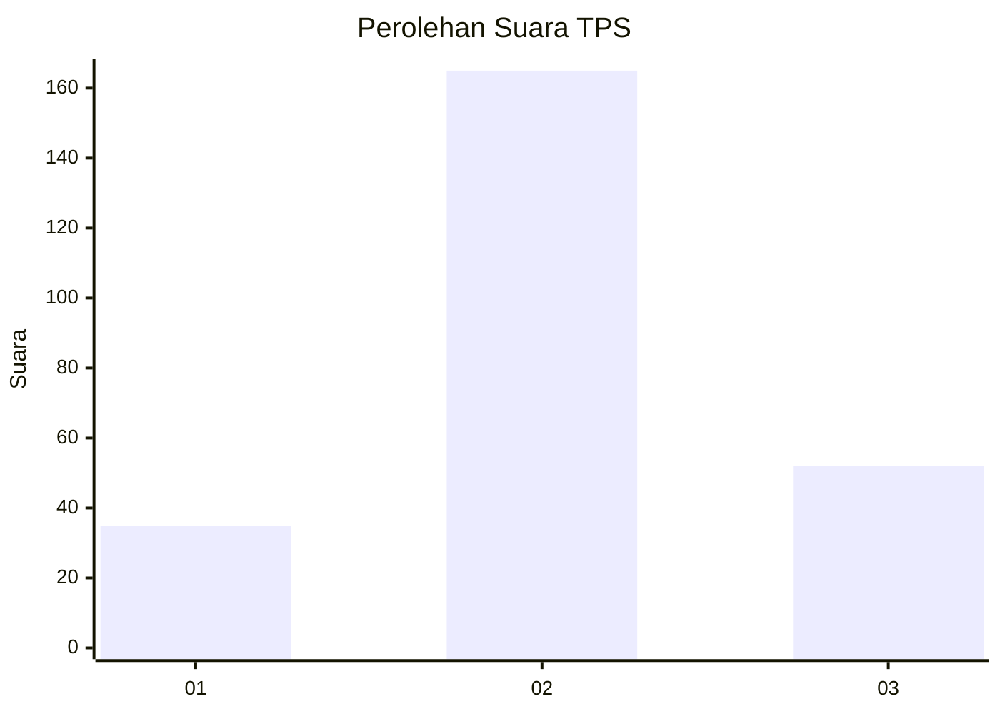
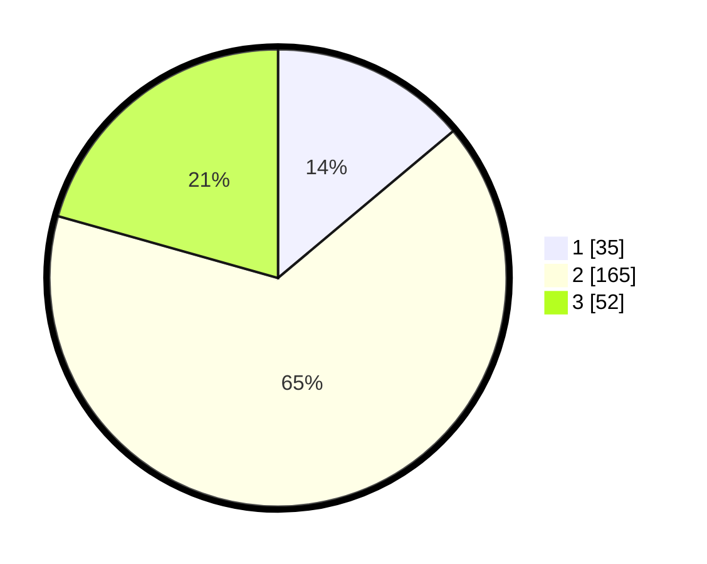

# Hasil

## Grafik

## Tabel

| No. | Nama Paslon    | Suara | Suara (raw) | Persentase |
|:--- |:-------------- | -----:| -----------:| ----------:|
| 1   | ANIES MUHAIMIN | 35    | [35][p-1]   | 13,89      |
| 2   | PRABOWO GIBRAN | 165   | [165][p-2]  | 65,48      |
| 3   | GANJAR MAHFUD  | 52    | [52][p-3]   | 20,63      |

[p-1]: https://github.com/gigit-pemilu/pemilu-2024/blob/main/pilpres/hitung-suara/sub/35-jawa-timur/sub/77-kota-madiun/sub/01-kartoharjo/sub/1005-pilangbango/sub/003-tps/sub/paslon-1.txt
[p-2]: https://github.com/gigit-pemilu/pemilu-2024/blob/main/pilpres/hitung-suara/sub/35-jawa-timur/sub/77-kota-madiun/sub/01-kartoharjo/sub/1005-pilangbango/sub/003-tps/sub/paslon-2.txt
[p-3]: https://github.com/gigit-pemilu/pemilu-2024/blob/main/pilpres/hitung-suara/sub/35-jawa-timur/sub/77-kota-madiun/sub/01-kartoharjo/sub/1005-pilangbango/sub/003-tps/sub/paslon-3.txt

## Foto C Plano

https://sirekap-obj-formc.kpu.go.id/cef6/pemilu/ppwp/35/77/01/10/05/3577011005003-20240215-050757--efa72269-2b96-4a83-bd6a-f6757bd841c0.jpg

https://sirekap-obj-formc.kpu.go.id/cef6/pemilu/ppwp/35/77/01/10/05/3577011005003-20240215-050859--82bf9a86-7d30-43ad-a28e-ee0808b8d55c.jpg

https://sirekap-obj-formc.kpu.go.id/cef6/pemilu/ppwp/35/77/01/10/05/3577011005003-20240215-051834--9dbd38a8-ba1b-4117-82b0-a192c79ddbcd.jpg

## Metadata

| Key        | Value               |
| ---------- | ------------------- |
| Time Stamp | 2024-02-15 21:30:27 |

