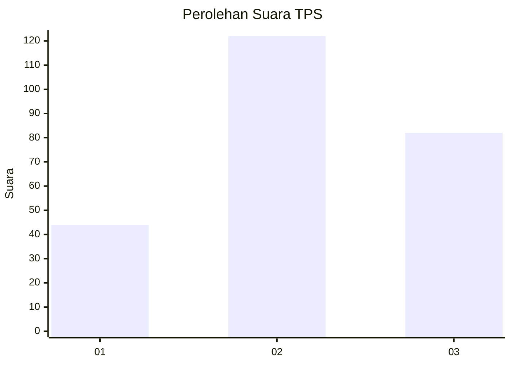
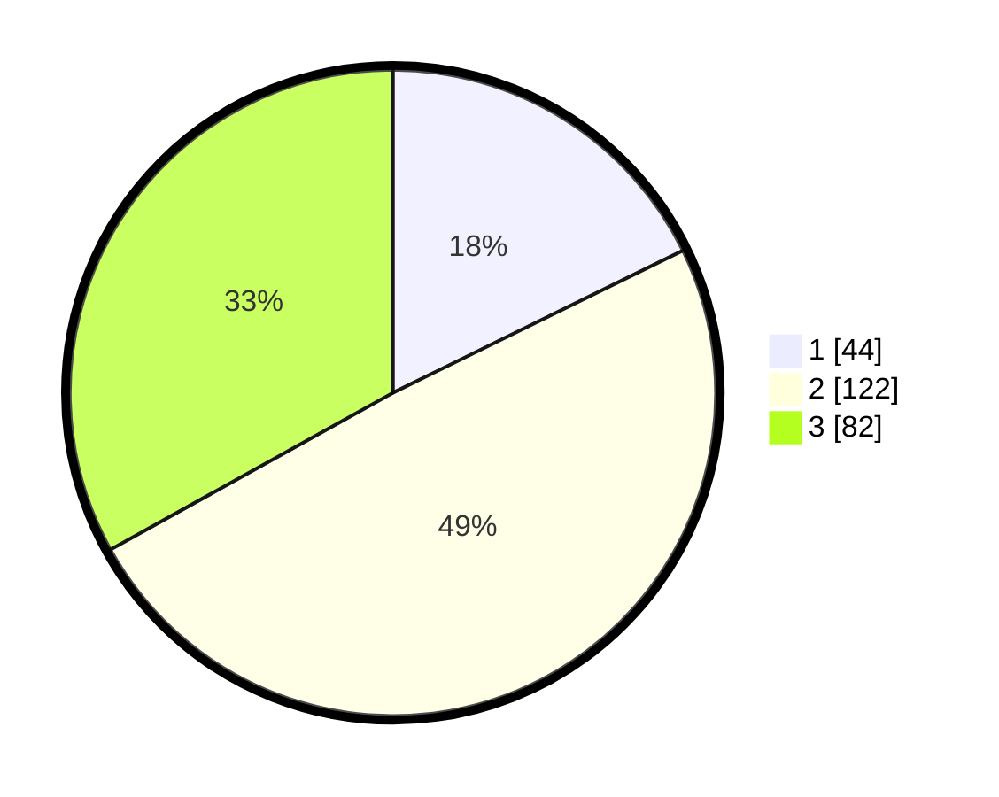

# Hasil

## Grafik

## Tabel

| No. | Nama Paslon    | Suara | Suara (raw) | Persentase |
|:--- |:-------------- | -----:| -----------:| ----------:|
| 1   | ANIES MUHAIMIN | 44    | [44][p-1]   | 17,74      |
| 2   | PRABOWO GIBRAN | 122   | [122][p-2]  | 49,19      |
| 3   | GANJAR MAHFUD  | 82    | [82][p-3]   | 33,06      |

[p-1]: https://github.com/gigit-pemilu/pemilu-2024-35-jawa-timur/blob/main/pilpres/hitung-suara/sub/35-jawa-timur/sub/77-kota-madiun/sub/01-kartoharjo/sub/1007-kanigoro/sub/022-tps/sub/paslon-1.txt
[p-2]: https://github.com/gigit-pemilu/pemilu-2024-35-jawa-timur/blob/main/pilpres/hitung-suara/sub/35-jawa-timur/sub/77-kota-madiun/sub/01-kartoharjo/sub/1007-kanigoro/sub/022-tps/sub/paslon-2.txt
[p-3]: https://github.com/gigit-pemilu/pemilu-2024-35-jawa-timur/blob/main/pilpres/hitung-suara/sub/35-jawa-timur/sub/77-kota-madiun/sub/01-kartoharjo/sub/1007-kanigoro/sub/022-tps/sub/paslon-3.txt

## Foto C Plano

https://sirekap-obj-formc.kpu.go.id/881e/pemilu/ppwp/35/77/01/10/07/3577011007022-20240215-020257--e6a38a9c-29f0-4682-97b1-d1150d78b1a6.jpg

https://sirekap-obj-formc.kpu.go.id/881e/pemilu/ppwp/35/77/01/10/07/3577011007022-20240215-020259--08eb4319-4286-474d-ad92-86192365d87b.jpg

https://sirekap-obj-formc.kpu.go.id/881e/pemilu/ppwp/35/77/01/10/07/3577011007022-20240215-020301--aa8f3e59-3df4-4b74-8772-8b24c2ce379c.jpg

## Metadata

| Key        | Value               |
| ---------- | ------------------- |
| Time Stamp | 2024-02-15 21:30:27 |

