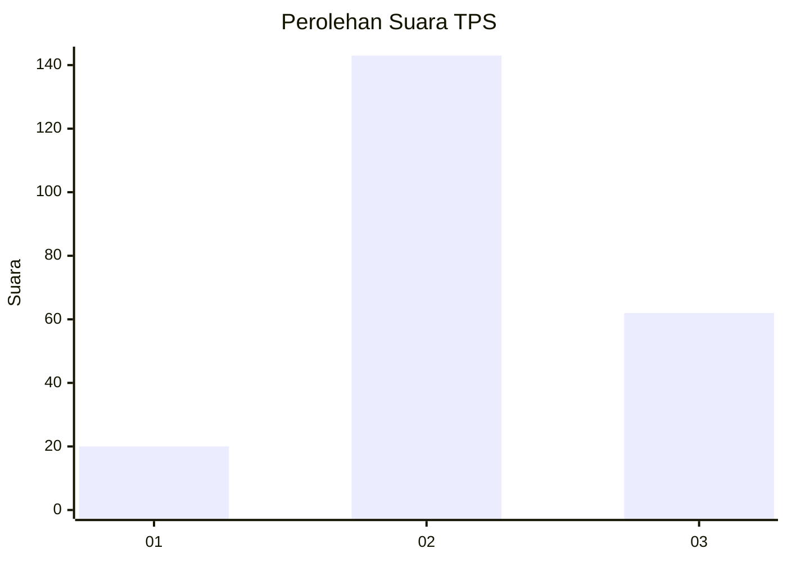
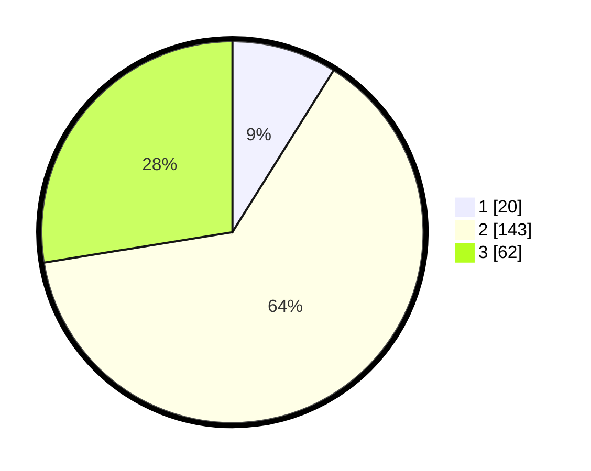

# Hasil

## Grafik

## Tabel

| No. | Nama Paslon    | Suara | Suara (raw) | Persentase |
|:--- |:-------------- | -----:| -----------:| ----------:|
| 1   | ANIES MUHAIMIN | 20    | [20][p-1]   | 8,89       |
| 2   | PRABOWO GIBRAN | 143   | [143][p-2]  | 63,56      |
| 3   | GANJAR MAHFUD  | 62    | [62][p-3]   | 27,56      |

[p-1]: https://github.com/gigit-pemilu/pemilu-2024-35-jawa-timur/blob/main/pilpres/hitung-suara/sub/35-jawa-timur/sub/77-kota-madiun/sub/02-manguharjo/sub/1001-manguharjo/sub/002-tps/sub/paslon-1.txt
[p-2]: https://github.com/gigit-pemilu/pemilu-2024-35-jawa-timur/blob/main/pilpres/hitung-suara/sub/35-jawa-timur/sub/77-kota-madiun/sub/02-manguharjo/sub/1001-manguharjo/sub/002-tps/sub/paslon-2.txt
[p-3]: https://github.com/gigit-pemilu/pemilu-2024-35-jawa-timur/blob/main/pilpres/hitung-suara/sub/35-jawa-timur/sub/77-kota-madiun/sub/02-manguharjo/sub/1001-manguharjo/sub/002-tps/sub/paslon-3.txt

## Foto C Plano

https://sirekap-obj-formc.kpu.go.id/fbac/pemilu/ppwp/35/77/02/10/01/3577021001002-20240220-110123--547c4531-4e15-49c2-b11a-19004e536d89.jpg

https://sirekap-obj-formc.kpu.go.id/fbac/pemilu/ppwp/35/77/02/10/01/3577021001002-20240220-110228--e761af9e-ff28-4a00-a48c-6f4cea04bec2.jpg

https://sirekap-obj-formc.kpu.go.id/fbac/pemilu/ppwp/35/77/02/10/01/3577021001002-20240220-110307--3cea148d-a230-41f6-8afc-884818e2c0e2.jpg

## Metadata

| Key        | Value               |
| ---------- | ------------------- |
| Time Stamp | 2024-02-20 14:00:00 |

