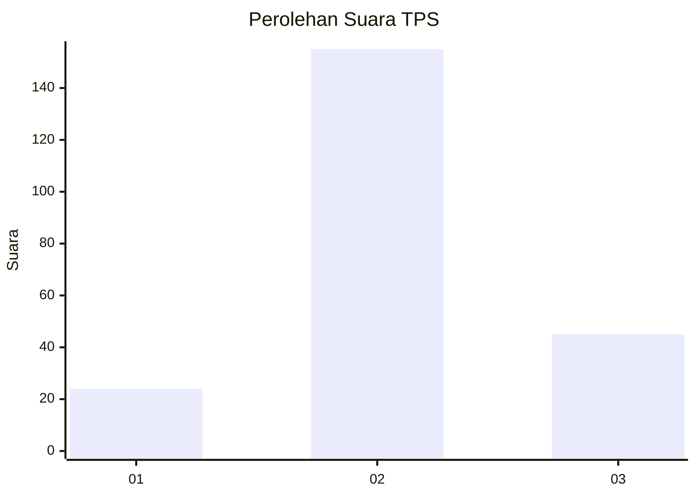
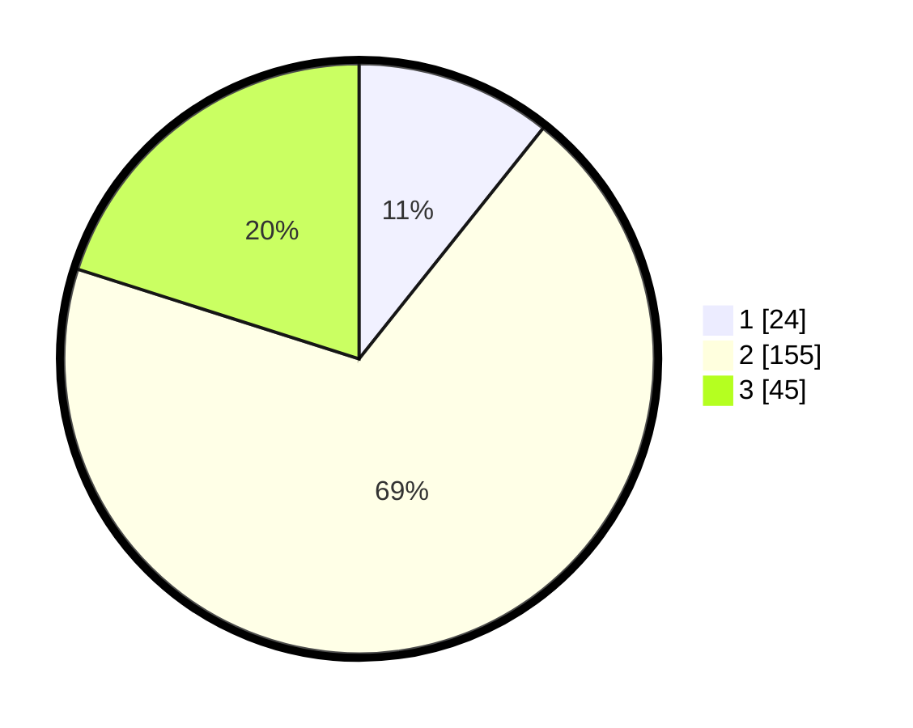

# Hasil

## Grafik

## Tabel

| No. | Nama Paslon    | Suara | Suara (raw) | Persentase |
|:--- |:-------------- | -----:| -----------:| ----------:|
| 1   | ANIES MUHAIMIN | 24    | [24][p-1]   | 10,71      |
| 2   | PRABOWO GIBRAN | 155   | [155][p-2]  | 69,20      |
| 3   | GANJAR MAHFUD  | 45    | [45][p-3]   | 20,09      |

[p-1]: https://github.com/gigit-pemilu/pemilu-2024-35-jawa-timur/blob/main/pilpres/hitung-suara/sub/35-jawa-timur/sub/77-kota-madiun/sub/02-manguharjo/sub/1001-manguharjo/sub/003-tps/sub/paslon-1.txt
[p-2]: https://github.com/gigit-pemilu/pemilu-2024-35-jawa-timur/blob/main/pilpres/hitung-suara/sub/35-jawa-timur/sub/77-kota-madiun/sub/02-manguharjo/sub/1001-manguharjo/sub/003-tps/sub/paslon-2.txt
[p-3]: https://github.com/gigit-pemilu/pemilu-2024-35-jawa-timur/blob/main/pilpres/hitung-suara/sub/35-jawa-timur/sub/77-kota-madiun/sub/02-manguharjo/sub/1001-manguharjo/sub/003-tps/sub/paslon-3.txt

## Foto C Plano

https://sirekap-obj-formc.kpu.go.id/9279/pemilu/ppwp/35/77/02/10/01/3577021001003-20240220-110606--7cac8413-6fc9-4dc2-ade6-09b7ad2d3179.jpg

https://sirekap-obj-formc.kpu.go.id/9279/pemilu/ppwp/35/77/02/10/01/3577021001003-20240220-110657--73067c30-2d74-481a-b496-3733b57b64b4.jpg

https://sirekap-obj-formc.kpu.go.id/9279/pemilu/ppwp/35/77/02/10/01/3577021001003-20240220-110741--0a76f426-026c-4eca-9cc6-3fd1c836083a.jpg

## Metadata

| Key        | Value               |
| ---------- | ------------------- |
| Time Stamp | 2024-02-20 14:00:00 |

