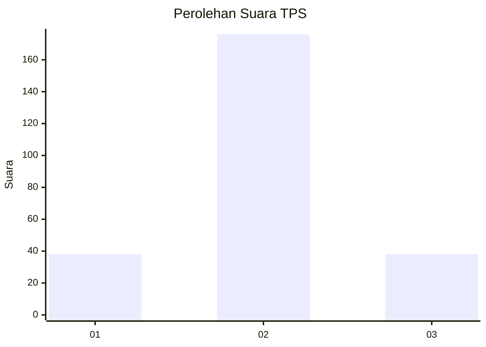

# Hasil

## Grafik

## Tabel

| No. | Nama Paslon    | Suara | Suara (raw) | Persentase |
|:--- |:-------------- | -----:| -----------:| ----------:|
| 1   | ANIES MUHAIMIN | 38    | [38][p-1]   | 15,08      |
| 2   | PRABOWO GIBRAN | 176   | [176][p-2]  | 69,84      |
| 3   | GANJAR MAHFUD  | 38    | [38][p-3]   | 15,08      |

[p-1]: https://github.com/gigit-pemilu/pemilu-2024-35-jawa-timur/blob/main/pilpres/hitung-suara/sub/35-jawa-timur/sub/77-kota-madiun/sub/02-manguharjo/sub/1001-manguharjo/sub/005-tps/sub/paslon-1.txt
[p-2]: https://github.com/gigit-pemilu/pemilu-2024-35-jawa-timur/blob/main/pilpres/hitung-suara/sub/35-jawa-timur/sub/77-kota-madiun/sub/02-manguharjo/sub/1001-manguharjo/sub/005-tps/sub/paslon-2.txt
[p-3]: https://github.com/gigit-pemilu/pemilu-2024-35-jawa-timur/blob/main/pilpres/hitung-suara/sub/35-jawa-timur/sub/77-kota-madiun/sub/02-manguharjo/sub/1001-manguharjo/sub/005-tps/sub/paslon-3.txt

## Foto C Plano

https://sirekap-obj-formc.kpu.go.id/b640/pemilu/ppwp/35/77/02/10/01/3577021001005-20240220-111624--71c9072a-bbc8-4b25-be9a-f5084f242687.jpg

https://sirekap-obj-formc.kpu.go.id/b640/pemilu/ppwp/35/77/02/10/01/3577021001005-20240220-111723--b059d0e1-0703-4cac-84cb-4ecae9d08436.jpg

https://sirekap-obj-formc.kpu.go.id/b640/pemilu/ppwp/35/77/02/10/01/3577021001005-20240220-111821--4bb7bdf8-6434-48ba-a651-f3a18f183069.jpg

## Metadata

| Key        | Value               |
| ---------- | ------------------- |
| Time Stamp | 2024-02-20 14:00:00 |

