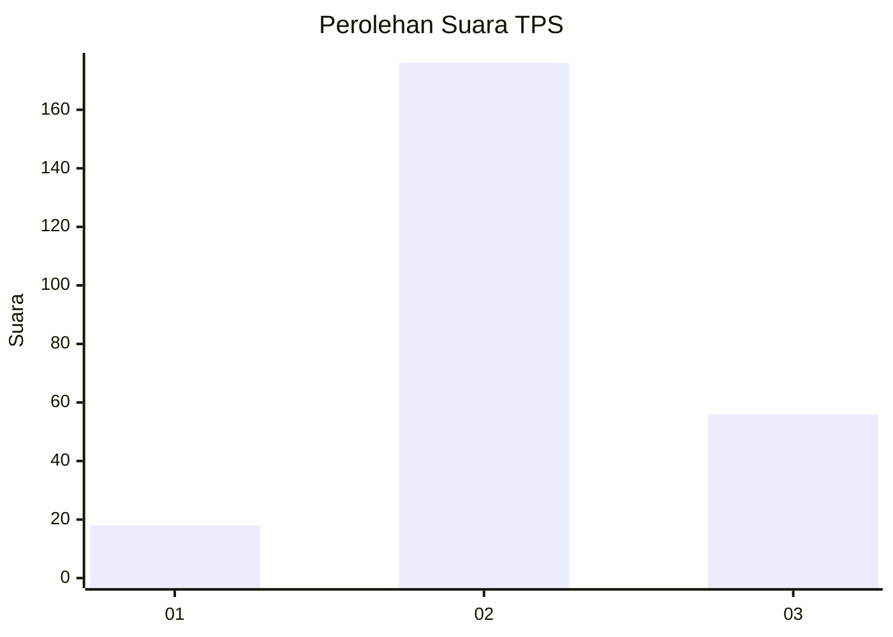
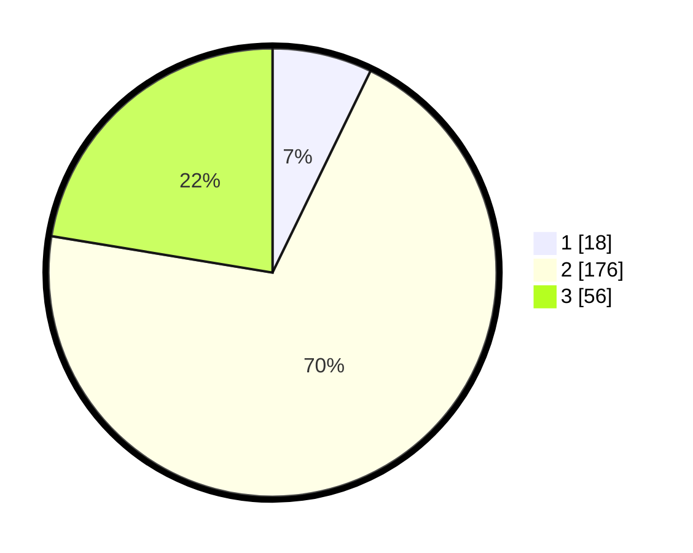

# Hasil

## Grafik

## Tabel

| No. | Nama Paslon    | Suara | Suara (raw) | Persentase |
|:--- |:-------------- | -----:| -----------:| ----------:|
| 1   | ANIES MUHAIMIN | 18    | [18][p-1]   | 7,20       |
| 2   | PRABOWO GIBRAN | 176   | [176][p-2]  | 70,40      |
| 3   | GANJAR MAHFUD  | 56    | [56][p-3]   | 22,40      |

[p-1]: https://github.com/gigit-pemilu/pemilu-2024/blob/main/pilpres/hitung-suara/sub/35-jawa-timur/sub/77-kota-madiun/sub/02-manguharjo/sub/1001-manguharjo/sub/006-tps/sub/paslon-1.txt
[p-2]: https://github.com/gigit-pemilu/pemilu-2024/blob/main/pilpres/hitung-suara/sub/35-jawa-timur/sub/77-kota-madiun/sub/02-manguharjo/sub/1001-manguharjo/sub/006-tps/sub/paslon-2.txt
[p-3]: https://github.com/gigit-pemilu/pemilu-2024/blob/main/pilpres/hitung-suara/sub/35-jawa-timur/sub/77-kota-madiun/sub/02-manguharjo/sub/1001-manguharjo/sub/006-tps/sub/paslon-3.txt

## Foto C Plano

https://sirekap-obj-formc.kpu.go.id/9f72/pemilu/ppwp/35/77/02/10/01/3577021001006-20240220-112414--b5a6db3d-da31-4618-8a84-f951e9d180ad.jpg

https://sirekap-obj-formc.kpu.go.id/9f72/pemilu/ppwp/35/77/02/10/01/3577021001006-20240220-112717--f7aec934-f339-4a6f-8c10-362e03178cda.jpg

https://sirekap-obj-formc.kpu.go.id/9f72/pemilu/ppwp/35/77/02/10/01/3577021001006-20240220-112801--05614bb1-64e6-469c-beb0-1471bcaf914b.jpg

## Metadata

| Key        | Value               |
| ---------- | ------------------- |
| Time Stamp | 2024-02-20 14:00:00 |

