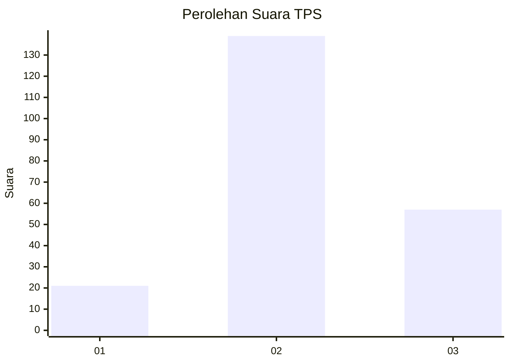
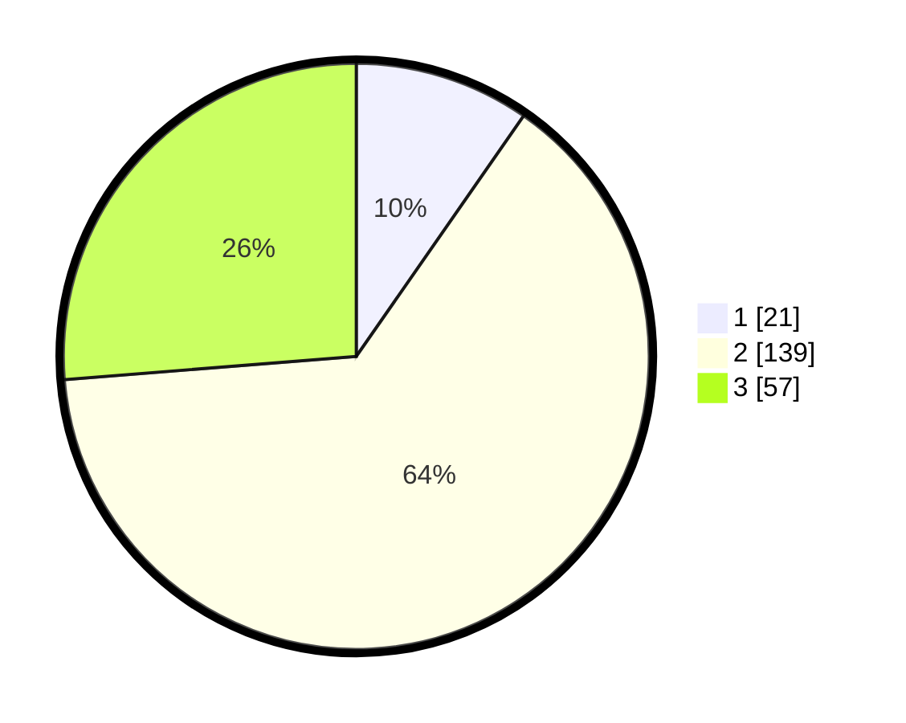

# Hasil

## Grafik

## Tabel

| No. | Nama Paslon    | Suara | Suara (raw) | Persentase |
|:--- |:-------------- | -----:| -----------:| ----------:|
| 1   | ANIES MUHAIMIN | 21    | [21][p-1]   | 9,68       |
| 2   | PRABOWO GIBRAN | 139   | [139][p-2]  | 64,06      |
| 3   | GANJAR MAHFUD  | 57    | [57][p-3]   | 26,27      |

[p-1]: https://github.com/gigit-pemilu/pemilu-2024/blob/main/pilpres/hitung-suara/sub/35-jawa-timur/sub/77-kota-madiun/sub/03-taman/sub/1001-mojorejo/sub/003-tps/sub/paslon-1.txt
[p-2]: https://github.com/gigit-pemilu/pemilu-2024/blob/main/pilpres/hitung-suara/sub/35-jawa-timur/sub/77-kota-madiun/sub/03-taman/sub/1001-mojorejo/sub/003-tps/sub/paslon-2.txt
[p-3]: https://github.com/gigit-pemilu/pemilu-2024/blob/main/pilpres/hitung-suara/sub/35-jawa-timur/sub/77-kota-madiun/sub/03-taman/sub/1001-mojorejo/sub/003-tps/sub/paslon-3.txt

## Foto C Plano

https://sirekap-obj-formc.kpu.go.id/9896/pemilu/ppwp/35/77/03/10/01/3577031001003-20240214-222044--3a6027a1-b36e-41e7-865a-a1a1eb099a1c.jpg

https://sirekap-obj-formc.kpu.go.id/9896/pemilu/ppwp/35/77/03/10/01/3577031001003-20240214-222450--57cde39a-2b01-41bd-a7d2-7e45f9b779ca.jpg

https://sirekap-obj-formc.kpu.go.id/9896/pemilu/ppwp/35/77/03/10/01/3577031001003-20240214-222640--c8987062-5959-456d-8be9-35d951dbfe63.jpg

## Metadata

| Key        | Value               |
| ---------- | ------------------- |
| Time Stamp | 2024-02-15 15:30:25 |

