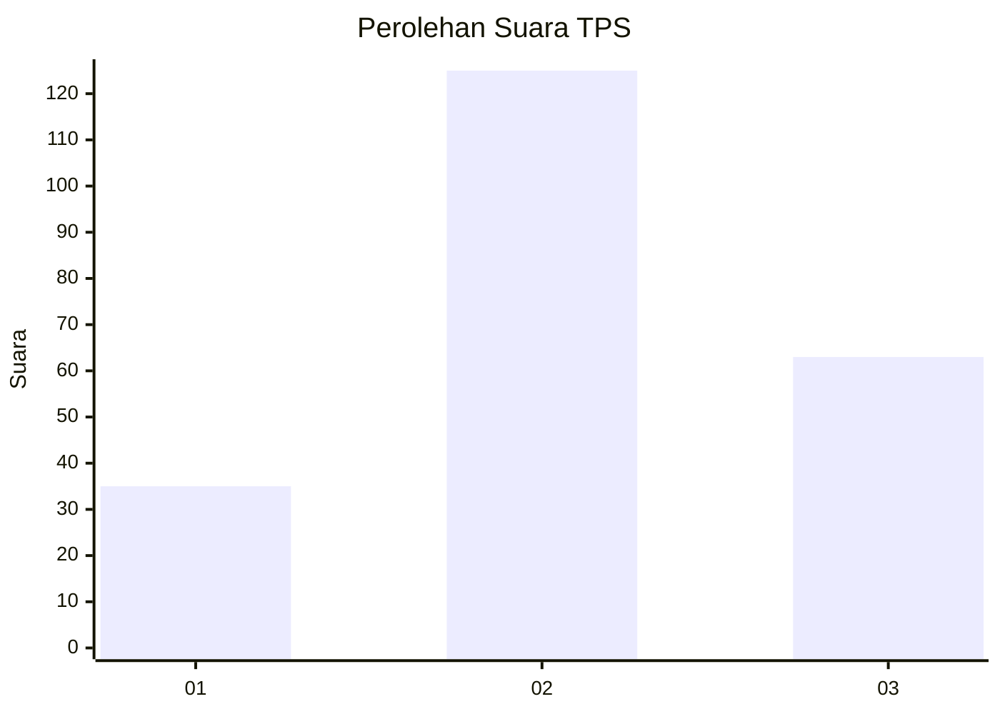
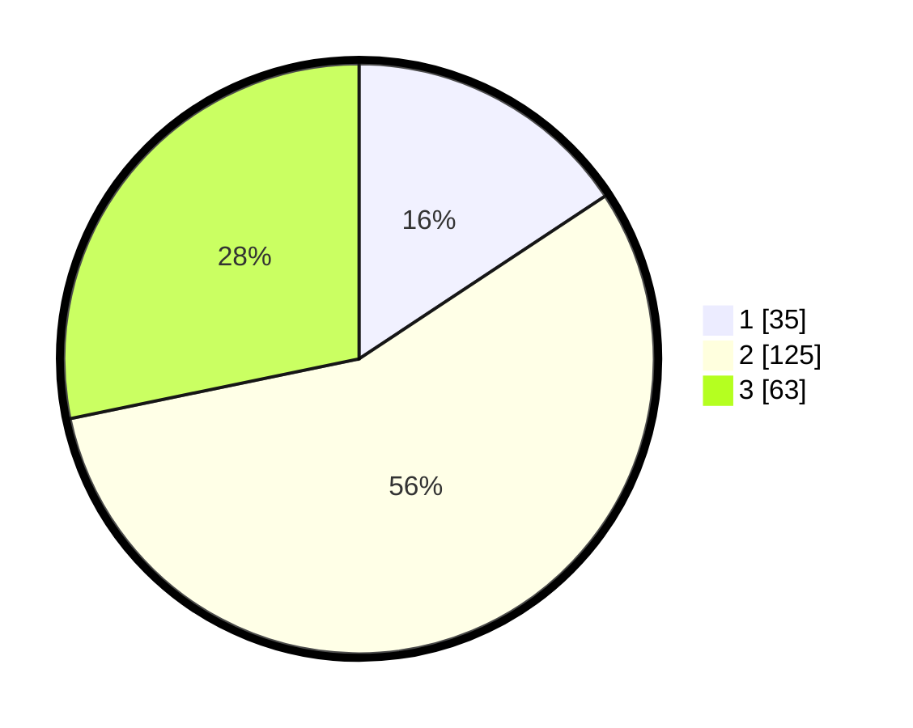

# Hasil

## Grafik

## Tabel

| No. | Nama Paslon    | Suara | Suara (raw) | Persentase |
|:--- |:-------------- | -----:| -----------:| ----------:|
| 1   | ANIES MUHAIMIN | 35    | [35][p-1]   | 15,70      |
| 2   | PRABOWO GIBRAN | 125   | [125][p-2]  | 56,05      |
| 3   | GANJAR MAHFUD  | 63    | [63][p-3]   | 28,25      |

[p-1]: https://github.com/gigit-pemilu/pemilu-2024-35-jawa-timur/blob/main/pilpres/hitung-suara/sub/35-jawa-timur/sub/77-kota-madiun/sub/03-taman/sub/1001-mojorejo/sub/004-tps/sub/paslon-1.txt
[p-2]: https://github.com/gigit-pemilu/pemilu-2024-35-jawa-timur/blob/main/pilpres/hitung-suara/sub/35-jawa-timur/sub/77-kota-madiun/sub/03-taman/sub/1001-mojorejo/sub/004-tps/sub/paslon-2.txt
[p-3]: https://github.com/gigit-pemilu/pemilu-2024-35-jawa-timur/blob/main/pilpres/hitung-suara/sub/35-jawa-timur/sub/77-kota-madiun/sub/03-taman/sub/1001-mojorejo/sub/004-tps/sub/paslon-3.txt

## Foto C Plano

https://sirekap-obj-formc.kpu.go.id/6e80/pemilu/ppwp/35/77/03/10/01/3577031001004-20240215-022631--6f239cdc-fc6b-45ea-bb21-4bb4eadca1b2.jpg

https://sirekap-obj-formc.kpu.go.id/6e80/pemilu/ppwp/35/77/03/10/01/3577031001004-20240215-015434--0ee6e37c-c5f8-4743-93a1-99316d86353e.jpg

https://sirekap-obj-formc.kpu.go.id/6e80/pemilu/ppwp/35/77/03/10/01/3577031001004-20240215-024801--395b8695-8c7a-47e7-bcc6-9c313a8aca1b.jpg

## Metadata

| Key        | Value               |
| ---------- | ------------------- |
| Time Stamp | 2024-02-15 21:30:27 |

