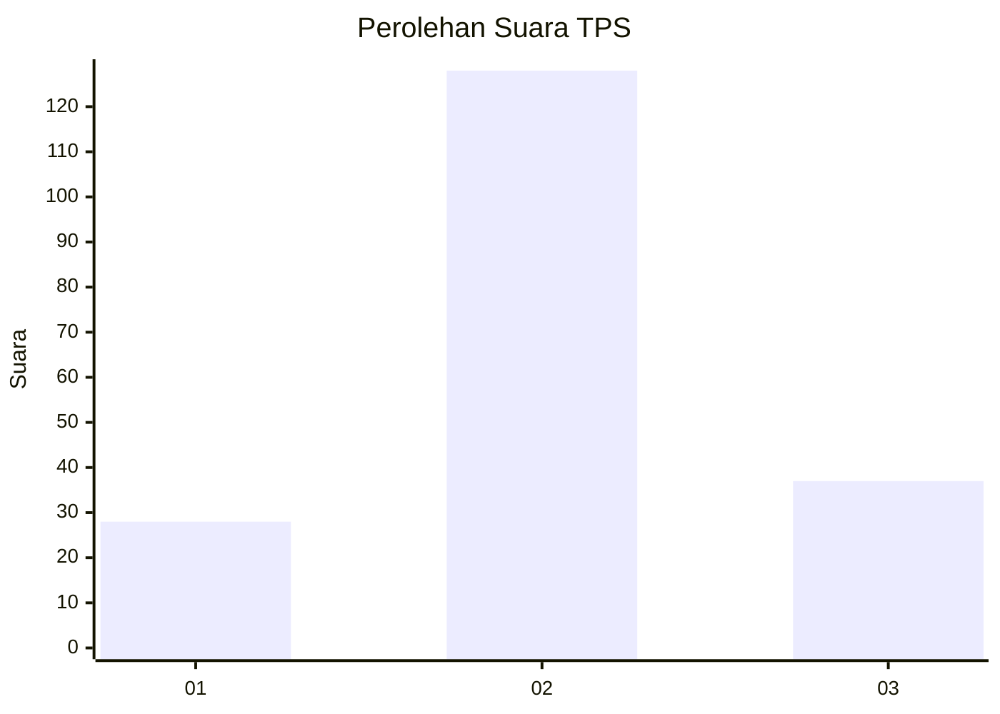
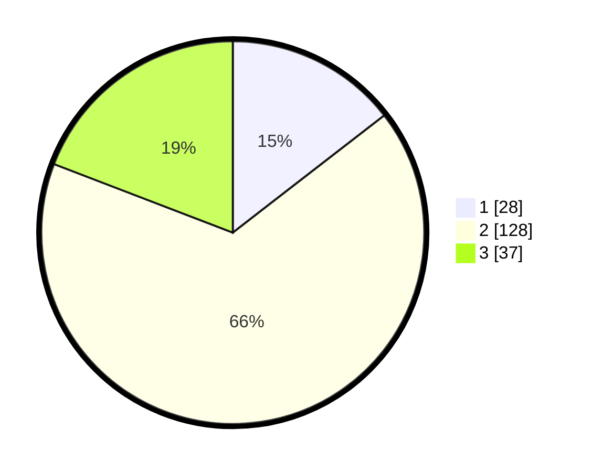

# Hasil

## Grafik

## Tabel

| No. | Nama Paslon    | Suara | Suara (raw) | Persentase |
|:--- |:-------------- | -----:| -----------:| ----------:|
| 1   | ANIES MUHAIMIN | 28    | [28][p-1]   | 14,51      |
| 2   | PRABOWO GIBRAN | 128   | [128][p-2]  | 66,32      |
| 3   | GANJAR MAHFUD  | 37    | [37][p-3]   | 19,17      |

[p-1]: https://github.com/gigit-pemilu/pemilu-2024/blob/main/pilpres/hitung-suara/sub/35-jawa-timur/sub/77-kota-madiun/sub/03-taman/sub/1001-mojorejo/sub/005-tps/sub/paslon-1.txt
[p-2]: https://github.com/gigit-pemilu/pemilu-2024/blob/main/pilpres/hitung-suara/sub/35-jawa-timur/sub/77-kota-madiun/sub/03-taman/sub/1001-mojorejo/sub/005-tps/sub/paslon-2.txt
[p-3]: https://github.com/gigit-pemilu/pemilu-2024/blob/main/pilpres/hitung-suara/sub/35-jawa-timur/sub/77-kota-madiun/sub/03-taman/sub/1001-mojorejo/sub/005-tps/sub/paslon-3.txt

## Foto C Plano

https://sirekap-obj-formc.kpu.go.id/cf5e/pemilu/ppwp/35/77/03/10/01/3577031001005-20240215-022329--bbdecc4d-e76a-488f-b49a-294b1942fcbd.jpg

https://sirekap-obj-formc.kpu.go.id/cf5e/pemilu/ppwp/35/77/03/10/01/3577031001005-20240215-022420--2b9fa5d5-65cb-44d1-b4d1-dfa0e358037c.jpg

https://sirekap-obj-formc.kpu.go.id/cf5e/pemilu/ppwp/35/77/03/10/01/3577031001005-20240215-022649--ceacfd4e-e50e-49cc-a16b-ff03477d43fb.jpg

## Metadata

| Key        | Value               |
| ---------- | ------------------- |
| Time Stamp | 2024-02-15 20:30:46 |

