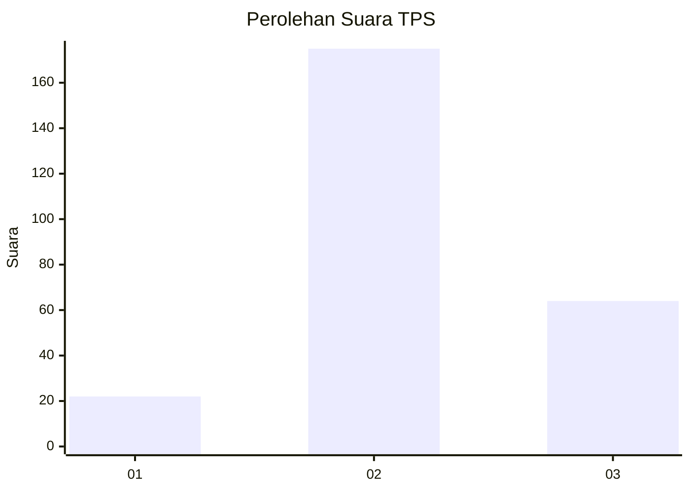
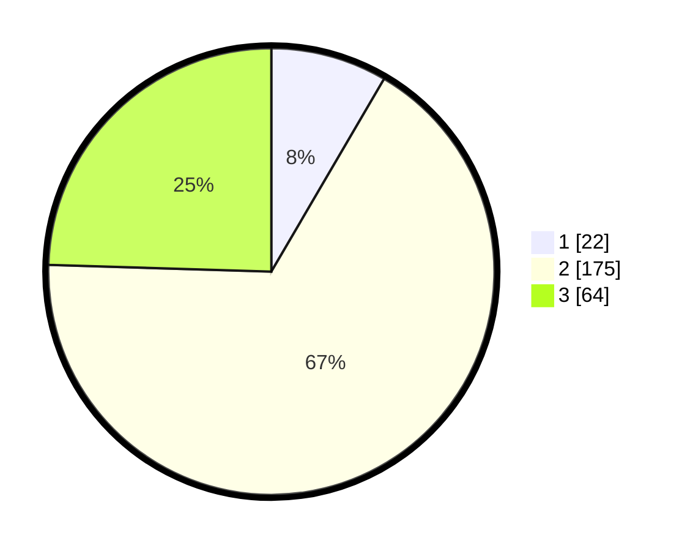

# Hasil

## Grafik

## Tabel

| No. | Nama Paslon    | Suara | Suara (raw) | Persentase |
|:--- |:-------------- | -----:| -----------:| ----------:|
| 1   | ANIES MUHAIMIN | 22    | [22][p-1]   | 8,43       |
| 2   | PRABOWO GIBRAN | 175   | [175][p-2]  | 67,05      |
| 3   | GANJAR MAHFUD  | 64    | [64][p-3]   | 24,52      |

[p-1]: https://github.com/gigit-pemilu/pemilu-2024-35-jawa-timur/blob/main/pilpres/hitung-suara/sub/35-jawa-timur/sub/77-kota-madiun/sub/03-taman/sub/1005-manisrejo/sub/016-tps/sub/paslon-1.txt
[p-2]: https://github.com/gigit-pemilu/pemilu-2024-35-jawa-timur/blob/main/pilpres/hitung-suara/sub/35-jawa-timur/sub/77-kota-madiun/sub/03-taman/sub/1005-manisrejo/sub/016-tps/sub/paslon-2.txt
[p-3]: https://github.com/gigit-pemilu/pemilu-2024-35-jawa-timur/blob/main/pilpres/hitung-suara/sub/35-jawa-timur/sub/77-kota-madiun/sub/03-taman/sub/1005-manisrejo/sub/016-tps/sub/paslon-3.txt

## Foto C Plano

https://sirekap-obj-formc.kpu.go.id/789b/pemilu/ppwp/35/77/03/10/05/3577031005016-20240214-233325--caca14b7-c39c-4861-b46c-eeddd2c30255.jpg

https://sirekap-obj-formc.kpu.go.id/789b/pemilu/ppwp/35/77/03/10/05/3577031005016-20240214-220735--68dc45b7-b4bb-436e-95e2-e8d049be2919.jpg

https://sirekap-obj-formc.kpu.go.id/789b/pemilu/ppwp/35/77/03/10/05/3577031005016-20240214-220925--fcc21564-c1aa-420e-90a1-082bae429848.jpg

## Metadata

| Key        | Value               |
| ---------- | ------------------- |
| Time Stamp | 2024-02-15 16:00:26 |

