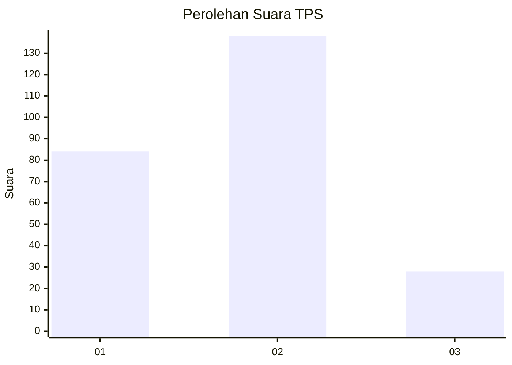
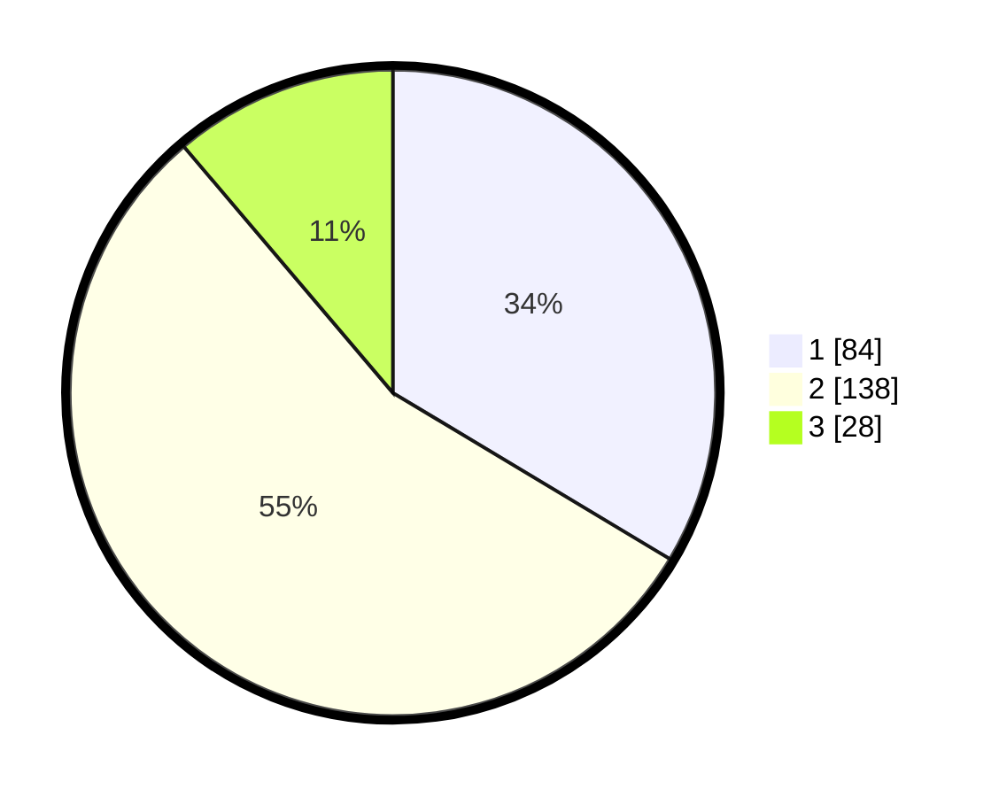

# Hasil

## Grafik

## Tabel

| No. | Nama Paslon    | Suara | Suara (raw) | Persentase |
|:--- |:-------------- | -----:| -----------:| ----------:|
| 1   | ANIES MUHAIMIN | 84    | [84][p-1]   | 33,60      |
| 2   | PRABOWO GIBRAN | 138   | [138][p-2]  | 55,20      |
| 3   | GANJAR MAHFUD  | 28    | [28][p-3]   | 11,20      |

[p-1]: https://github.com/gigit-pemilu/pemilu-2024-35-jawa-timur/blob/main/pilpres/hitung-suara/sub/35-jawa-timur/sub/77-kota-madiun/sub/03-taman/sub/1005-manisrejo/sub/027-tps/sub/paslon-1.txt
[p-2]: https://github.com/gigit-pemilu/pemilu-2024-35-jawa-timur/blob/main/pilpres/hitung-suara/sub/35-jawa-timur/sub/77-kota-madiun/sub/03-taman/sub/1005-manisrejo/sub/027-tps/sub/paslon-2.txt
[p-3]: https://github.com/gigit-pemilu/pemilu-2024-35-jawa-timur/blob/main/pilpres/hitung-suara/sub/35-jawa-timur/sub/77-kota-madiun/sub/03-taman/sub/1005-manisrejo/sub/027-tps/sub/paslon-3.txt

## Foto C Plano

https://sirekap-obj-formc.kpu.go.id/bff4/pemilu/ppwp/35/77/03/10/05/3577031005027-20240215-002252--53db84da-70a8-43c7-afed-798c6db3e60d.jpg

https://sirekap-obj-formc.kpu.go.id/bff4/pemilu/ppwp/35/77/03/10/05/3577031005027-20240215-011928--2bfb13f9-8d6f-4e81-a6b1-004764d13063.jpg

https://sirekap-obj-formc.kpu.go.id/bff4/pemilu/ppwp/35/77/03/10/05/3577031005027-20240215-012013--8834bca0-d043-4349-b72b-fe0c83505557.jpg

## Metadata

| Key        | Value               |
| ---------- | ------------------- |
| Time Stamp | 2024-02-15 23:29:50 |

