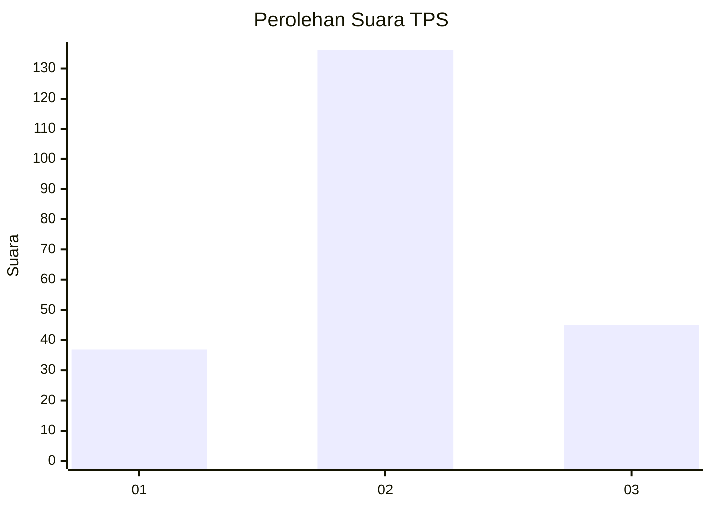
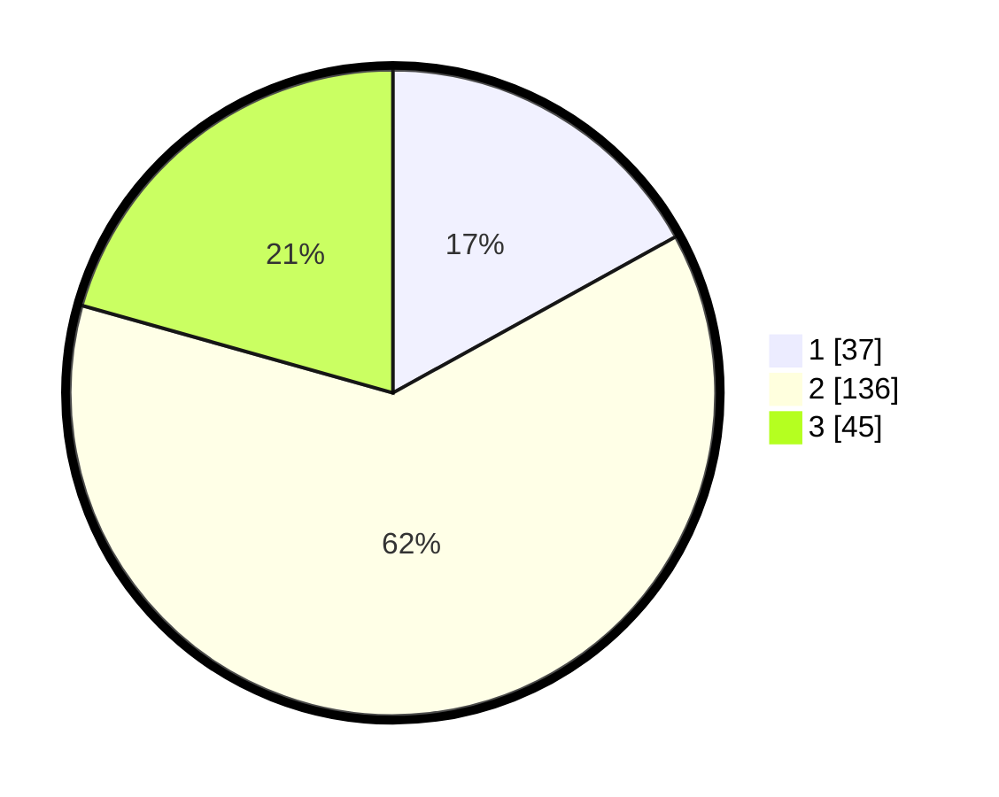

# Hasil

## Grafik

## Tabel

| No. | Nama Paslon    | Suara | Suara (raw) | Persentase |
|:--- |:-------------- | -----:| -----------:| ----------:|
| 1   | ANIES MUHAIMIN | 37    | [37][p-1]   | 16,97      |
| 2   | PRABOWO GIBRAN | 136   | [136][p-2]  | 62,39      |
| 3   | GANJAR MAHFUD  | 45    | [45][p-3]   | 20,64      |

[p-1]: https://github.com/gigit-pemilu/pemilu-2024-35-jawa-timur/blob/main/pilpres/hitung-suara/sub/35-jawa-timur/sub/78-kota-surabaya/sub/01-karang-pilang/sub/1001-karang-pilang/sub/001-tps/sub/paslon-1.txt
[p-2]: https://github.com/gigit-pemilu/pemilu-2024-35-jawa-timur/blob/main/pilpres/hitung-suara/sub/35-jawa-timur/sub/78-kota-surabaya/sub/01-karang-pilang/sub/1001-karang-pilang/sub/001-tps/sub/paslon-2.txt
[p-3]: https://github.com/gigit-pemilu/pemilu-2024-35-jawa-timur/blob/main/pilpres/hitung-suara/sub/35-jawa-timur/sub/78-kota-surabaya/sub/01-karang-pilang/sub/1001-karang-pilang/sub/001-tps/sub/paslon-3.txt

## Foto C Plano

https://sirekap-obj-formc.kpu.go.id/f86b/pemilu/ppwp/35/78/01/10/01/3578011001001-20240220-095702--63e87c3d-40f9-49cd-bade-0511e2cfe049.jpg

https://sirekap-obj-formc.kpu.go.id/f86b/pemilu/ppwp/35/78/01/10/01/3578011001001-20240220-095738--ba3daec5-4753-44c5-805c-f2565c03bebf.jpg

https://sirekap-obj-formc.kpu.go.id/f86b/pemilu/ppwp/35/78/01/10/01/3578011001001-20240220-095817--d496c3a4-c55b-4276-ac8c-887f0d2a3ce1.jpg

## Metadata

| Key        | Value               |
| ---------- | ------------------- |
| Time Stamp | 2024-02-26 16:00:00 |

