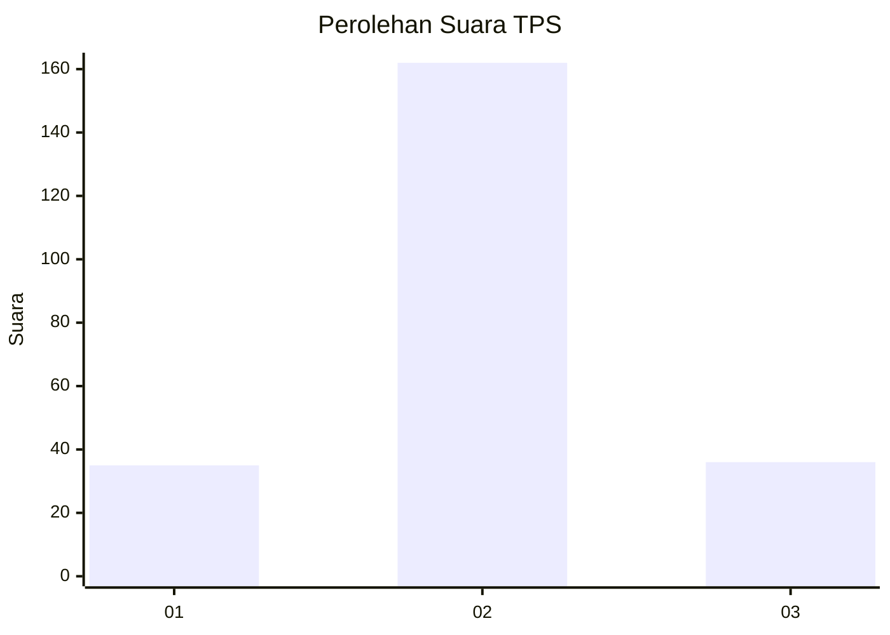

# Hasil

## Grafik

## Tabel

| No. | Nama Paslon    | Suara | Suara (raw) | Persentase |
|:--- |:-------------- | -----:| -----------:| ----------:|
| 1   | ANIES MUHAIMIN | 35    | [35][p-1]   | 15,02      |
| 2   | PRABOWO GIBRAN | 162   | [162][p-2]  | 69,53      |
| 3   | GANJAR MAHFUD  | 36    | [36][p-3]   | 15,45      |

[p-1]: https://github.com/gigit-pemilu/pemilu-2024-35-jawa-timur/blob/main/pilpres/hitung-suara/sub/35-jawa-timur/sub/78-kota-surabaya/sub/01-karang-pilang/sub/1001-karang-pilang/sub/002-tps/sub/paslon-1.txt
[p-2]: https://github.com/gigit-pemilu/pemilu-2024-35-jawa-timur/blob/main/pilpres/hitung-suara/sub/35-jawa-timur/sub/78-kota-surabaya/sub/01-karang-pilang/sub/1001-karang-pilang/sub/002-tps/sub/paslon-2.txt
[p-3]: https://github.com/gigit-pemilu/pemilu-2024-35-jawa-timur/blob/main/pilpres/hitung-suara/sub/35-jawa-timur/sub/78-kota-surabaya/sub/01-karang-pilang/sub/1001-karang-pilang/sub/002-tps/sub/paslon-3.txt

## Foto C Plano

https://sirekap-obj-formc.kpu.go.id/4087/pemilu/ppwp/35/78/01/10/01/3578011001002-20240220-095916--3bcce22e-bd98-41ab-8354-a1bcd7277300.jpg

https://sirekap-obj-formc.kpu.go.id/4087/pemilu/ppwp/35/78/01/10/01/3578011001002-20240220-100016--29a798fc-2a92-4df9-80d5-0c3dd58afcc3.jpg

https://sirekap-obj-formc.kpu.go.id/4087/pemilu/ppwp/35/78/01/10/01/3578011001002-20240220-100037--bd2e7174-7dd4-4958-b46e-391588acf180.jpg

## Metadata

| Key        | Value               |
| ---------- | ------------------- |
| Time Stamp | 2024-02-25 13:00:00 |

