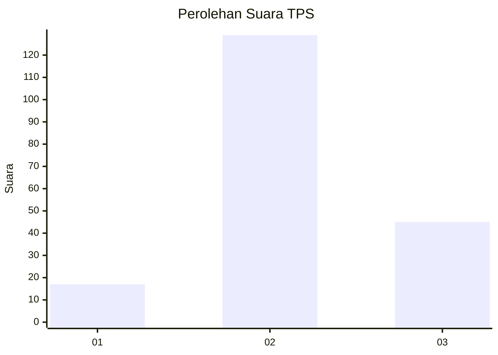
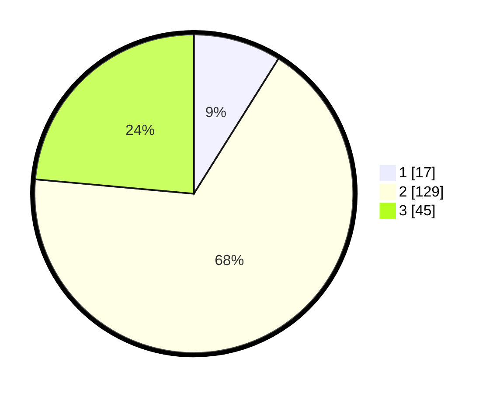

# Hasil

## Grafik

## Tabel

| No. | Nama Paslon    | Suara | Suara (raw) | Persentase |
|:--- |:-------------- | -----:| -----------:| ----------:|
| 1   | ANIES MUHAIMIN | 17    | [17][p-1]   | 8,90       |
| 2   | PRABOWO GIBRAN | 129   | [129][p-2]  | 67,54      |
| 3   | GANJAR MAHFUD  | 45    | [45][p-3]   | 23,56      |

[p-1]: https://github.com/gigit-pemilu/pemilu-2024/blob/main/pilpres/hitung-suara/sub/35-jawa-timur/sub/78-kota-surabaya/sub/01-karang-pilang/sub/1001-karang-pilang/sub/004-tps/sub/paslon-1.txt
[p-2]: https://github.com/gigit-pemilu/pemilu-2024/blob/main/pilpres/hitung-suara/sub/35-jawa-timur/sub/78-kota-surabaya/sub/01-karang-pilang/sub/1001-karang-pilang/sub/004-tps/sub/paslon-2.txt
[p-3]: https://github.com/gigit-pemilu/pemilu-2024/blob/main/pilpres/hitung-suara/sub/35-jawa-timur/sub/78-kota-surabaya/sub/01-karang-pilang/sub/1001-karang-pilang/sub/004-tps/sub/paslon-3.txt

## Foto C Plano

https://sirekap-obj-formc.kpu.go.id/cad2/pemilu/ppwp/35/78/01/10/01/3578011001004-20240220-100425--cf52ef58-99f1-459a-b14d-a0e39542e71c.jpg

https://sirekap-obj-formc.kpu.go.id/cad2/pemilu/ppwp/35/78/01/10/01/3578011001004-20240220-100504--580fc6cc-bc7a-472a-8ea4-902f097bcf18.jpg

https://sirekap-obj-formc.kpu.go.id/cad2/pemilu/ppwp/35/78/01/10/01/3578011001004-20240220-100529--bb96cc64-79af-4070-98ef-0594da0b3bc0.jpg

## Metadata

| Key        | Value               |
| ---------- | ------------------- |
| Time Stamp | 2024-02-25 12:00:00 |

