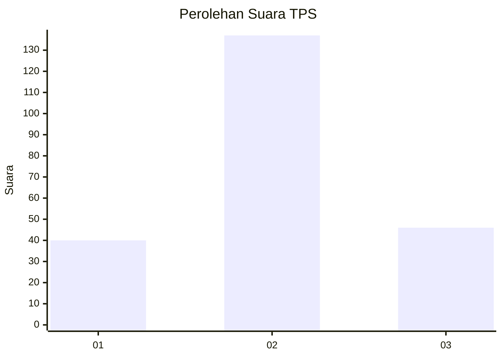
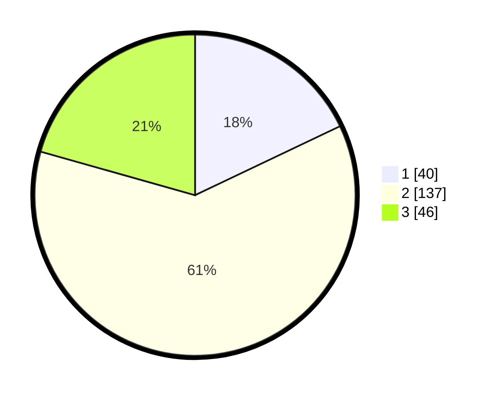

# Hasil

## Grafik

## Tabel

| No. | Nama Paslon    | Suara | Suara (raw) | Persentase |
|:--- |:-------------- | -----:| -----------:| ----------:|
| 1   | ANIES MUHAIMIN | 40    | [40][p-1]   | 17,94      |
| 2   | PRABOWO GIBRAN | 137   | [137][p-2]  | 61,43      |
| 3   | GANJAR MAHFUD  | 46    | [46][p-3]   | 20,63      |

[p-1]: https://github.com/gigit-pemilu/pemilu-2024-35-jawa-timur/blob/main/pilpres/hitung-suara/sub/35-jawa-timur/sub/78-kota-surabaya/sub/01-karang-pilang/sub/1001-karang-pilang/sub/005-tps/sub/paslon-1.txt
[p-2]: https://github.com/gigit-pemilu/pemilu-2024-35-jawa-timur/blob/main/pilpres/hitung-suara/sub/35-jawa-timur/sub/78-kota-surabaya/sub/01-karang-pilang/sub/1001-karang-pilang/sub/005-tps/sub/paslon-2.txt
[p-3]: https://github.com/gigit-pemilu/pemilu-2024-35-jawa-timur/blob/main/pilpres/hitung-suara/sub/35-jawa-timur/sub/78-kota-surabaya/sub/01-karang-pilang/sub/1001-karang-pilang/sub/005-tps/sub/paslon-3.txt

## Foto C Plano

https://sirekap-obj-formc.kpu.go.id/3750/pemilu/ppwp/35/78/01/10/01/3578011001005-20240220-100649--81cae143-e246-418d-bbdc-083bbff318b7.jpg

https://sirekap-obj-formc.kpu.go.id/3750/pemilu/ppwp/35/78/01/10/01/3578011001005-20240220-100732--7515fe55-83be-4df2-9f8f-f0c00d89bf90.jpg

https://sirekap-obj-formc.kpu.go.id/3750/pemilu/ppwp/35/78/01/10/01/3578011001005-20240220-100757--b7920d41-b099-486c-87d6-77a79847bde3.jpg

## Metadata

| Key        | Value               |
| ---------- | ------------------- |
| Time Stamp | 2024-02-24 22:31:28 |

