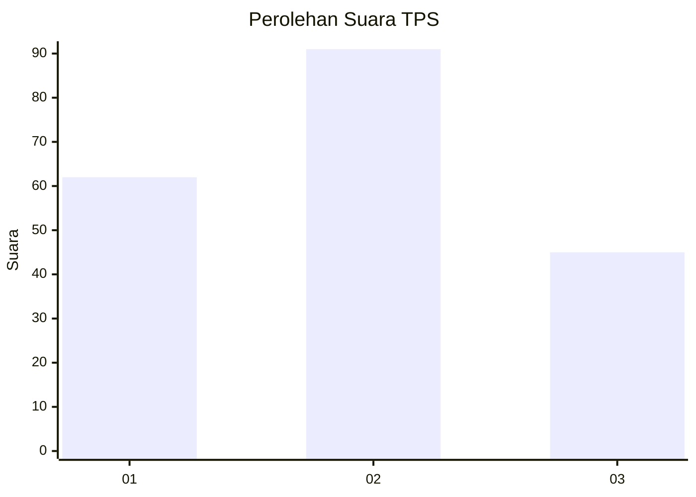
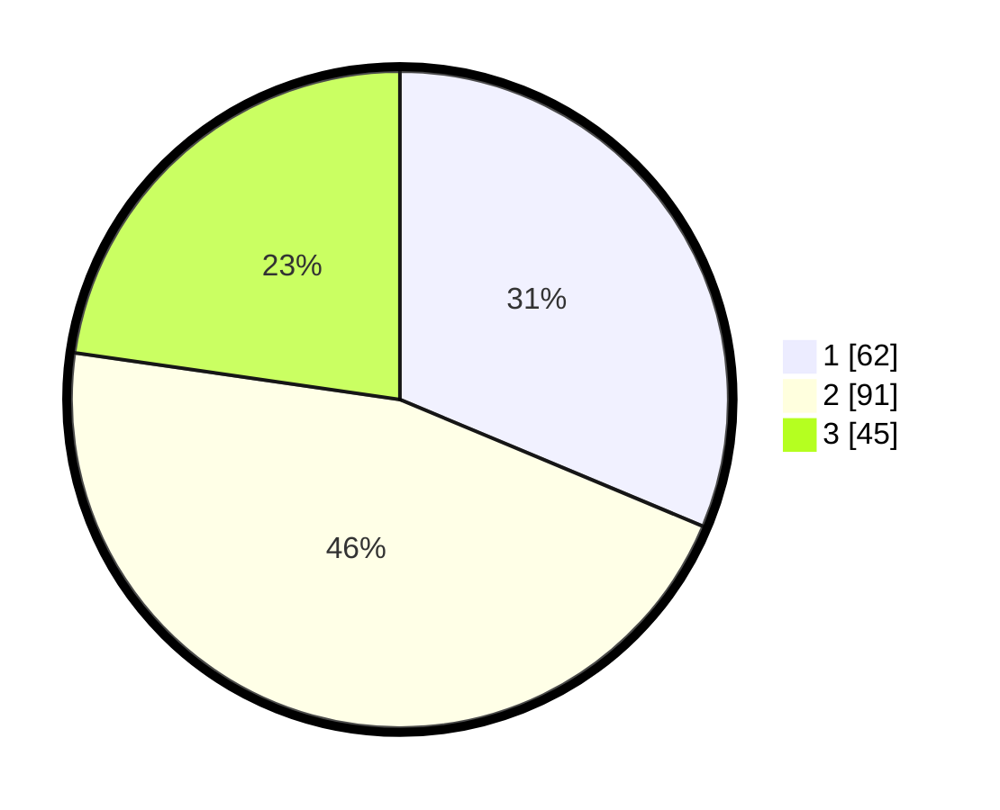

# Hasil

## Grafik

## Tabel

| No. | Nama Paslon    | Suara | Suara (raw) | Persentase |
|:--- |:-------------- | -----:| -----------:| ----------:|
| 1   | ANIES MUHAIMIN | 62    | [62][p-1]   | 31,31      |
| 2   | PRABOWO GIBRAN | 91    | [91][p-2]   | 45,96      |
| 3   | GANJAR MAHFUD  | 45    | [45][p-3]   | 22,73      |

[p-1]: https://github.com/gigit-pemilu/pemilu-2024-35-jawa-timur/blob/main/pilpres/hitung-suara/sub/35-jawa-timur/sub/78-kota-surabaya/sub/01-karang-pilang/sub/1002-kebraon/sub/029-tps/sub/paslon-1.txt
[p-2]: https://github.com/gigit-pemilu/pemilu-2024-35-jawa-timur/blob/main/pilpres/hitung-suara/sub/35-jawa-timur/sub/78-kota-surabaya/sub/01-karang-pilang/sub/1002-kebraon/sub/029-tps/sub/paslon-2.txt
[p-3]: https://github.com/gigit-pemilu/pemilu-2024-35-jawa-timur/blob/main/pilpres/hitung-suara/sub/35-jawa-timur/sub/78-kota-surabaya/sub/01-karang-pilang/sub/1002-kebraon/sub/029-tps/sub/paslon-3.txt

## Foto C Plano

https://sirekap-obj-formc.kpu.go.id/d177/pemilu/ppwp/35/78/01/10/02/3578011002029-20240219-143901--63c8c5f5-715c-48bf-bcdf-aa6344d990c1.jpg

https://sirekap-obj-formc.kpu.go.id/d177/pemilu/ppwp/35/78/01/10/02/3578011002029-20240219-143925--e9fa1dd8-46fb-48cb-a1c9-4072e3f1cd91.jpg

https://sirekap-obj-formc.kpu.go.id/d177/pemilu/ppwp/35/78/01/10/02/3578011002029-20240219-144241--081233c7-b888-456f-ac4f-233d540f6908.jpg

## Metadata

| Key        | Value               |
| ---------- | ------------------- |
| Time Stamp | 2024-02-25 14:00:00 |

