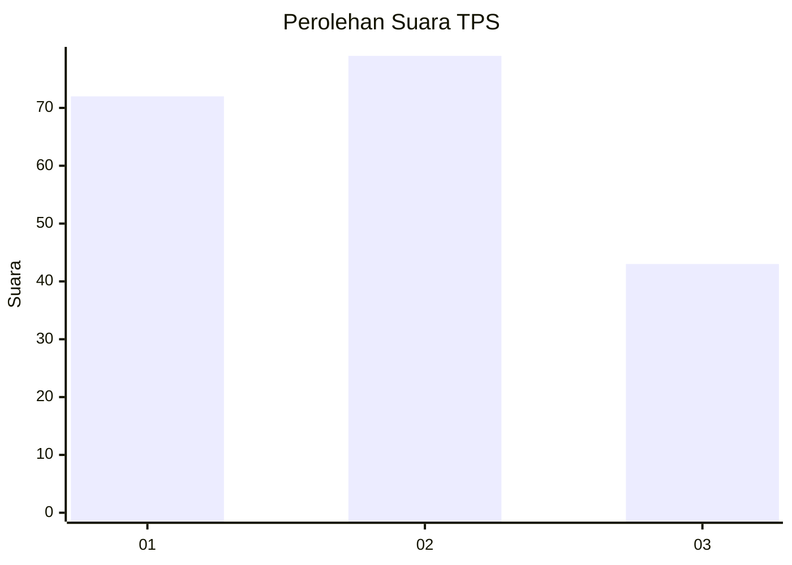
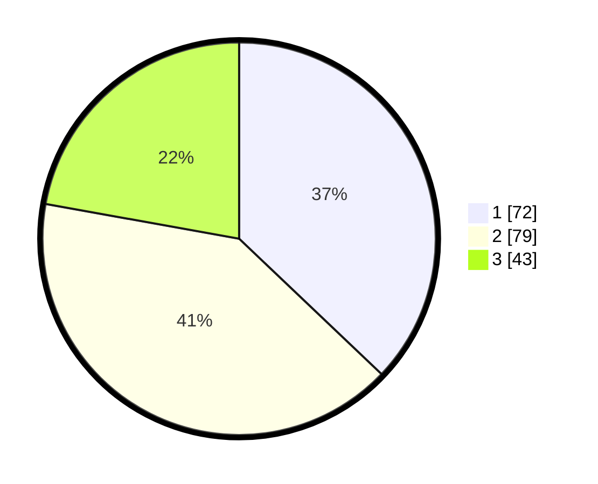

# Hasil

## Grafik

## Tabel

| No. | Nama Paslon    | Suara | Suara (raw) | Persentase |
|:--- |:-------------- | -----:| -----------:| ----------:|
| 1   | ANIES MUHAIMIN | 72    | [72][p-1]   | 37,11      |
| 2   | PRABOWO GIBRAN | 79    | [79][p-2]   | 40,72      |
| 3   | GANJAR MAHFUD  | 43    | [43][p-3]   | 22,16      |

[p-1]: https://github.com/gigit-pemilu/pemilu-2024-35-jawa-timur/blob/main/pilpres/hitung-suara/sub/35-jawa-timur/sub/78-kota-surabaya/sub/01-karang-pilang/sub/1002-kebraon/sub/034-tps/sub/paslon-1.txt
[p-2]: https://github.com/gigit-pemilu/pemilu-2024-35-jawa-timur/blob/main/pilpres/hitung-suara/sub/35-jawa-timur/sub/78-kota-surabaya/sub/01-karang-pilang/sub/1002-kebraon/sub/034-tps/sub/paslon-2.txt
[p-3]: https://github.com/gigit-pemilu/pemilu-2024-35-jawa-timur/blob/main/pilpres/hitung-suara/sub/35-jawa-timur/sub/78-kota-surabaya/sub/01-karang-pilang/sub/1002-kebraon/sub/034-tps/sub/paslon-3.txt

## Foto C Plano

https://sirekap-obj-formc.kpu.go.id/7bfa/pemilu/ppwp/35/78/01/10/02/3578011002034-20240214-205906--5cb9ad00-b99a-49f9-8002-8517e1e55b2d.jpg

https://sirekap-obj-formc.kpu.go.id/7bfa/pemilu/ppwp/35/78/01/10/02/3578011002034-20240215-014657--9625e6a7-1b10-449c-b8ce-64492d5766f9.jpg

https://sirekap-obj-formc.kpu.go.id/7bfa/pemilu/ppwp/35/78/01/10/02/3578011002034-20240215-014829--28be17b2-d81f-4860-9433-3ba0e9d39d18.jpg

## Metadata

| Key        | Value               |
| ---------- | ------------------- |
| Time Stamp | 2024-02-21 22:00:00 |

