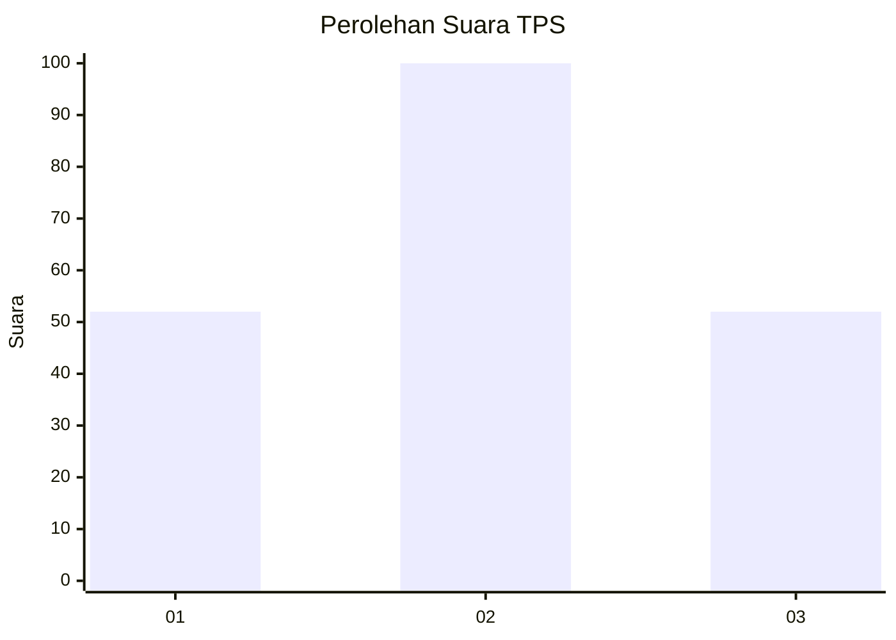
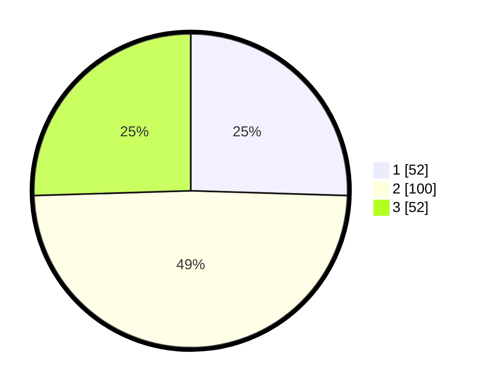

# Hasil

## Grafik

## Tabel

| No. | Nama Paslon    | Suara | Suara (raw) | Persentase |
|:--- |:-------------- | -----:| -----------:| ----------:|
| 1   | ANIES MUHAIMIN | 52    | [52][p-1]   | 25,49      |
| 2   | PRABOWO GIBRAN | 100   | [100][p-2]  | 49,02      |
| 3   | GANJAR MAHFUD  | 52    | [52][p-3]   | 25,49      |

[p-1]: https://github.com/gigit-pemilu/pemilu-2024-35-jawa-timur/blob/main/pilpres/hitung-suara/sub/35-jawa-timur/sub/78-kota-surabaya/sub/01-karang-pilang/sub/1002-kebraon/sub/046-tps/sub/paslon-1.txt
[p-2]: https://github.com/gigit-pemilu/pemilu-2024-35-jawa-timur/blob/main/pilpres/hitung-suara/sub/35-jawa-timur/sub/78-kota-surabaya/sub/01-karang-pilang/sub/1002-kebraon/sub/046-tps/sub/paslon-2.txt
[p-3]: https://github.com/gigit-pemilu/pemilu-2024-35-jawa-timur/blob/main/pilpres/hitung-suara/sub/35-jawa-timur/sub/78-kota-surabaya/sub/01-karang-pilang/sub/1002-kebraon/sub/046-tps/sub/paslon-3.txt

## Foto C Plano

https://sirekap-obj-formc.kpu.go.id/cbe5/pemilu/ppwp/35/78/01/10/02/3578011002046-20240219-163108--5999b616-b743-46b3-bf12-7a01c617f78d.jpg

https://sirekap-obj-formc.kpu.go.id/cbe5/pemilu/ppwp/35/78/01/10/02/3578011002046-20240219-163131--994b9b82-98cb-41bd-92b3-f6cae9c44da9.jpg

https://sirekap-obj-formc.kpu.go.id/cbe5/pemilu/ppwp/35/78/01/10/02/3578011002046-20240219-163400--396db449-6c93-4282-8fde-6da2e4976228.jpg

## Metadata

| Key        | Value               |
| ---------- | ------------------- |
| Time Stamp | 2024-02-25 13:00:00 |

