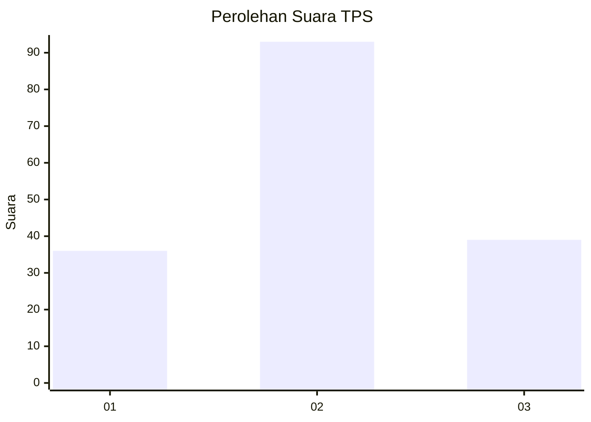
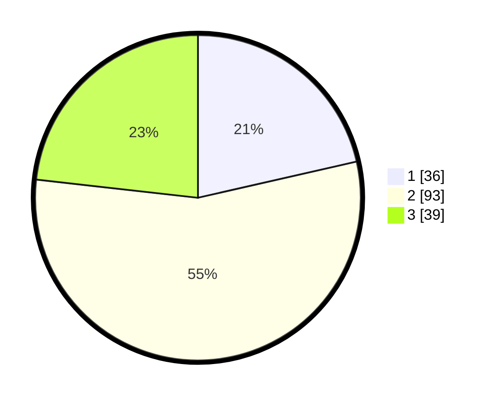

# Hasil

## Grafik

## Tabel

| No. | Nama Paslon    | Suara | Suara (raw) | Persentase |
|:--- |:-------------- | -----:| -----------:| ----------:|
| 1   | ANIES MUHAIMIN | 36    | [36][p-1]   | 21,43      |
| 2   | PRABOWO GIBRAN | 93    | [93][p-2]   | 55,36      |
| 3   | GANJAR MAHFUD  | 39    | [39][p-3]   | 23,21      |

[p-1]: https://github.com/gigit-pemilu/pemilu-2024/blob/main/pilpres/hitung-suara/sub/35-jawa-timur/sub/78-kota-surabaya/sub/01-karang-pilang/sub/1002-kebraon/sub/063-tps/sub/paslon-1.txt
[p-2]: https://github.com/gigit-pemilu/pemilu-2024/blob/main/pilpres/hitung-suara/sub/35-jawa-timur/sub/78-kota-surabaya/sub/01-karang-pilang/sub/1002-kebraon/sub/063-tps/sub/paslon-2.txt
[p-3]: https://github.com/gigit-pemilu/pemilu-2024/blob/main/pilpres/hitung-suara/sub/35-jawa-timur/sub/78-kota-surabaya/sub/01-karang-pilang/sub/1002-kebraon/sub/063-tps/sub/paslon-3.txt

## Foto C Plano

https://sirekap-obj-formc.kpu.go.id/f220/pemilu/ppwp/35/78/01/10/02/3578011002063-20240219-173541--976a47aa-4651-405e-af56-fa77ab85584a.jpg

https://sirekap-obj-formc.kpu.go.id/f220/pemilu/ppwp/35/78/01/10/02/3578011002063-20240219-173612--f5befc54-6704-46fa-8b93-83936ba039da.jpg

https://sirekap-obj-formc.kpu.go.id/f220/pemilu/ppwp/35/78/01/10/02/3578011002063-20240219-173843--3741d908-83d4-4a36-b0f9-28c65bb9637b.jpg

## Metadata

| Key        | Value               |
| ---------- | ------------------- |
| Time Stamp | 2024-02-25 12:00:00 |

