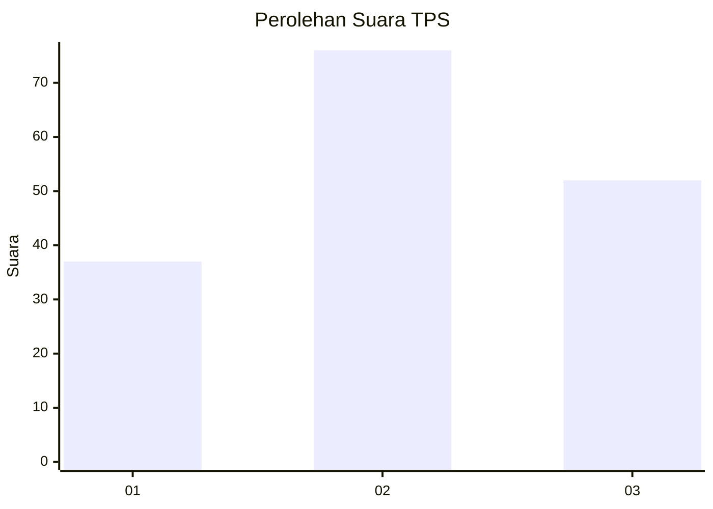
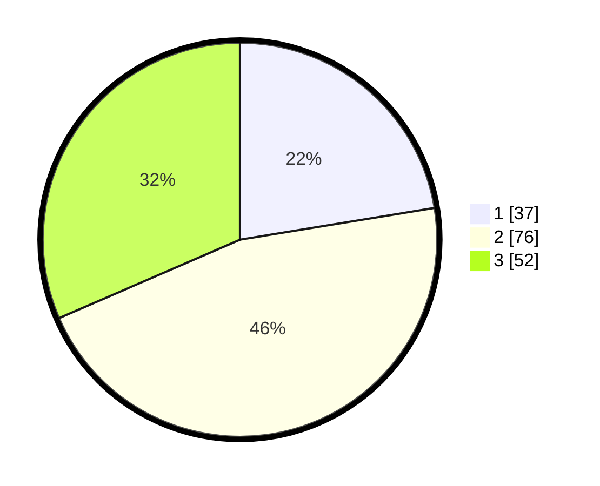

# Hasil

## Grafik

## Tabel

| No. | Nama Paslon    | Suara | Suara (raw) | Persentase |
|:--- |:-------------- | -----:| -----------:| ----------:|
| 1   | ANIES MUHAIMIN | 37    | [37][p-1]   | 22,42      |
| 2   | PRABOWO GIBRAN | 76    | [76][p-2]   | 46,06      |
| 3   | GANJAR MAHFUD  | 52    | [52][p-3]   | 31,52      |

[p-1]: https://github.com/gigit-pemilu/pemilu-2024/blob/main/pilpres/hitung-suara/sub/35-jawa-timur/sub/78-kota-surabaya/sub/01-karang-pilang/sub/1002-kebraon/sub/067-tps/sub/paslon-1.txt
[p-2]: https://github.com/gigit-pemilu/pemilu-2024/blob/main/pilpres/hitung-suara/sub/35-jawa-timur/sub/78-kota-surabaya/sub/01-karang-pilang/sub/1002-kebraon/sub/067-tps/sub/paslon-2.txt
[p-3]: https://github.com/gigit-pemilu/pemilu-2024/blob/main/pilpres/hitung-suara/sub/35-jawa-timur/sub/78-kota-surabaya/sub/01-karang-pilang/sub/1002-kebraon/sub/067-tps/sub/paslon-3.txt

## Foto C Plano

https://sirekap-obj-formc.kpu.go.id/a3e0/pemilu/ppwp/35/78/01/10/02/3578011002067-20240219-174550--1cd993ef-7966-46be-b6e2-d4c2e9424b68.jpg

https://sirekap-obj-formc.kpu.go.id/a3e0/pemilu/ppwp/35/78/01/10/02/3578011002067-20240219-174612--d7fd0b25-7573-4a78-9275-d0c5807ef733.jpg

https://sirekap-obj-formc.kpu.go.id/a3e0/pemilu/ppwp/35/78/01/10/02/3578011002067-20240219-174649--84c0b6cf-8a7b-4daa-b1b2-a0123a24d134.jpg

## Metadata

| Key        | Value               |
| ---------- | ------------------- |
| Time Stamp | 2024-02-24 22:31:28 |

