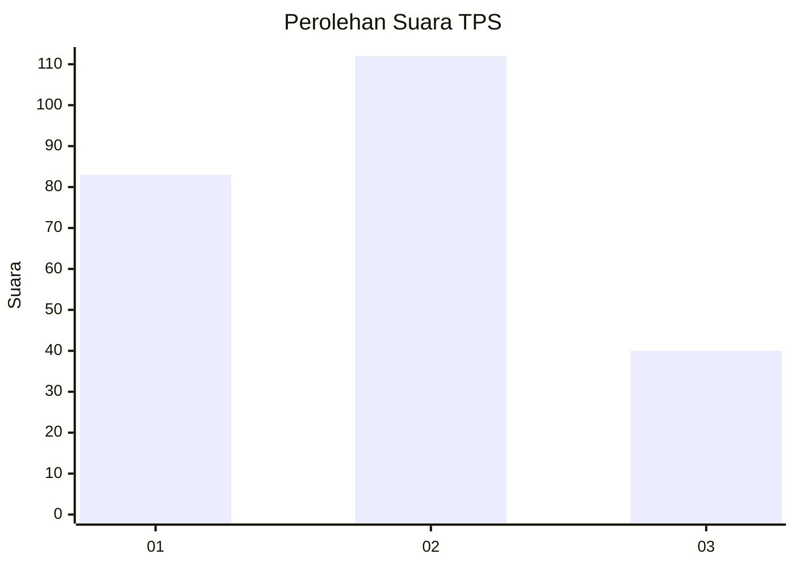
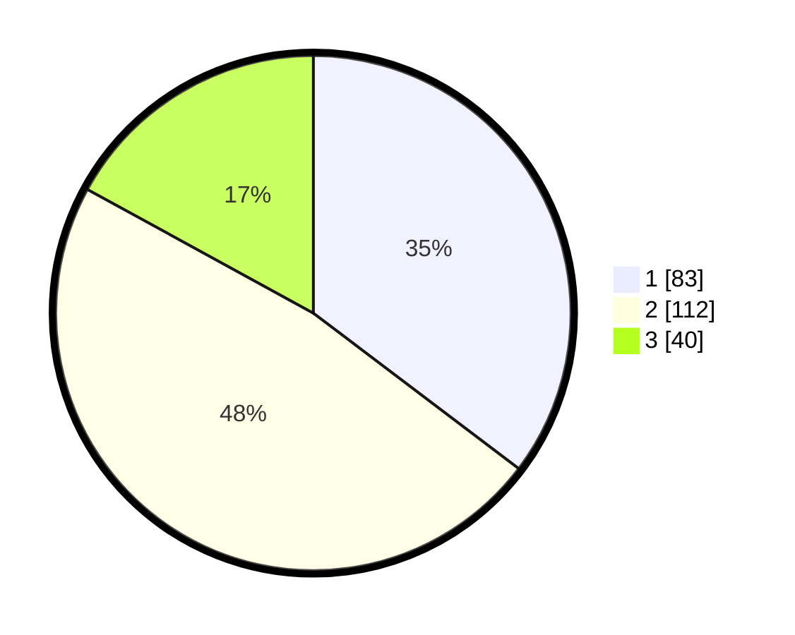

# Hasil

## Grafik

## Tabel

| No. | Nama Paslon    | Suara | Suara (raw) | Persentase |
|:--- |:-------------- | -----:| -----------:| ----------:|
| 1   | ANIES MUHAIMIN | 83    | [83][p-1]   | 35,32      |
| 2   | PRABOWO GIBRAN | 112   | [112][p-2]  | 47,66      |
| 3   | GANJAR MAHFUD  | 40    | [40][p-3]   | 17,02      |

[p-1]: https://github.com/gigit-pemilu/pemilu-2024/blob/main/pilpres/hitung-suara/sub/35-jawa-timur/sub/78-kota-surabaya/sub/01-karang-pilang/sub/1002-kebraon/sub/078-tps/sub/paslon-1.txt
[p-2]: https://github.com/gigit-pemilu/pemilu-2024/blob/main/pilpres/hitung-suara/sub/35-jawa-timur/sub/78-kota-surabaya/sub/01-karang-pilang/sub/1002-kebraon/sub/078-tps/sub/paslon-2.txt
[p-3]: https://github.com/gigit-pemilu/pemilu-2024/blob/main/pilpres/hitung-suara/sub/35-jawa-timur/sub/78-kota-surabaya/sub/01-karang-pilang/sub/1002-kebraon/sub/078-tps/sub/paslon-3.txt

## Foto C Plano

https://sirekap-obj-formc.kpu.go.id/26a8/pemilu/ppwp/35/78/01/10/02/3578011002078-20240214-220931--3c2ec2af-7e07-4a32-880e-c9cab98036fd.jpg

https://sirekap-obj-formc.kpu.go.id/26a8/pemilu/ppwp/35/78/01/10/02/3578011002078-20240214-205302--d7ddd9ce-17fe-4e01-b837-0d1dbd3fa08a.jpg

https://sirekap-obj-formc.kpu.go.id/26a8/pemilu/ppwp/35/78/01/10/02/3578011002078-20240214-221110--6d6e007e-26cf-4879-9020-b54856c70b5e.jpg

## Metadata

| Key        | Value               |
| ---------- | ------------------- |
| Time Stamp | 2024-02-21 17:00:00 |

