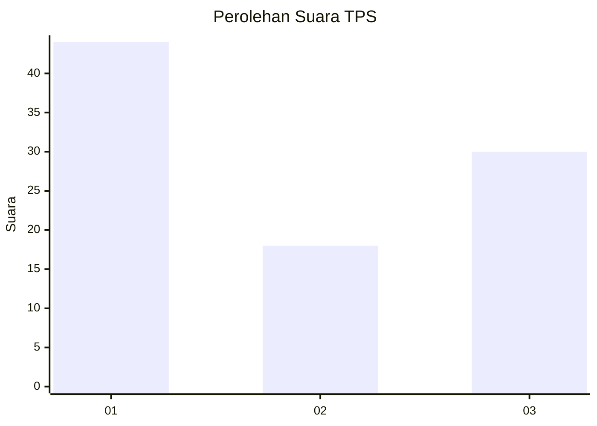
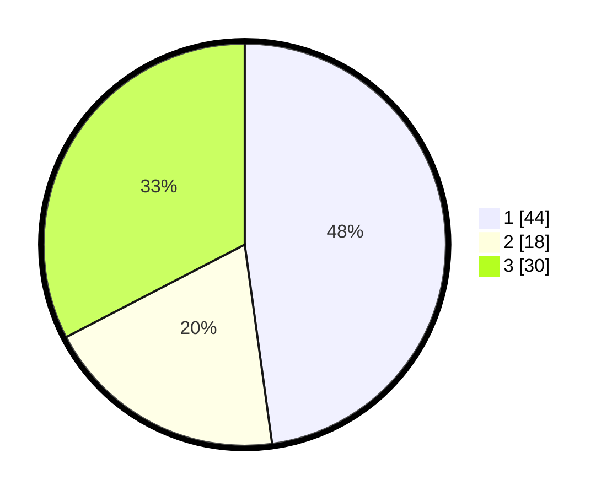

# Hasil

## Grafik

## Tabel

| No. | Nama Paslon    | Suara | Suara (raw) | Persentase |
|:--- |:-------------- | -----:| -----------:| ----------:|
| 1   | ANIES MUHAIMIN | 44    | [44][p-1]   | 47,83      |
| 2   | PRABOWO GIBRAN | 18    | [18][p-2]   | 19,57      |
| 3   | GANJAR MAHFUD  | 30    | [30][p-3]   | 32,61      |

[p-1]: https://github.com/gigit-pemilu/pemilu-2024-35-jawa-timur/blob/main/pilpres/hitung-suara/sub/35-jawa-timur/sub/78-kota-surabaya/sub/01-karang-pilang/sub/1003-kedurus/sub/050-tps/sub/paslon-1.txt
[p-2]: https://github.com/gigit-pemilu/pemilu-2024-35-jawa-timur/blob/main/pilpres/hitung-suara/sub/35-jawa-timur/sub/78-kota-surabaya/sub/01-karang-pilang/sub/1003-kedurus/sub/050-tps/sub/paslon-2.txt
[p-3]: https://github.com/gigit-pemilu/pemilu-2024-35-jawa-timur/blob/main/pilpres/hitung-suara/sub/35-jawa-timur/sub/78-kota-surabaya/sub/01-karang-pilang/sub/1003-kedurus/sub/050-tps/sub/paslon-3.txt

## Foto C Plano

https://sirekap-obj-formc.kpu.go.id/d583/pemilu/ppwp/35/78/01/10/03/3578011003050-20240219-165420--6651af88-7e2e-4bd7-b7bd-5589298d59bb.jpg

https://sirekap-obj-formc.kpu.go.id/d583/pemilu/ppwp/35/78/01/10/03/3578011003050-20240219-165520--ffb4202a-294f-4ee9-a381-e859bdcabb8d.jpg

https://sirekap-obj-formc.kpu.go.id/d583/pemilu/ppwp/35/78/01/10/03/3578011003050-20240219-165545--dbf3d90a-28b8-497f-ba39-e32023284540.jpg

## Metadata

| Key        | Value               |
| ---------- | ------------------- |
| Time Stamp | 2024-02-25 21:00:00 |

