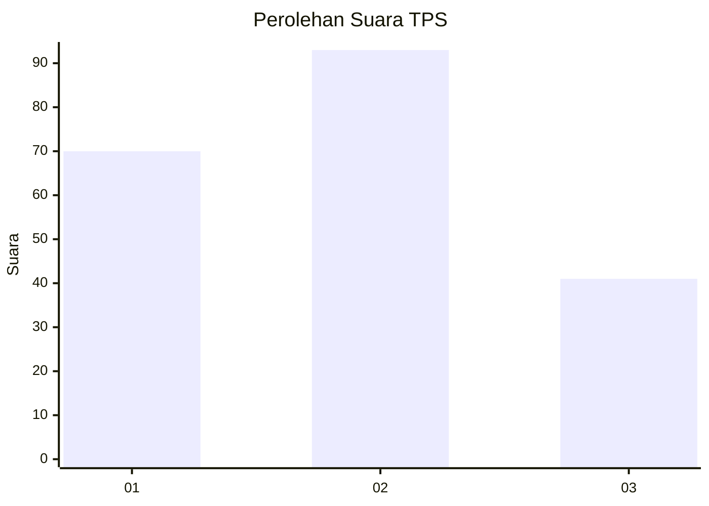
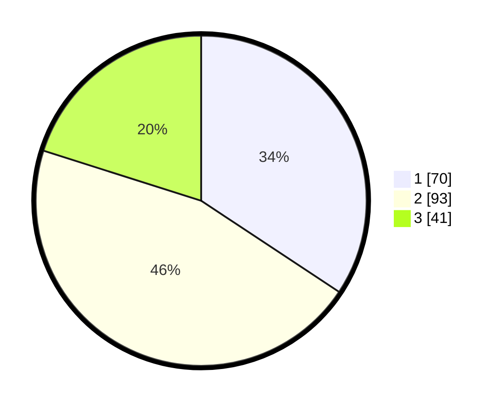

# Hasil

## Grafik

## Tabel

| No. | Nama Paslon    | Suara | Suara (raw) | Persentase |
|:--- |:-------------- | -----:| -----------:| ----------:|
| 1   | ANIES MUHAIMIN | 70    | [70][p-1]   | 34,31      |
| 2   | PRABOWO GIBRAN | 93    | [93][p-2]   | 45,59      |
| 3   | GANJAR MAHFUD  | 41    | [41][p-3]   | 20,10      |

[p-1]: https://github.com/gigit-pemilu/pemilu-2024/blob/main/pilpres/hitung-suara/sub/35-jawa-timur/sub/78-kota-surabaya/sub/01-karang-pilang/sub/1003-kedurus/sub/064-tps/sub/paslon-1.txt
[p-2]: https://github.com/gigit-pemilu/pemilu-2024/blob/main/pilpres/hitung-suara/sub/35-jawa-timur/sub/78-kota-surabaya/sub/01-karang-pilang/sub/1003-kedurus/sub/064-tps/sub/paslon-2.txt
[p-3]: https://github.com/gigit-pemilu/pemilu-2024/blob/main/pilpres/hitung-suara/sub/35-jawa-timur/sub/78-kota-surabaya/sub/01-karang-pilang/sub/1003-kedurus/sub/064-tps/sub/paslon-3.txt

## Foto C Plano

https://sirekap-obj-formc.kpu.go.id/75de/pemilu/ppwp/35/78/01/10/03/3578011003064-20240215-033730--83b8db31-5a87-4298-9cba-874c13d3635b.jpg

https://sirekap-obj-formc.kpu.go.id/75de/pemilu/ppwp/35/78/01/10/03/3578011003064-20240215-033802--f6db0b20-6c84-4fed-984b-2c8abb237353.jpg

https://sirekap-obj-formc.kpu.go.id/75de/pemilu/ppwp/35/78/01/10/03/3578011003064-20240215-033827--eba479e0-dffd-4f37-9b53-355c9c11042f.jpg

## Metadata

| Key        | Value               |
| ---------- | ------------------- |
| Time Stamp | 2024-02-15 22:30:27 |

