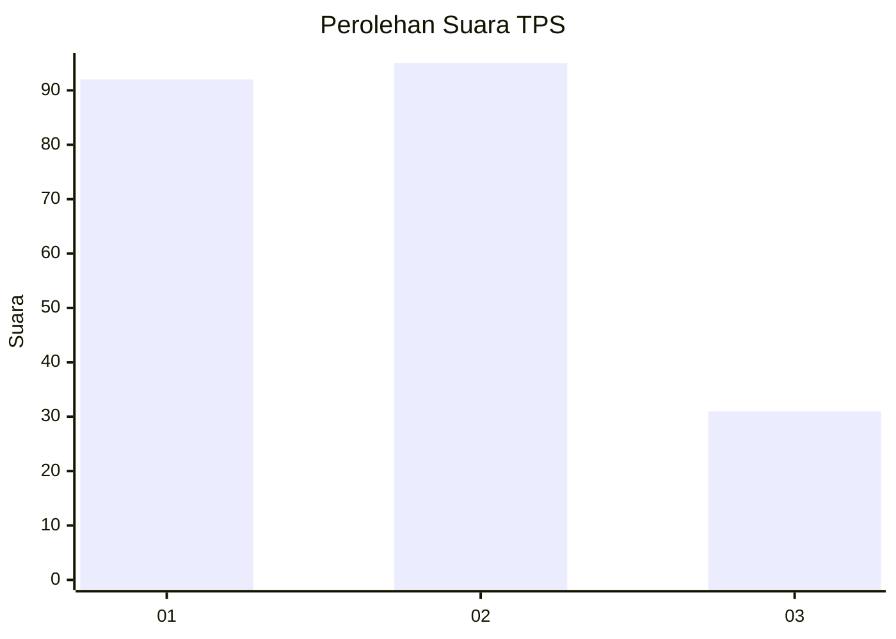
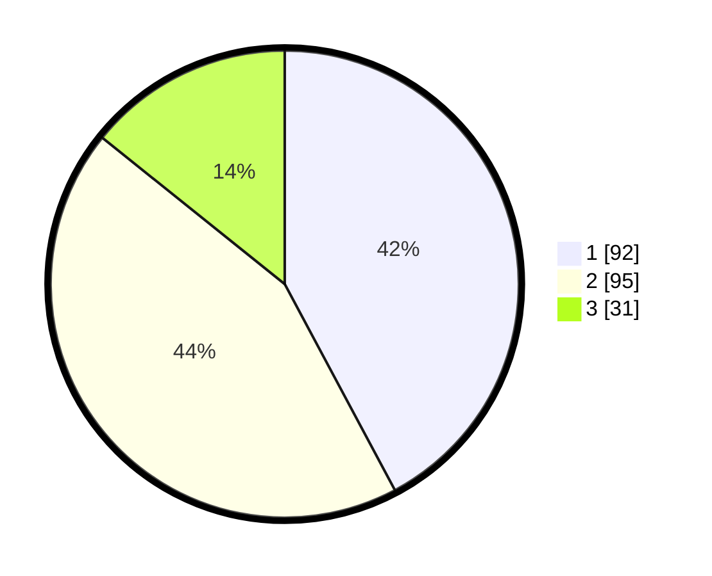

# Hasil

## Grafik

## Tabel

| No. | Nama Paslon    | Suara | Suara (raw) | Persentase |
|:--- |:-------------- | -----:| -----------:| ----------:|
| 1   | ANIES MUHAIMIN | 92    | [92][p-1]   | 42,20      |
| 2   | PRABOWO GIBRAN | 95    | [95][p-2]   | 43,58      |
| 3   | GANJAR MAHFUD  | 31    | [31][p-3]   | 14,22      |

[p-1]: https://github.com/gigit-pemilu/pemilu-2024/blob/main/pilpres/hitung-suara/sub/35-jawa-timur/sub/78-kota-surabaya/sub/01-karang-pilang/sub/1003-kedurus/sub/072-tps/sub/paslon-1.txt
[p-2]: https://github.com/gigit-pemilu/pemilu-2024/blob/main/pilpres/hitung-suara/sub/35-jawa-timur/sub/78-kota-surabaya/sub/01-karang-pilang/sub/1003-kedurus/sub/072-tps/sub/paslon-2.txt
[p-3]: https://github.com/gigit-pemilu/pemilu-2024/blob/main/pilpres/hitung-suara/sub/35-jawa-timur/sub/78-kota-surabaya/sub/01-karang-pilang/sub/1003-kedurus/sub/072-tps/sub/paslon-3.txt

## Foto C Plano

https://sirekap-obj-formc.kpu.go.id/4916/pemilu/ppwp/35/78/01/10/03/3578011003072-20240215-020825--1b114c80-4302-44b5-ba94-1e70c7117916.jpg

https://sirekap-obj-formc.kpu.go.id/4916/pemilu/ppwp/35/78/01/10/03/3578011003072-20240215-020942--b5468e22-4b5a-4ee2-96be-6b5d5f032b7a.jpg

https://sirekap-obj-formc.kpu.go.id/4916/pemilu/ppwp/35/78/01/10/03/3578011003072-20240215-021332--ea513152-9bcc-4cb1-9be7-c9d67b239960.jpg

## Metadata

| Key        | Value               |
| ---------- | ------------------- |
| Time Stamp | 2024-02-24 22:31:28 |

