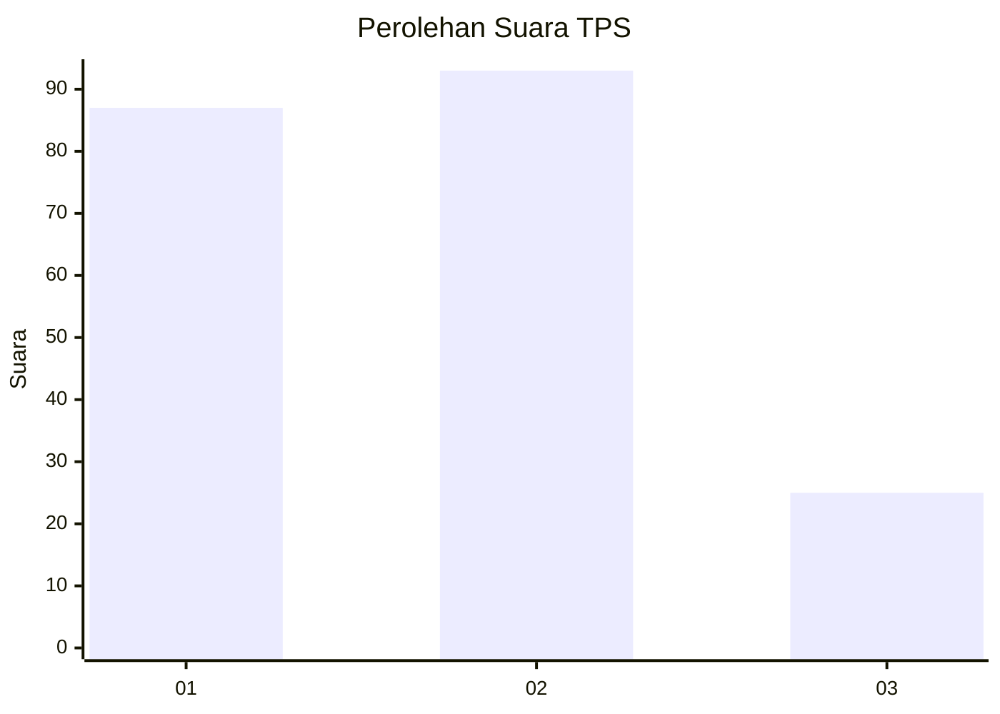
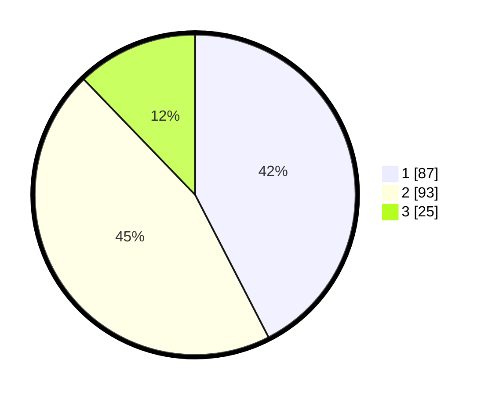

# Hasil

## Grafik

## Tabel

| No. | Nama Paslon    | Suara | Suara (raw) | Persentase |
|:--- |:-------------- | -----:| -----------:| ----------:|
| 1   | ANIES MUHAIMIN | 87    | [87][p-1]   | 42,44      |
| 2   | PRABOWO GIBRAN | 93    | [93][p-2]   | 45,37      |
| 3   | GANJAR MAHFUD  | 25    | [25][p-3]   | 12,20      |

[p-1]: https://github.com/gigit-pemilu/pemilu-2024/blob/main/pilpres/hitung-suara/sub/35-jawa-timur/sub/78-kota-surabaya/sub/01-karang-pilang/sub/1003-kedurus/sub/074-tps/sub/paslon-1.txt
[p-2]: https://github.com/gigit-pemilu/pemilu-2024/blob/main/pilpres/hitung-suara/sub/35-jawa-timur/sub/78-kota-surabaya/sub/01-karang-pilang/sub/1003-kedurus/sub/074-tps/sub/paslon-2.txt
[p-3]: https://github.com/gigit-pemilu/pemilu-2024/blob/main/pilpres/hitung-suara/sub/35-jawa-timur/sub/78-kota-surabaya/sub/01-karang-pilang/sub/1003-kedurus/sub/074-tps/sub/paslon-3.txt

## Foto C Plano

https://sirekap-obj-formc.kpu.go.id/72a1/pemilu/ppwp/35/78/01/10/03/3578011003074-20240215-040121--35811c03-1c16-425b-bac9-3f0de8ae57ea.jpg

https://sirekap-obj-formc.kpu.go.id/72a1/pemilu/ppwp/35/78/01/10/03/3578011003074-20240215-040212--4b67e5e1-19cb-4e5a-b0dd-d20d62582ca6.jpg

https://sirekap-obj-formc.kpu.go.id/72a1/pemilu/ppwp/35/78/01/10/03/3578011003074-20240215-040256--67e12525-231a-4871-9186-80b5a34a9c3b.jpg

## Metadata

| Key        | Value               |
| ---------- | ------------------- |
| Time Stamp | 2024-02-25 17:00:00 |

