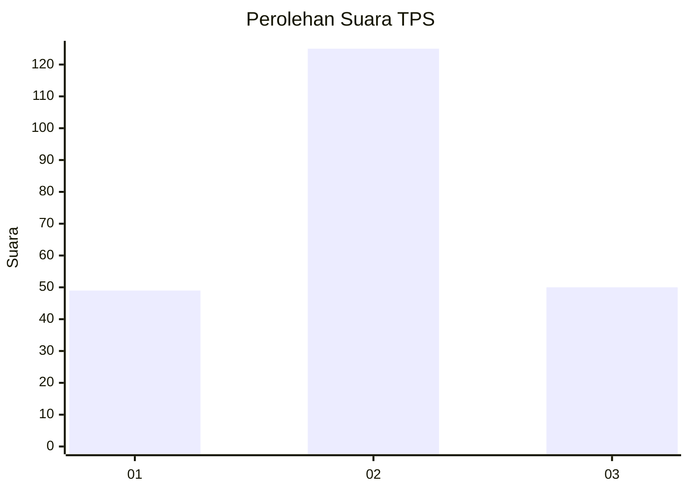
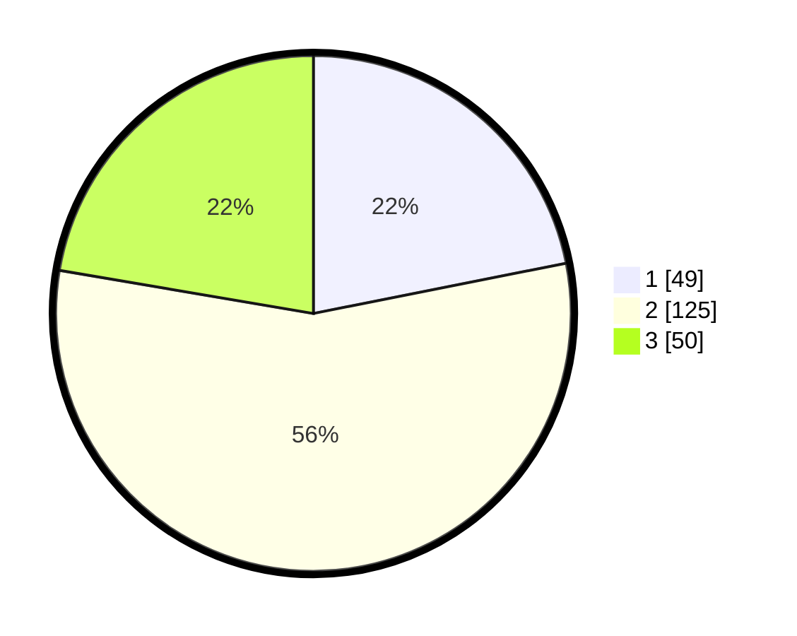

# Hasil

## Grafik

## Tabel

| No. | Nama Paslon    | Suara | Suara (raw) | Persentase |
|:--- |:-------------- | -----:| -----------:| ----------:|
| 1   | ANIES MUHAIMIN | 49    | [49][p-1]   | 21,88      |
| 2   | PRABOWO GIBRAN | 125   | [125][p-2]  | 55,80      |
| 3   | GANJAR MAHFUD  | 50    | [50][p-3]   | 22,32      |

[p-1]: https://github.com/gigit-pemilu/pemilu-2024/blob/main/pilpres/hitung-suara/sub/35-jawa-timur/sub/78-kota-surabaya/sub/02-wonocolo/sub/1001-sidosermo/sub/002-tps/sub/paslon-1.txt
[p-2]: https://github.com/gigit-pemilu/pemilu-2024/blob/main/pilpres/hitung-suara/sub/35-jawa-timur/sub/78-kota-surabaya/sub/02-wonocolo/sub/1001-sidosermo/sub/002-tps/sub/paslon-2.txt
[p-3]: https://github.com/gigit-pemilu/pemilu-2024/blob/main/pilpres/hitung-suara/sub/35-jawa-timur/sub/78-kota-surabaya/sub/02-wonocolo/sub/1001-sidosermo/sub/002-tps/sub/paslon-3.txt

## Foto C Plano

https://sirekap-obj-formc.kpu.go.id/d633/pemilu/ppwp/35/78/02/10/01/3578021001002-20240225-153318--24b510d5-7c92-4be0-9eb4-e8f4071f531f.jpg

https://sirekap-obj-formc.kpu.go.id/d633/pemilu/ppwp/35/78/02/10/01/3578021001002-20240225-153410--a5120ab6-4653-4bbe-b0dd-264c32f59c81.jpg

https://sirekap-obj-formc.kpu.go.id/d633/pemilu/ppwp/35/78/02/10/01/3578021001002-20240225-153459--6d055597-6bd8-4f65-bb59-4cb6651b1757.jpg

## Metadata

| Key        | Value               |
| ---------- | ------------------- |
| Time Stamp | 2024-02-28 19:00:00 |

