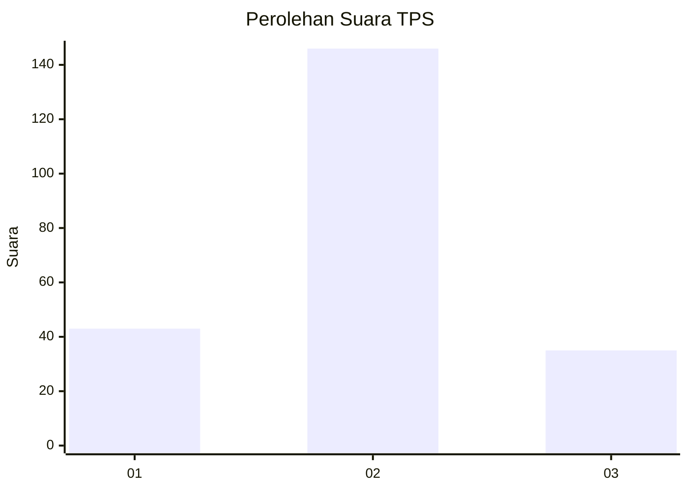
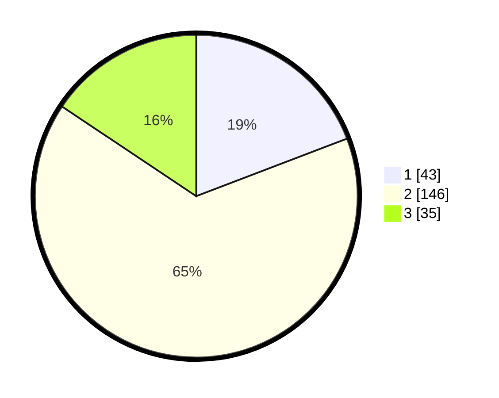

# Hasil

## Grafik

## Tabel

| No. | Nama Paslon    | Suara | Suara (raw) | Persentase |
|:--- |:-------------- | -----:| -----------:| ----------:|
| 1   | ANIES MUHAIMIN | 43    | [43][p-1]   | 19,20      |
| 2   | PRABOWO GIBRAN | 146   | [146][p-2]  | 65,18      |
| 3   | GANJAR MAHFUD  | 35    | [35][p-3]   | 15,63      |

[p-1]: https://github.com/gigit-pemilu/pemilu-2024-35-jawa-timur/blob/main/pilpres/hitung-suara/sub/35-jawa-timur/sub/78-kota-surabaya/sub/02-wonocolo/sub/1001-sidosermo/sub/006-tps/sub/paslon-1.txt
[p-2]: https://github.com/gigit-pemilu/pemilu-2024-35-jawa-timur/blob/main/pilpres/hitung-suara/sub/35-jawa-timur/sub/78-kota-surabaya/sub/02-wonocolo/sub/1001-sidosermo/sub/006-tps/sub/paslon-2.txt
[p-3]: https://github.com/gigit-pemilu/pemilu-2024-35-jawa-timur/blob/main/pilpres/hitung-suara/sub/35-jawa-timur/sub/78-kota-surabaya/sub/02-wonocolo/sub/1001-sidosermo/sub/006-tps/sub/paslon-3.txt

## Foto C Plano

https://sirekap-obj-formc.kpu.go.id/58c5/pemilu/ppwp/35/78/02/10/01/3578021001006-20240214-232939--7f69509a-0b5c-44bd-8974-8604b58407d7.jpg

https://sirekap-obj-formc.kpu.go.id/58c5/pemilu/ppwp/35/78/02/10/01/3578021001006-20240215-004718--3059a484-b0a2-4615-bea3-4ad8ad9c2c32.jpg

https://sirekap-obj-formc.kpu.go.id/58c5/pemilu/ppwp/35/78/02/10/01/3578021001006-20240215-004907--6a6b1ec7-db56-4e62-af78-485be569a087.jpg

## Metadata

| Key        | Value               |
| ---------- | ------------------- |
| Time Stamp | 2024-02-16 08:30:27 |

