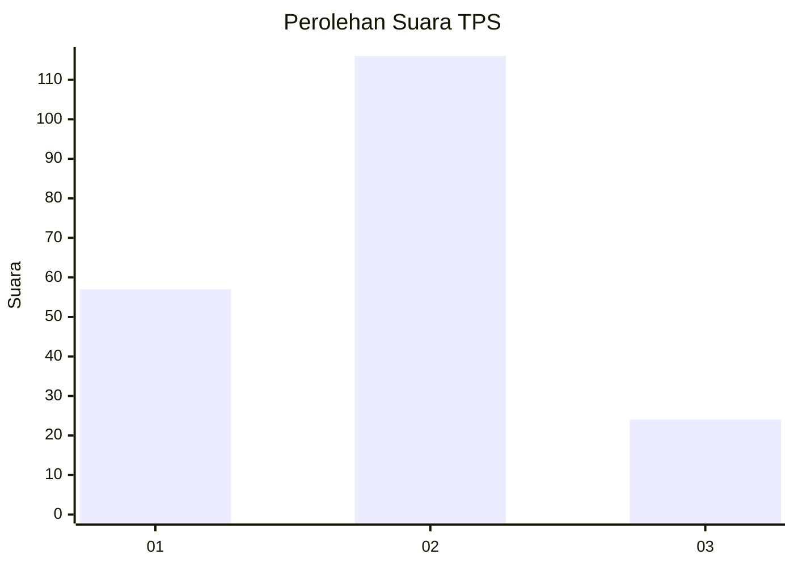
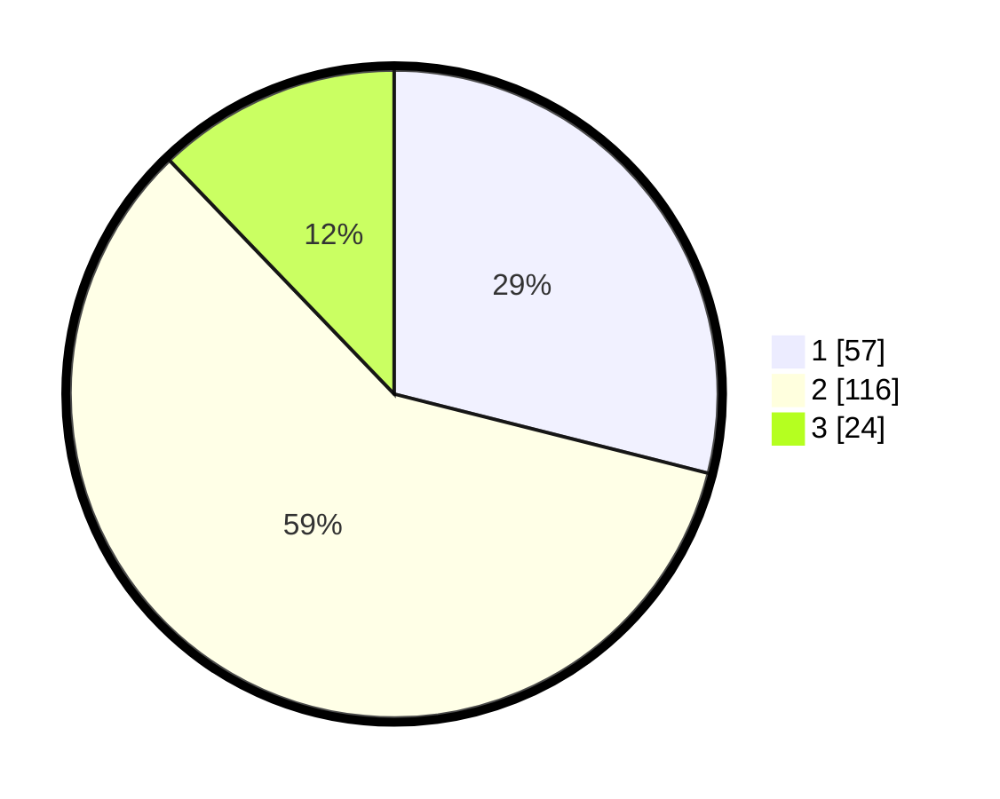

# Hasil

## Grafik

## Tabel

| No. | Nama Paslon    | Suara | Suara (raw) | Persentase |
|:--- |:-------------- | -----:| -----------:| ----------:|
| 1   | ANIES MUHAIMIN | 57    | [57][p-1]   | 28,93      |
| 2   | PRABOWO GIBRAN | 116   | [116][p-2]  | 58,88      |
| 3   | GANJAR MAHFUD  | 24    | [24][p-3]   | 12,18      |

[p-1]: https://github.com/gigit-pemilu/pemilu-2024/blob/main/pilpres/hitung-suara/sub/35-jawa-timur/sub/78-kota-surabaya/sub/02-wonocolo/sub/1001-sidosermo/sub/007-tps/sub/paslon-1.txt
[p-2]: https://github.com/gigit-pemilu/pemilu-2024/blob/main/pilpres/hitung-suara/sub/35-jawa-timur/sub/78-kota-surabaya/sub/02-wonocolo/sub/1001-sidosermo/sub/007-tps/sub/paslon-2.txt
[p-3]: https://github.com/gigit-pemilu/pemilu-2024/blob/main/pilpres/hitung-suara/sub/35-jawa-timur/sub/78-kota-surabaya/sub/02-wonocolo/sub/1001-sidosermo/sub/007-tps/sub/paslon-3.txt

## Foto C Plano

https://sirekap-obj-formc.kpu.go.id/c18a/pemilu/ppwp/35/78/02/10/01/3578021001007-20240215-023623--e7705cc4-9158-43ad-b2e5-592f39c79d5f.jpg

https://sirekap-obj-formc.kpu.go.id/c18a/pemilu/ppwp/35/78/02/10/01/3578021001007-20240215-024009--a9777e4c-19cc-4d80-9dda-d1230c0b8196.jpg

https://sirekap-obj-formc.kpu.go.id/c18a/pemilu/ppwp/35/78/02/10/01/3578021001007-20240215-024411--500f8a6b-df3b-4665-a6e0-4b87c74617e5.jpg

## Metadata

| Key        | Value               |
| ---------- | ------------------- |
| Time Stamp | 2024-02-15 22:30:27 |

